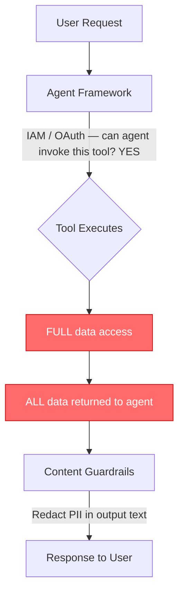
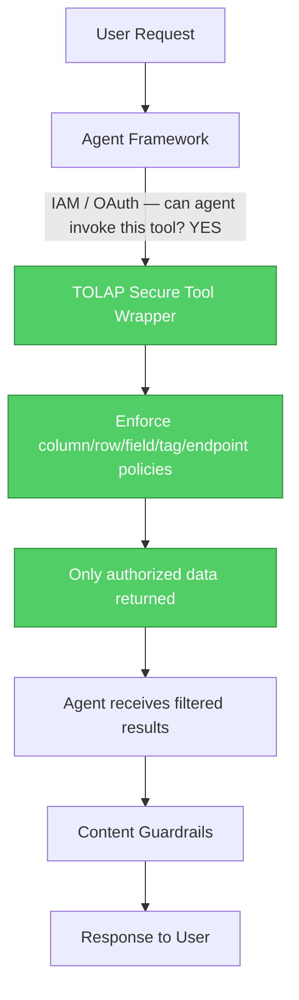

# TOLAP -- Tool-Object Level Access Protocol

**The missing security layer for AI agent tools.**

When an AI agent queries a database, calls an API, or searches a knowledge base on behalf of a user, it does so through tools -- MCP servers, plugins, function calls. These tools connect directly to data sources. The agent constructs its own queries, decides which endpoints to call, and determines what data to retrieve.

**The problem:** the tool has unrestricted access to the underlying data. RBAC checks whether a user can access a resource. ABAC evaluates attributes at a gateway. Neither operates where agents actually touch data -- *inside the tool itself*. If the agent constructs a query the application layer did not anticipate, sensitive data leaks through.

**TOLAP fixes this** by moving security enforcement inside the tool, at the data-object level. Column-level masking, row-level filtering, field-level redaction, tag-based access, endpoint restrictions -- enforced transparently before any data reaches the agent. The agent never receives data the user is not authorized to see.

## The Problem in Practice



The red steps are the gap. The agent already received the unrestricted data. Guardrails filter what the model *says*, not what the model *sees*. Every major agent framework -- AWS Bedrock Agents, Azure AI Agent Service, Google Vertex AI Agents, LangChain -- acknowledges this gap and tells you to solve it yourself inside your tool code.

**With TOLAP:**



The tool never returns data the user is not authorized to see. There is nothing to bypass because there is nothing to see.

## Three Principles

**Source-Point Enforcement** -- Security is enforced where data originates, not in a layer above it. The tool wraps the data source and applies policies before any data crosses the boundary. There is no path to the data that bypasses enforcement.

**Object Granularity** -- Policies operate on individual data objects: columns, rows, fields, tags, endpoints, HTTP methods, similarity thresholds, file prefixes, result limits. A single policy can say "this user can query the patients table but cannot see the SSN column, rows are filtered to their region, and the email field is returned as a SHA-256 hash."

**Agent Transparency** -- The calling agent requires zero security-awareness code. Restricted data simply does not exist from the agent's perspective. This eliminates an entire class of prompt injection and data exfiltration risks.

## What TOLAP Covers

| Data Source | Enforcement |
|-------------|------------|
| **Databases** (PostgreSQL, MySQL, Athena, BigQuery, ...) | Column hiding, row filtering, field masking, result limits |
| **APIs** (REST, GraphQL, SOAP, FHIR, gRPC, ...) | Endpoint allow/deny, HTTP method restrictions, response field masking |
| **Knowledge Bases** (Bedrock KB, OpenSearch, Elasticsearch, ...) | Tag-based filtering (classification levels are expressed as tags), similarity thresholds |
| **Object Storage** (S3, Azure Blob, GCS, ...) | Prefix allow/deny, size limits, metadata masking |

One policy schema covers all source types. No category-specific schemas.

Enforcement is applied to results **after** the tool executes — that pass is the
security boundary and always runs. The agent never receives an excluded row.

For SQL sources the .NET SDK additionally offers **optional query rewriting**, which
pushes row filters into a `WHERE` clause and the result limit into a `LIMIT` so the
database returns less data. That is a resource optimization, not the enforcement: the
post-execution pass still runs, because some filters have no portable SQL form. Without
rewriting, a large result set is fetched and then trimmed, so push limits into your own
queries when a collection may be large.

## How It Works

1. **Define policies** -- Declarative JSON policies specify what each user/group/role can access, at the object level
2. **Assign policies** -- Link policies to users, groups, roles, or service accounts with mandatory audit trails
3. **Resolve** -- The SDK merges all applicable policies using most-restrictive-wins rules
4. **Sign** -- The merged policy is HMAC-signed for tamper-proof cross-boundary transport
5. **Enforce** -- The secure tool wrapper applies the policy transparently on every tool call

```json
{
  "name": "healthcare-analyst",
  "permissions": { "canQuery": true, "canExport": false, "readOnly": true },
  "objectRules": {
    "allowedObjects": ["patients", "encounters", "diagnoses"],
    "hiddenObjects": ["billing_internal", "audit_log"],
    "fieldRules": {
      "hiddenFields": ["patients.ssn", "patients.date_of_birth"],
      "maskedFields": [
        { "field": "patients.email", "maskType": "hash", "parameters": { "algorithm": "sha256" } },
        { "field": "patients.full_name", "maskType": "partial", "parameters": { "showFirst": 1, "maskChar": "*" } }
      ]
    },
    "rowFilters": [
      { "field": "region", "operator": "in", "values": ["us-east", "us-west"] },
      { "field": "status", "operator": "notEquals", "value": "deleted" }
    ]
  },
  "limits": { "maxResults": 5000, "maxQueryTimeSeconds": 30 }
}
```

The agent sees: `J*********` for the name, a SHA-256 hash for the email, no SSN column at all, and only rows from us-east and us-west. The restricted data never crosses the tool boundary.

## SDK Packages

The TOLAP SDK ships in three languages, each with three packages:

### .NET

```bash
dotnet add package Tolap.Core
dotnet add package Tolap.Store
dotnet add package Tolap.Mcp
```

| Package | Description |
|---------|-------------|
| **Tolap.Core** | Policy models, merge algorithm, HMAC signing, enforcement engine. Zero dependencies. |
| **Tolap.Store** | `IPolicyStore` interface + in-memory implementation. Pluggable for any backend. |
| **Tolap.Mcp** | Wraps any MCP server with TOLAP enforcement. |

### Python

```bash
pip install tolap-core
pip install tolap-store
pip install tolap-mcp
```

| Package | Description |
|---------|-------------|
| **tolap-core** | Policy models, merge algorithm, HMAC signing, enforcement engine. Zero dependencies. |
| **tolap-store** | `PolicyStore` protocol + in-memory implementation. Pluggable for any backend. |
| **tolap-mcp** | Wraps any MCP server with TOLAP enforcement. |

### TypeScript

```bash
npm install @tolap/core
npm install @tolap/store
npm install @tolap/mcp
```

| Package | Description |
|---------|-------------|
| **@tolap/core** | Policy models, merge algorithm, HMAC signing, enforcement engine. Zero dependencies. |
| **@tolap/store** | `PolicyStore` interface + in-memory implementation. Pluggable for any backend. |
| **@tolap/mcp** | Wraps any MCP server with TOLAP enforcement. |

**Core packages have zero external dependencies** in all three languages. Crypto, JSON, and collections use standard library only. The enforcement engine is embeddable anywhere -- MCP servers, Lambda functions, edge workers, Semantic Kernel plugins.

## Quick Start

### Wrap an MCP Server with TOLAP (TypeScript)

```typescript
import { merge, signContext, buildSecurityContext } from "@tolap/core";
import { InMemoryPolicyStore } from "@tolap/store";
import { SecureMcpToolWrapper } from "@tolap/mcp";

// 1. Create a policy store and add policies
const store = new InMemoryPolicyStore();
await store.createPolicy({
  version: "1.0",
  name: "analyst-db-access",
  permissions: { canQuery: true, readOnly: true },
  objectRules: {
    hiddenFields: ["ssn", "date_of_birth"],
    maskedFields: [{ field: "email", maskType: "hash", parameters: { algorithm: "sha256" } }]
  },
  limits: { maxResults: 1000 }
});

// 2. Assign the policy to a user
await store.assignPolicy({
  version: "1.0",
  policyName: "analyst-db-access",
  assignee: { type: "user", identifier: "user-123" },
  scope: { tenantId: "tenant-acme" },
  active: true,
  audit: { grantedBy: "admin", grantedAt: new Date().toISOString(), reason: "Analyst role" }
});

// 3. Resolve and enforce
const policy = await store.resolveEffectivePolicy("user-123", "tenant-acme", "ds-postgres");
// policy.objectRules.fieldRules.hiddenFields -> ["ssn", "date_of_birth"]
// The wrapper applies this automatically on every MCP tool call
```

### Enforce on Query Results (Python)

```python
from tolap_core import apply_field_masking, validate_field_access, EffectivePolicy

policy = ...  # resolved effective policy

# Check which fields the user can access
result = validate_field_access(["name", "email", "ssn", "region"], policy)
# result.allowed = ["name", "email", "region"]
# result.denied = ["ssn"]

# Mask sensitive fields in a result record
record = {"name": "John Smith", "email": "john@example.com", "region": "us-east"}
masked = apply_field_masking(record, policy)
# masked = {"name": "J*********", "email": "a1b2c3d4e5f6...", "region": "us-east"}
```

### Merge Multiple Policies (.NET)

```csharp
using Tolap.Core;

// Two overlapping policies -- most restrictive wins
var merged = PolicyMerger.Merge(new[] { policyA, policyB });

// Permissions: AND (both must allow)
// Allowed fields: intersection (only fields in both)
// Hidden fields: union (hidden in either = hidden)
// Max results: minimum (stricter limit wins)
// Masked fields: most restrictive mask type per field
```

## Centralizing the Policy Store

The Quick Start examples above use the built-in `InMemoryPolicyStore` -- great for development, testing, and single-process deployments. In production, you will want a centralized store backed by a database so that all services share the same policies.

The SDK defines a store interface (`IPolicyStore` in .NET, `PolicyStore` protocol in Python, `PolicyStore` interface in TypeScript). Implement it against any backend. Here is a PostgreSQL example for each language:

### Schema

```sql
CREATE TABLE tolap_policies (
    name        TEXT PRIMARY KEY,
    version     TEXT NOT NULL DEFAULT '1.0',
    priority    INTEGER NOT NULL DEFAULT 0,
    policy_json JSONB NOT NULL,
    created_at  TIMESTAMPTZ NOT NULL DEFAULT now(),
    updated_at  TIMESTAMPTZ NOT NULL DEFAULT now()
);

CREATE TABLE tolap_assignments (
    id            UUID PRIMARY KEY DEFAULT gen_random_uuid(),
    policy_name   TEXT NOT NULL REFERENCES tolap_policies(name),
    assignee_type TEXT NOT NULL,
    assignee_id   TEXT NOT NULL,
    tenant_id     TEXT,
    data_source_id TEXT,
    active        BOOLEAN NOT NULL DEFAULT true,
    expires_at    TIMESTAMPTZ,
    granted_by    TEXT NOT NULL,
    granted_at    TIMESTAMPTZ NOT NULL DEFAULT now(),
    reason        TEXT
);
```

### .NET (PostgreSQL with Npgsql)

```csharp
public class PostgresPolicyStore : IPolicyStore
{
    private readonly NpgsqlDataSource _db;

    public PostgresPolicyStore(string connectionString)
        => _db = NpgsqlDataSource.Create(connectionString);

    public async Task<EffectivePolicy> ResolveEffectivePolicyAsync(
        string userId, string tenantId, string dataSourceId, CancellationToken ct = default)
    {
        const string sql = """
            SELECT p.policy_json FROM tolap_assignments a
            JOIN tolap_policies p ON a.policy_name = p.name
            WHERE a.assignee_id = @userId
              AND (a.tenant_id IS NULL OR a.tenant_id = @tenantId)
              AND (a.data_source_id IS NULL OR a.data_source_id = @dsId)
              AND a.active = true
              AND (a.expires_at IS NULL OR a.expires_at > now())
            ORDER BY p.priority DESC
            """;
        var policies = new List<PolicyDefinition>();
        await using var cmd = _db.CreateCommand(sql);
        cmd.Parameters.AddWithValue("userId", userId);
        cmd.Parameters.AddWithValue("tenantId", tenantId);
        cmd.Parameters.AddWithValue("dsId", dataSourceId);
        await using var reader = await cmd.ExecuteReaderAsync(ct);
        while (await reader.ReadAsync(ct))
            policies.Add(Deserialize<PolicyDefinition>(reader.GetString(0)));
        return PolicyMerger.Merge(policies);
    }
}
```

### Python (asyncpg)

```python
class PostgresPolicyStore(PolicyStore):
    def __init__(self, pool: asyncpg.Pool):
        self._pool = pool

    async def resolve_effective_policy(self, user_id, tenant_id, data_source_id):
        rows = await self._pool.fetch(
            """SELECT p.policy_json FROM tolap_assignments a
               JOIN tolap_policies p ON a.policy_name = p.name
               WHERE a.assignee_id = $1
                 AND (a.tenant_id IS NULL OR a.tenant_id = $2)
                 AND (a.data_source_id IS NULL OR a.data_source_id = $3)
                 AND a.active = true
                 AND (a.expires_at IS NULL OR a.expires_at > now())
               ORDER BY p.priority DESC""",
            user_id, tenant_id, data_source_id,
        )
        policies = [PolicyDefinition.from_json(r["policy_json"]) for r in rows]
        return PolicyMerger.merge(policies)
```

### TypeScript (pg)

```typescript
export class PostgresPolicyStore implements PolicyStore {
  constructor(private pool: Pool) {}

  async resolveEffectivePolicy(
    userId: string, tenantId: string, dataSourceId: string
  ): Promise<EffectivePolicy> {
    const { rows } = await this.pool.query(
      `SELECT p.policy_json FROM tolap_assignments a
       JOIN tolap_policies p ON a.policy_name = p.name
       WHERE a.assignee_id = $1
         AND (a.tenant_id IS NULL OR a.tenant_id = $2)
         AND (a.data_source_id IS NULL OR a.data_source_id = $3)
         AND a.active = true
         AND (a.expires_at IS NULL OR a.expires_at > now())
       ORDER BY p.priority DESC`,
      [userId, tenantId, dataSourceId]
    );
    return PolicyMerger.merge(rows.map(r => r.policy_json));
  }
}
```

### Other Backends

The same interface works with any backend:

| Backend | Best for |
|---------|----------|
| **PostgreSQL** | Relational data, JSONB querying, existing Postgres infrastructure |
| **DynamoDB** | Serverless, AWS-native, high-throughput reads |
| **Redis** | Low-latency caching layer in front of a primary store |
| **REST API** | Dedicated policy service shared across teams |

For caching, architecture diagrams, and a complete policy service API design, see the [Architecture Guide](docs/architecture.md#deployment-patterns-centralized-policy-store).

## Policy Merge Rules

When multiple policies apply to a user, TOLAP merges them using most-restrictive-wins:

| Field Type | Strategy | Example |
|-----------|----------|---------|
| Allowed sets | Intersection | `allowedFields` from two policies -> only fields in both |
| Hidden/denied sets | Union | `hiddenFields` from two policies -> all hidden fields combined |
| Boolean permissions | AND | `canQuery` true + false -> false |
| Numeric limits (maxima) | Minimum | `maxResults` 100 + 50 -> 50 |
| Numeric limits (minima) | Maximum | `minSimilarityScore` 0.7 + 0.8 -> 0.8 |
| Masked fields | Most restrictive | ranked by disclosure: null > redact > full > hash > partial |
| Row filters | Concatenate | All filters from all policies apply (AND) |

## TOLAP vs Traditional Approaches

| | RBAC | ABAC | Database RLS | **TOLAP** |
|---|---|---|---|---|
| **Enforcement point** | Application layer | Policy engine / gateway | Database engine | **Inside the tool** |
| **Granularity** | Role / resource | Attribute / policy | Row | **Column, row, field, tag, endpoint** |
| **Cross-source** | Per-system | Centralized but bypassable | Database only | **All source types unified** |
| **Agent-safe** | Requires agent compliance | Requires routing through engine | N/A | **Transparent -- agent unaware** |
| **Masking** | Not built-in | Policy-dependent | Not built-in | **Built-in per-field masking** |
| **Multi-tenant** | Application logic | Policy logic | Database logic | **Embedded in every tool** |

## Policy Schema

TOLAP policies are defined in three layers:

1. **[Policy Definition](schema/v1.0/policy-definition.schema.json)** -- Declares access rules: objects, fields, rows, tags, endpoints, masking, limits
2. **[Policy Assignment](schema/v1.0/policy-assignment.schema.json)** -- Links a policy to a user/group/role with scope, expiry, and audit trail
3. **[Effective Policy](schema/v1.0/effective-policy.schema.json)** -- The merged, signed result enforced at the tool layer

Schema version: **v1.0** (strict versioning, no extension points)

## Security Properties

- **Non-bypassable where the wrapper is the only path** -- Enforcement runs inside the
  tool, so an agent cannot route around it. This holds only as far as the integrator
  wires it: a tool that reaches a data source without going through a secure wrapper is
  outside the boundary, and TOLAP cannot know about it.
- **Tamper-proof** -- Effective policies are HMAC-signed over a canonical form that
  covers the whole context including its expiry. Any modification invalidates the
  signature, and a context signed by one SDK verifies in the other two.
- **Replay-bounded** -- Signed contexts carry an expiry that is inside the signature, so
  it cannot be extended without the key. A valid context is replayable until it expires:
  there is no nonce and contexts are not single-use, so keep TTLs short.
- **Cross-boundary** -- Signed contexts can be transported across process, network, and
  cloud boundaries without losing integrity.
- **Audit fields are mandatory in the schema** -- Every policy assignment must carry who
  granted it, when, and why. This is a schema constraint on stored assignments; validate
  assignments against the schema in your store, because the SDK does not reject an
  assignment that omits them at load time.

See [Known limitations](docs/canonical-enforcement-spec.md#13-known-limitations) for the
full list of what TOLAP does not guarantee.

## Documentation

- [Architecture Guide](docs/architecture.md) -- Components, data flow, sequence diagrams
- [Canonical Enforcement Spec](docs/canonical-enforcement-spec.md) -- Normative cross-language behavior: canonical signing, enforcement pipeline order, fail-closed rules
- [Connector Spec](docs/connector-spec.md) -- Normative per-category behavior: which policy fields apply to `db` / `api` / `kb` / `storage`, what an object and a record mean for each, and which fields are advisory rather than enforced
- [Local Testing](docs/local-testing.md) -- Running the suites against live Postgres/MySQL and the test API server
- [Next Steps](docs/NEXT-STEPS.md) -- Current task plan: open items, decisions awaiting an owner, and the verified test baseline
- Implementation Guides:
  - [.NET / C#](docs/implementation-guide-dotnet.md)
  - [Python](docs/implementation-guide-python.md)
  - [TypeScript](docs/implementation-guide-typescript.md)
- [Schema Examples](schema/v1.0/examples/) -- Database (read and write), API, knowledge base, and storage policy examples

## Project Structure

```
tolap-sdk/
  docs/           TOLAP standard documentation
  schema/v1.0/    JSON Schema specification
  fixtures/       Shared test data (all languages validate against these)
  sdk/
    dotnet/       Tolap.Core, Tolap.Store, Tolap.Mcp
    python/       tolap-core, tolap-store, tolap-mcp
    typescript/   @tolap/core, @tolap/store, @tolap/mcp
  tools/test-api/ Local HTTP server for socket-level enforcement tests
```

## Contributing

TOLAP is protocol-agnostic. It works with MCP servers, Semantic Kernel plugins, LangChain tools, AWS Bedrock Agents, or any tool-based AI agent architecture. Contributions welcome -- see [CONTRIBUTING.md](CONTRIBUTING.md).

## License

Licensed under the Apache License, Version 2.0. See [LICENSE](LICENSE) and [NOTICE](NOTICE).
