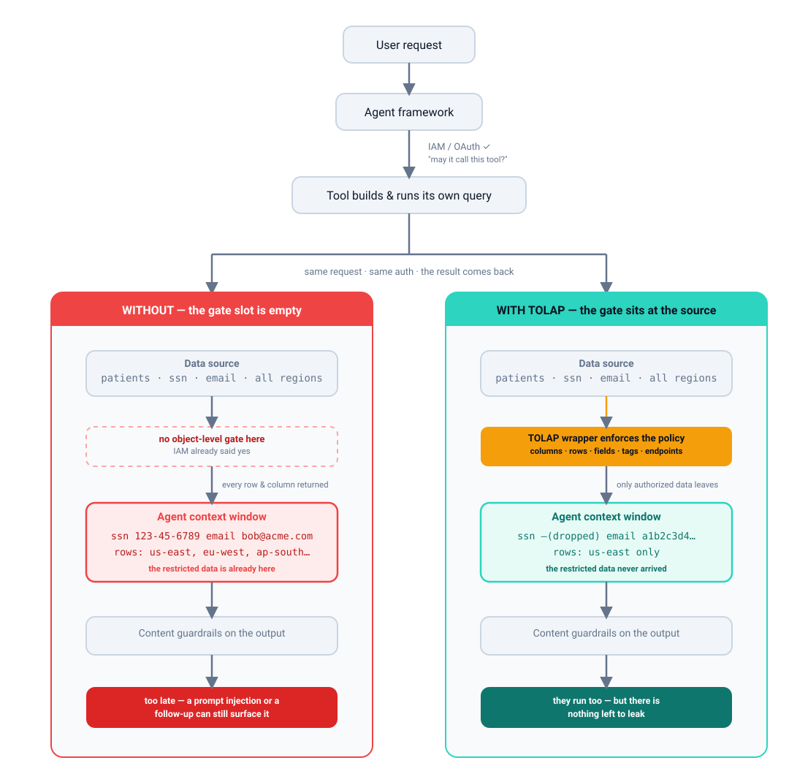
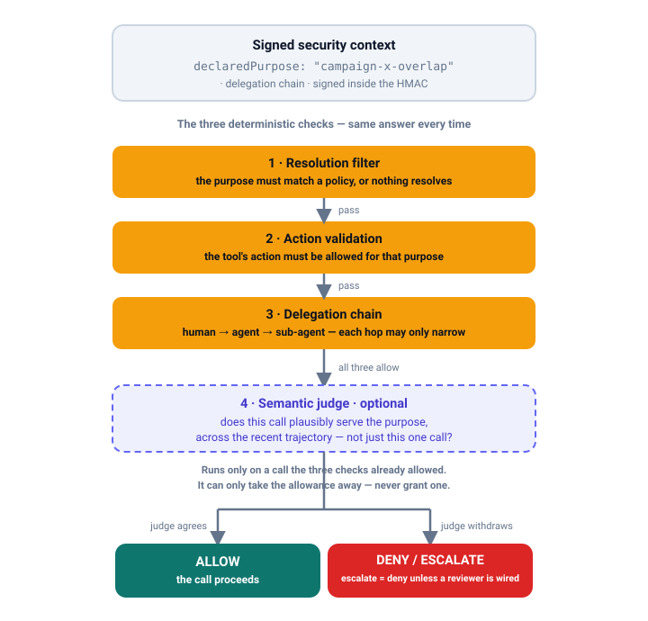

<div align="center">


# TOLAP

### Tool-Object Level Access Protocol

</div>

<div align="center">

**The security layer your agent tools are missing.**

</div>

<div align="center">

Object-level access control enforced *inside the tool*, before any data reaches the agent.
Hide columns, filter rows, mask fields, gate on tags and endpoints — one policy schema across
databases, APIs, knowledge bases and object storage. Three SDKs, byte-identical. Apache 2.0.

</div>

<div align="center">


**[Documentation](docs/architecture.md)** ·
**[Quick Start](#quick-start)** ·
**[Policy Server](docs/policy-server.md)** ·
**[Examples](examples/)** ·
**[Threat Model](docs/security/threat-model.md)**

</div>

---

Your agent talks to a database, an API, a knowledge base — through tools: MCP servers, plugins,
function calls. Those tools hold a live connection to the data and the agent writes its own queries
against it. RBAC asks whether a user may reach a resource; ABAC evaluates attributes at a gateway.
Neither one is standing where the agent actually touches the data, which is *inside the tool*. Write
a query nobody anticipated and out comes something sensitive.

TOLAP puts the check there instead. Wrap the function your tool already calls, and restricted data
never crosses the boundary — the agent doesn't have to know any of it is happening.

```python
# Python — enforcement is transparent; the agent sees only what the policy allows
from tolap_mcp import SecureMcpToolWrapper, SecureMcpServerOptions

tool = SecureMcpToolWrapper(SecureMcpServerOptions(signing_key=KEY))
rows = tool.post_execute(context, db.query("SELECT * FROM patients"))
# ssn column dropped · email hashed · out-of-region rows removed — before the agent sees them
```

```typescript
// TypeScript — same policy, same result, one function around your data
import { applyResultPipeline } from "@aws/tolap-core";

const rows = applyResultPipeline(await db.query("SELECT * FROM patients"), policy);
// ssn column dropped · email hashed · out-of-region rows removed — before the agent sees them
```

```bash
# Build from source — the SDKs are not published to a registry
git clone https://github.com/awslabs/tolap && cd tolap
./tools/build-local.sh          # wheels · npm tarballs · .nupkg under dist/, all three languages
```

---

## The Problem in Practice

Both paths below start identically and clear the same authorization check. They part company at one
point: what the tool is allowed to hand back. Everything after that follows from it.

<div align="center">

<picture>
  <source media="(prefers-color-scheme: dark)" srcset="assets/diagrams/problem-dark.svg">
  
</picture>

</div>

Look at where the dark red step sits. It's *before* the guardrails, not after. By the time anything
filters the output, the data is already sitting in the agent's context window. Guardrails control
what the model says. They have nothing to say about what the model saw, so a prompt injection, a
tool-call trace or an innocent follow-up question can still pull it back out.

Notice what both paths have in common: the IAM/OAuth check passes either way. It's answering a
different question, namely *may this agent call this tool at all?* Neither RBAC at the identity
layer nor ABAC at a gateway can tell you which columns and rows this particular user should see
through this particular call. That has to be decided where the query meets the data. Bedrock Agents,
Azure AI Agent Service, Vertex AI Agents, LangChain: they all say the same thing, which is that
it's on you to handle inside your tool code.

On the green path there's nothing to bypass. The restricted data never left the source.

## What it comes down to

**Enforce at the source, not above it.** The tool wraps the data source and applies the policy
before anything crosses the boundary. If the wrapper is the only way in, there's no route around it.

**Work at the object level.** Columns, rows, fields, tags, endpoints, HTTP methods, similarity
thresholds, file prefixes, result caps. One policy can say: this user may query `patients`, but not
the SSN column, only rows in their own region, and the email comes back as a SHA-256 hash.

**Keep the agent out of it.** You write no security-aware code in the agent. From where it sits, the
restricted data was never there. That takes a whole category of prompt-injection and exfiltration
problems off the table.

## Purpose Binding

Everything above answers "what may this identity see?" A signed context pins down identity, tenant,
source and expiry. What it never pins down is *why* the data is being read.

That's a bigger deal for an agent than for a person. An agent holding a perfectly legitimate context
can use it for anything its policy happens to allow, which means an agent that has wandered off task
looks exactly like one that hasn't.

So a policy can say what it's for:

```json
"purposeProfile": {
  "purposeId": "campaign-x-overlap",
  "description": "Identify overlapping opted-in customer segments for Campaign X",
  "allowedActions": ["aggregate_overlap", "count_segments"],
  "prohibitedActions": ["export_pii", "enumerate_individuals"]
}
```

You get three checks that always give the same answer, plus one that doesn't:

| | What it does |
|---|---|
| **Resolution filtering** | The policy resolves only for a caller declaring a matching `purposeId`. Declare no purpose and it does not resolve at all. |
| **Action validation** | A tool call must carry an action category the purpose permits. The category comes from an administrator-supplied map, never from the agent. |
| **Delegation chains** | A human → agent → sub-agent chain may only narrow. A sub-agent cannot grant itself a wider purpose than it was delegated. |
| **Semantic judge** (opt-in) | An LLM check on whether a call plausibly serves the purpose, across the recent trajectory rather than one call. Strictly subtractive: it can only take away an allowance the deterministic checks already granted. |

<div align="center">

<picture>
  <source media="(prefers-color-scheme: dark)" srcset="assets/diagrams/purpose-binding-dark.svg">
  
</picture>

</div>

The judge is the only non-deterministic step, and it sits **last** on purpose. The three checks
above it always give the same answer; the judge runs only on a call they already allowed, and it
can only take the allowance away. That ordering is what makes a prompt-injected judge survivable —
the worst it can do is deny something that was about to be allowed, never allow something that was
denied.

All of it is opt-in. Leave `purposeProfile` off a policy, declare no purpose when you resolve, and
nothing changes. Not the behaviour, not even the signed bytes. Both the purpose and the delegation
chain live inside the HMAC, so nobody can lift a context and reuse it for something else.

Here's what it won't do: the caller is the one asserting the purpose, and TOLAP can't tell whether
they're being honest. It checks that the assertion matches a real policy and that a delegation chain
doesn't contradict itself. That's enough to catch an agent that drifts, and enough to limit the
damage when one gets compromised halfway through a task. It is not a defence against an integrator
who lies to you. Details in [§15](docs/canonical-enforcement-spec.md#15-purpose-binding).

## What TOLAP Covers

| Data Source | Enforcement |
|-------------|------------|
| **Databases** (PostgreSQL, MySQL, Athena, BigQuery, ...) | Column hiding, row filtering, field masking, result limits |
| **APIs** (REST, GraphQL, SOAP, FHIR, gRPC, ...) | Endpoint allow/deny, HTTP method restrictions, response field masking |
| **Knowledge Bases** (Bedrock KB, OpenSearch, Elasticsearch, ...) | Tag-based filtering (classification levels are expressed as tags), similarity thresholds |
| **Object Storage** (S3, Azure Blob, GCS, ...) | Prefix allow/deny, size limits, metadata masking |

One schema for every source type. No per-category variants.

The policy is applied to results *after* the tool runs, and that pass always happens. It's the actual
security boundary. An excluded row never reaches the agent.

### With SQL, you pick where the filtering happens

All three SDKs can cut down database results in two places. `SqlEnforcementMode` decides which:

| Mode | What happens |
|---|---|
| **`rewriteAndPost`** (default) | TOLAP pushes row filters into a `WHERE` clause, the result limit into a `LIMIT`, and hidden columns out of the `SELECT`, so the database returns less data. Enforcement still runs on the results. |
| **`postOnly`** | Your query runs byte for byte as written. Enforcement happens entirely on the rows that come back. |

**Both modes give you the same rows.** That's the point: this is a decision about how much data
crosses the wire, not about who can see what, which is why it's safe to hand you the switch. And it's
verified against live PostgreSQL and MySQL, not assumed.

Reach for `postOnly` when your SQL has to stay exactly as written. Maybe the rewriter's parser
doesn't cover your statement, maybe it's a stored procedure, maybe an ORM owns the SQL, maybe a
reviewer needs the query that ran to be the query they signed off on. The trade is that the database
hands back rows and columns the post pass then throws away, so put your own limits in the query if
the result set could get big.

**There's no rewrite-only mode, on purpose.** The post-execution pass *is* the enforcement boundary,
and two things simply have no SQL equivalent. Masking is the first: no `SELECT` returns `[REDACTED]`
or a salted hash. The `contains`, `startsWith` and `matches` operators are the second, because
there's no portable way to express them, so the rewriter leaves them alone and tells you about it in
`unpushableFilters`. Skip the post pass and you get unmasked values *and* rows the policy said no
to.

See [`examples/python/enforcement_mode_example.py`](examples/python/enforcement_mode_example.py)
for a runnable side-by-side comparison.

## How It Works

1. **Write a policy.** Plain JSON, saying what a user, group or role may reach, object by object.
2. **Assign it** to a user, group, role or service account. The audit fields aren't optional.
3. **Resolve.** The SDK pulls every policy that applies and merges them, most restrictive winning.
4. **Sign.** The merged result gets an HMAC so it survives the trip across a boundary intact.
5. **Enforce.** The wrapper applies it on every call, and the agent notices nothing.

```json
{
  "name": "healthcare-analyst",
  "permissions": { "canQuery": true, "readOnly": true },
  "objectRules": {
    "allowedObjects": ["patients", "encounters", "diagnoses"],
    "hiddenObjects": ["billing_internal", "audit_log"],
    "fieldRules": {
      "hiddenFields": ["patients.ssn", "patients.date_of_birth"],
      "maskedFields": [
        { "field": "patients.email", "maskType": "hash", "parameters": { "algorithm": "sha256" } },
        { "field": "patients.full_name", "maskType": "partial", "parameters": { "showFirst": 1, "maskChar": "*" } }
      ]
    },
    "rowFilters": [
      { "field": "region", "operator": "in", "values": ["us-east", "us-west"] },
      { "field": "status", "operator": "notEquals", "value": "deleted" }
    ]
  },
  "limits": { "maxResults": 5000 }
}
```

What the agent actually gets: `J*********` for the name, a hash where the email was, no SSN column
at all, and rows only from us-east and us-west. Nothing else made it past the tool.

## SDK Packages

Three languages, three packages each. You build them from this repo. They're not on any package
registry.

```bash
git clone https://github.com/awslabs/tolap && cd tolap
./tools/build-local.sh              # all three languages
./tools/build-local.sh python       # or just one
./tools/build-local.sh --artifacts  # build only, do not install
```

You end up with exactly what a registry would have served you: wheels, npm tarballs and `.nupkg`
files under `dist/`, installed locally. Missing a toolchain for one language? It gets skipped with a
note instead of taking the whole run down. If you'd rather do it by hand, the per-language steps are
below.

### .NET

```bash
dotnet pack sdk/dotnet/src/Tolap.Core/Tolap.Core.csproj -c Release -o dist/nuget
dotnet nuget add source "$PWD/dist/nuget" --name tolap-local
```

Once that feed's registered, `dotnet add package Tolap.Core` just works. Or skip packaging and point
straight at the projects:

```xml
<ProjectReference Include="path/to/tolap/sdk/dotnet/src/Tolap.Core/Tolap.Core.csproj" />
```

| Package | Description |
|---------|-------------|
| **Tolap.Core** | Policy models, merge algorithm, HMAC signing, enforcement engine. Zero dependencies. |
| **Tolap.Store** | `IPolicyStore` interface + in-memory implementation. Pluggable for any backend. |
| **Tolap.Mcp** | Enforcement wrappers for the function your tool layer calls -- MCP servers, agent-framework tools, Lambda handlers. Speaks no wire protocol of its own. |

### Python

```bash
pip install ./sdk/python/tolap-core ./sdk/python/tolap-store ./sdk/python/tolap-mcp
```

| Package | Description |
|---------|-------------|
| **tolap-core** | Policy models, merge algorithm, HMAC signing, enforcement engine. Zero dependencies. |
| **tolap-store** | `PolicyStore` protocol + in-memory implementation. Pluggable for any backend. |
| **tolap-mcp** | Enforcement wrappers for the function your tool layer calls -- MCP servers, agent-framework tools, Lambda handlers. Speaks no wire protocol of its own. |

### TypeScript

```bash
cd sdk/typescript && npm ci
# core first: store and mcp resolve it through packages/core/dist
for pkg in core store mcp; do (cd "packages/$pkg" && npx tsc -p tsconfig.json); done
```

They're an npm workspace, so you can reference them by path
(`file:../tolap/sdk/typescript/packages/core`). That's how [`examples/`](examples/) and
[`server/`](server/) pull them in.

| Package | Description |
|---------|-------------|
| **@aws/tolap-core** | Policy models, merge algorithm, HMAC signing, enforcement engine. Zero dependencies. |
| **@aws/tolap-store** | `PolicyStore` interface + in-memory implementation. Pluggable for any backend. |
| **@aws/tolap-mcp** | Enforcement wrappers for the function your tool layer calls -- MCP servers, agent-framework tools, Lambda handlers. Speaks no wire protocol of its own. |

**The core packages have no external dependencies at all**, in any of the three languages. Crypto,
JSON, collections: standard library only. Which means you can drop the enforcement engine wherever you
like, whether that's an MCP server, a Lambda, an edge worker or a Semantic Kernel plugin.
[`examples/`](examples/) wires it into fourteen agent frameworks and not one of them puts a dependency
on your enforcement path.

The `store` packages add nothing on top of `core`. One `mcp` package does: **`tolap-mcp` needs
`httpx`**, because the HTTP wrapper uses `httpx.URL` for the same-origin check that keeps a redirect
from walking off the policy's host. TypeScript and .NET take a fetch function or an `HttpClient` from
you instead, so they declare nothing. Embedding just the engine? Depend on `core` and the question
never comes up.

## Quick Start

### Resolve a policy and sign a context (TypeScript)

```typescript
import { merge, signContext, buildSecurityContext } from "@aws/tolap-core";
import { InMemoryPolicyStore } from "@aws/tolap-store";
import { SecureMcpToolWrapper } from "@aws/tolap-mcp";

// 1. Create a policy store and add policies
const store = new InMemoryPolicyStore();
await store.putDefinition({
  version: "1.0",
  name: "analyst-db-access",
  permissions: { canQuery: true, readOnly: true },
  objectRules: {
    // hiddenFields and maskedFields nest under fieldRules, not directly under objectRules.
    fieldRules: {
      hiddenFields: ["ssn", "date_of_birth"],
      maskedFields: [{ field: "email", maskType: "hash", parameters: { algorithm: "sha256" } }]
    }
  },
  limits: { maxResults: 1000 }
});

// 2. Assign the policy to a user
await store.putAssignment({
  version: "1.0",
  policyName: "analyst-db-access",
  assignee: { type: "user", identifier: "user-123" },
  scope: { tenantId: "tenant-acme" },
  active: true,
  audit: { grantedBy: "admin", grantedAt: new Date().toISOString(), reason: "Analyst role" }
});

// 3. Resolve -- this merges EVERY assignment the user holds for that source into one
//    effective policy, most-restrictive-wins.
const policy = await store.resolvePolicy("user-123", "tenant-acme", "ds-postgres");
// policy.objectRules.fieldRules.hiddenFields -> ["ssn", "date_of_birth"]

// 4. Sign it. The signature covers the whole envelope including sourceConnectionId, so a
//    context cannot be replayed against a different source. Never hand-roll this: a plain
//    JSON.stringify is not the canonical form and the signature will not verify.
const context = signContext(buildSecurityContext("user-123", "tenant-acme", policy), signingKey);
```

Want to see this running inside a real agent framework? [`examples/`](examples/) has 14 of them, all
CI-tested.

### Enforce on Query Results (Python)

```python
from tolap_core import apply_field_masking, validate_field_access, EffectivePolicy

policy = ...  # resolved effective policy

# Check which fields the user can access
result = validate_field_access(["name", "email", "ssn", "region"], policy)
# result.allowed = ["name", "email", "region"]
# result.denied = ["ssn"]

# Mask sensitive fields in a result record
record = {"name": "John Smith", "email": "john@example.com", "region": "us-east"}
masked = apply_field_masking(record, policy)
# masked = {"name": "J*********", "email": "a1b2c3d4e5f6...", "region": "us-east"}
```

### Merge Multiple Policies (.NET)

```csharp
using Tolap.Core;

// Two overlapping policies -- most restrictive wins
var merged = PolicyMerger.Merge(new[] { policyA, policyB });

// Permissions: AND (both must allow)
// Allowed fields: intersection (only fields in both)
// Hidden fields: union (hidden in either = hidden)
// Max results: minimum (stricter limit wins)
// Masked fields: most restrictive mask type per field
```

## Centralizing the Policy Store

The Quick Start uses `InMemoryPolicyStore`, which is fine for development, tests and a single
process. In production you'll want a real store behind a database so every service is reading the
same policies.

> **You don't have to build one.** [`server/`](server/) already is one: PostgreSQL store, a
> `GET /v1/resolve` endpoint handing back a signed policy that all three SDKs verify, schema
> validation, immutable policy versions with publish and rollback, an audit trail, Cognito on the
> admin side. [`console/`](console/) is the UI for it. It authors every rule in the model against a
> catalog imported from your OpenAPI document or SQL DDL, so the policy names columns and endpoints
> that actually exist. Worth caring about: `hiddenFields: ["ssn"]` protects nothing at all if the
> column is really `ssn_number`, and TOLAP has no way to notice. Start at
> [`docs/policy-server.md`](docs/policy-server.md) if running one beats building one.
>
> The rest of this section is for you if you're embedding TOLAP directly or writing a store against
> some other backend.

There's a store interface in each SDK: `IPolicyStore` in .NET, a `PolicyStore` protocol in Python, a
`PolicyStore` interface in TypeScript. Implement it against whatever you're using. Here's PostgreSQL
in all three:

### Schema

```sql
CREATE TABLE tolap_policies (
    name        TEXT PRIMARY KEY,
    version     TEXT NOT NULL DEFAULT '1.0',
    priority    INTEGER NOT NULL DEFAULT 0,
    policy_json JSONB NOT NULL,
    created_at  TIMESTAMPTZ NOT NULL DEFAULT now(),
    updated_at  TIMESTAMPTZ NOT NULL DEFAULT now()
);

CREATE TABLE tolap_assignments (
    id            UUID PRIMARY KEY DEFAULT gen_random_uuid(),
    policy_name   TEXT NOT NULL REFERENCES tolap_policies(name),
    assignee_type TEXT NOT NULL,
    assignee_id   TEXT NOT NULL,
    tenant_id     TEXT,
    data_source_id TEXT,
    active        BOOLEAN NOT NULL DEFAULT true,
    expires_at    TIMESTAMPTZ,
    granted_by    TEXT NOT NULL,
    granted_at    TIMESTAMPTZ NOT NULL DEFAULT now(),
    reason        TEXT
);
```

### .NET (PostgreSQL with Npgsql)

```csharp
public class PostgresPolicyStore : IPolicyStore
{
    private readonly NpgsqlDataSource _db;

    public PostgresPolicyStore(string connectionString)
        => _db = NpgsqlDataSource.Create(connectionString);

    public async Task<EffectivePolicy> ResolveEffectivePolicyAsync(
        string userId, string tenantId, string dataSourceId, CancellationToken ct = default)
    {
        const string sql = """
            SELECT p.policy_json FROM tolap_assignments a
            JOIN tolap_policies p ON a.policy_name = p.name
            WHERE a.assignee_id = @userId
              AND (a.tenant_id IS NULL OR a.tenant_id = @tenantId)
              AND (a.data_source_id IS NULL OR a.data_source_id = @dsId)
              AND a.active = true
              AND (a.expires_at IS NULL OR a.expires_at > now())
            ORDER BY p.priority DESC
            """;
        var policies = new List<PolicyDefinition>();
        await using var cmd = _db.CreateCommand(sql);
        cmd.Parameters.AddWithValue("userId", userId);
        cmd.Parameters.AddWithValue("tenantId", tenantId);
        cmd.Parameters.AddWithValue("dsId", dataSourceId);
        await using var reader = await cmd.ExecuteReaderAsync(ct);
        while (await reader.ReadAsync(ct))
            policies.Add(Deserialize<PolicyDefinition>(reader.GetString(0)));
        return PolicyMerger.Merge(policies);
    }
}
```

### Python (asyncpg)

```python
class PostgresPolicyStore(PolicyStore):
    def __init__(self, pool: asyncpg.Pool):
        self._pool = pool

    # `resolve_policy`, and `declared_purpose` is keyword-only. Forward it: purpose
    # filtering runs BEFORE the merge (spec 15.1), so accepting it and not passing it on
    # makes every purpose-scoped policy invisible with nothing to indicate why.
    async def resolve_policy(
        self, user_id, tenant_id, source_connection_id, *, declared_purpose=None
    ):
        rows = await self._pool.fetch(
            """SELECT a.policy_name, a.assignee_type, a.assignee_id, a.tenant_id,
                      a.data_source_id, a.active, a.expires_at, a.revoked_at,
                      a.granted_by, a.granted_at, a.reason, p.policy_json
               FROM tolap_assignments a
               JOIN tolap_policies p ON a.policy_name = p.name
               WHERE a.assignee_id = $1
                 AND (a.tenant_id IS NULL OR a.tenant_id = $2)
                 AND (a.data_source_id IS NULL OR a.data_source_id = $3)
                 AND a.active = true
                 AND (a.expires_at IS NULL OR a.expires_at > now())
               ORDER BY p.priority DESC""",
            user_id, tenant_id, source_connection_id,
        )
        # `resolve`, not `merge`: the source-pattern and declared-purpose filters run
        # before the merge, and `merge` alone skips both. `definitions` is a dict keyed
        # by name. Full example: docs/architecture.md#implementing-a-custom-policy-store
        definitions = {
            d.name: d
            for d in (PolicyDefinition.from_json(r["policy_json"]) for r in rows)
        }
        return resolve(
            user_id=user_id,
            tenant_id=tenant_id,
            source_connection_id=source_connection_id,
            assignments=[_assignment_from_row(r) for r in rows],
            definitions=definitions,
            get_groups=self._groups_for,
            get_roles=self._roles_for,
            declared_purpose=declared_purpose,
        )
```

### TypeScript (pg)

```typescript
export class PostgresPolicyStore implements PolicyStore {
  constructor(private pool: Pool) {}

  // `resolvePolicy`, with `declaredPurpose` as the trailing optional parameter. Forward
  // it: purpose filtering runs BEFORE the merge (spec §15.1).
  async resolvePolicy(
    userId: string,
    tenantId: string,
    sourceConnectionId: string,
    declaredPurpose?: string,
  ): Promise<EffectivePolicy> {
    const { rows } = await this.pool.query(
      `SELECT a.policy_name, a.assignee_type, a.assignee_id, a.tenant_id,
              a.data_source_id, a.active, a.expires_at, a.revoked_at,
              a.granted_by, a.granted_at, a.reason, p.policy_json
       FROM tolap_assignments a
       JOIN tolap_policies p ON a.policy_name = p.name
       WHERE a.assignee_id = $1
         AND (a.tenant_id IS NULL OR a.tenant_id = $2)
         AND (a.data_source_id IS NULL OR a.data_source_id = $3)
         AND a.active = true
         AND (a.expires_at IS NULL OR a.expires_at > now())
       ORDER BY p.priority DESC`,
      [userId, tenantId, sourceConnectionId]
    );
    // `resolve`, not `merge`: the source-pattern and declared-purpose filters run before
    // the merge, and `merge` alone skips both. `definitions` is a **Map** keyed by name,
    // not an array. Full example: docs/architecture.md#implementing-a-custom-policy-store
    return resolve(
      userId,
      tenantId,
      sourceConnectionId,
      rows.map(assignmentFromRow),
      new Map<string, PolicyDefinition>(
        rows.map((r) => [r.policy_json.name, r.policy_json] as [string, PolicyDefinition]),
      ),
      (id) => this.groupsFor(id),
      (id) => this.rolesFor(id),
      3_600_000,          // ttlMs -- declaredPurpose follows it positionally
      declaredPurpose,
    );
  }
}
```

### Other Backends

Same interface, any backend:

| Backend | Best for |
|---------|----------|
| **PostgreSQL** | Relational data, JSONB querying, existing Postgres infrastructure |
| **DynamoDB** | Serverless, AWS-native, high-throughput reads |
| **Redis** | Low-latency caching layer in front of a primary store |
| **REST API** | Dedicated policy service shared across teams |

For caching, architecture diagrams, and a complete policy service API design, see the [Architecture Guide](docs/architecture.md#deployment-patterns-centralized-policy-store).

## Policy Merge Rules

When several policies apply to one user, they get merged. Most restrictive wins, every time:

| Field Type | Strategy | Example |
|-----------|----------|---------|
| Allowed sets | Intersection | `allowedFields` from two policies -> only fields in both |
| Hidden/denied sets | Union | `hiddenFields` from two policies -> all hidden fields combined |
| Boolean permissions | AND | `canQuery` true + false -> false |
| Numeric limits (maxima) | Minimum | `maxResults` 100 + 50 -> 50 |
| Numeric limits (minima) | Maximum | `minSimilarityScore` 0.7 + 0.8 -> 0.8 |
| Masked fields | Most restrictive | ranked by disclosure: null > redact > full > hash > partial |
| Row filters | Concatenate | All filters from all policies apply (AND) |
| `purposeProfile.allowedActions` | Intersection | Disjoint lists yield `[]`, which denies every action |
| `purposeProfile.prohibitedActions` | Union | Any policy can forbid a category |
| `purposeProfile.purposeId` | Must agree | Two different purposes cannot merge -> deny-all |
| `purposeProfile.judge.model` | Must agree | Two different models cannot merge -> deny-all. Same hazard class as `purposeId`: a verdict is only meaningful against the model that produced it, so picking one would apply a judgement nobody asked for |

Pay attention to the two **deny-all** rows. Everywhere else the merge just narrows things. But
two policies disagreeing about *which purpose* or *which judge model* have no most-restrictive
combination to pick — one of them has to lose, and picking would apply rules the caller never
asked for. So it refuses instead. Full table, thresholds and window included, in
[spec §15.5](docs/canonical-enforcement-spec.md#155-merging-purpose-profiles).

## TOLAP vs Traditional Approaches

| | RBAC | ABAC | Database RLS | **TOLAP** |
|---|---|---|---|---|
| **Enforcement point** | Application layer | Policy engine / gateway | Database engine | **Inside the tool** |
| **Granularity** | Role / resource | Attribute / policy | Row | **Column, row, field, tag, endpoint** |
| **Cross-source** | Per-system | Centralized but bypassable | Database only | **All source types unified** |
| **Agent-safe** | Requires agent compliance | Requires routing through engine | N/A | **Transparent -- agent unaware** |
| **Masking** | Not built-in | Policy-dependent | Not built-in | **Built-in per-field masking** |
| **Multi-tenant** | Application logic | Policy logic | Database logic | **Embedded in every tool** |

## Policy Schema

Four schemas. Three for the policy layers, one for the envelope that carries the resolved policy
around.

1. **[Policy Definition](schema/v1.0/policy-definition.schema.json)** -- Declares access rules: objects, fields, rows, tags, endpoints, masking, limits, and an optional `purposeProfile`
2. **[Policy Assignment](schema/v1.0/policy-assignment.schema.json)** -- Links a policy to a user/group/role with scope, expiry, and audit trail
3. **[Effective Policy](schema/v1.0/effective-policy.schema.json)** -- The merged result enforced at the tool layer
4. **[Security Context](schema/v1.0/security-context.schema.json)** — **new in 1.1.0.** The signed envelope. It had no schema at all before this release, just prose and two known-answer fixtures. It describes the *canonical signing projection*, not any one SDK's context type, because the three differ on purpose and only meet at the signed form. Practical upshot: `delegationHop` and `principalType` finally have a published contract, and every `fixtures/signing/*.json` payload is checked against it. Before, a signing fixture could carry any field it liked and nothing noticed.

All four are `additionalProperties: false`. The schema stays at **v1.0** — strict, no extension
points. Everything 1.1.0 added is an optional property, so your v1.0 policies are still valid
v1.0 policies.

## Security Properties

- **Nothing routes around it — as far as you wire it.** Enforcement lives inside the tool, so
  the agent has no way past. The honest caveat: that only holds where the wrapper is the only
  path. A tool that reaches a data source directly is outside the boundary and TOLAP has no way
  to know it exists.
- **You can't tamper with a signed policy.** The HMAC covers the whole canonical form, expiry
  included. Change anything and the signature stops verifying. Sign in one SDK, verify in the
  other two.
- **Replay is bounded, not prevented.** The expiry is inside the signature, so nobody extends it
  without the key. Every context carries a signed `jti`, and the deserializers take an optional
  `ReplayGuard` if you want single-use. Without one, a valid context works until it expires —
  so keep your TTLs short.
- **It survives the trip.** Process, network, cloud boundary: integrity holds.
- **Revocation is the SDK's job now.** An assignment with `revokedAt` stops resolving, beating
  both `active` and `expiresAt`, and an unreadable value fails closed. Still filter revoked rows
  in your own store if you write one — just know that filter is no longer the only thing between
  a revoked grant and a live policy.
- **Masking can actually be a confidentiality control.** Set a `hashSalt` and `hash` becomes a
  keyed HMAC instead of a plain digest, so a masked SSN or date of birth doesn't fall to a
  rainbow table. Same salt, same pseudonym, every SDK — so it still joins across services.
- **Access can be tied to a purpose.** A policy with a `purposeProfile` resolves only for a
  caller declaring the matching purpose, and that purpose is inside the signature, so a captured
  context can't be pointed at something else. Delegation chains only narrow, so a sub-agent
  can't hand itself more authority than it was given. Opt-in, and remember the purpose is
  caller-asserted.
- **The schema won't let you skip the audit fields.** Who granted it, when, and why are
  required on every assignment. That's a constraint on the *stored* document, so validate
  against the schema in your store — the SDK won't reject an assignment missing them at load
  time.

[Known limitations](docs/canonical-enforcement-spec.md#13-known-limitations) has the full list of
what TOLAP doesn't promise. Worth reading before you rely on any of the above.

## Documentation

- [Architecture Guide](docs/architecture.md) -- Components, data flow, sequence diagrams
- [Policy Server](docs/policy-server.md) -- Running the central policy server in [`server/`](server/) and its console: Cognito setup, the two roles, install registration, and the signed artifact `/v1/resolve` returns
- [Canonical Enforcement Spec](docs/canonical-enforcement-spec.md) -- Normative cross-language behavior: canonical signing, enforcement pipeline order, fail-closed rules
- [Connector Spec](docs/connector-spec.md) -- Normative per-category behavior: which policy fields apply to `db` / `api` / `kb` / `storage`, what an object and a record mean for each, and which fields are advisory rather than enforced
- [Local Testing](docs/local-testing.md) -- Running the suites against live Postgres/MySQL and the test API server
- [Building locally](tools/build-local.sh) -- Builds and installs all nine SDK packages from source
- [Integration examples](examples/) -- Fourteen integrations across Python, TypeScript and .NET (MCP SDK, Strands, LangChain, Vercel AI, Mastra, OpenAI Agents, Pydantic AI, Semantic Kernel, Bedrock Agents), each CI-tested to enforce the same policy identically
- [Threat Model](docs/security/threat-model.md) -- STRIDE analysis per trust boundary, with the defects found and fixed since revision 1
- [Testing Anti-Patterns](docs/testing-antipatterns.md) -- Eight defects that shipped here while the suite was green, and the smell to grep for in each
- Design records -- the reasoning behind decisions that were not obvious, kept out of the specs so the normative documents stay normative:
  - [Purpose binding](docs/superpowers/specs/2026-09-01-purpose-binding-design.md) -- why prefix matching is not narrowing, why case sensitivity points two ways on purpose, why there are two action-category maps, and why the envelope finally got a schema
  - [SQL enforcement mode](docs/superpowers/specs/2026-08-17-sql-enforcement-mode-design.md) -- why the rewrite/post-only choice is exposed at all, and why both modes must return the same rows
- Test evidence:
  - [`security/aws/`](security/aws/) -- 129 tests against real S3, Athena, Bedrock KB, OpenSearch and Elasticsearch, with the findings each one produced
  - [`security/databases/`](security/databases/) -- Verbose transcripts showing the actual SQL, rows before and after, and each masking type, against live PostgreSQL, MySQL, pgvector and a real HTTP socket
- Implementation Guides:
  - [.NET / C#](docs/implementation-guide-dotnet.md)
  - [Python](docs/implementation-guide-python.md)
  - [TypeScript](docs/implementation-guide-typescript.md)
- [Schema Examples](schema/v1.0/examples/) -- Database (read and write), API, knowledge base, and storage policy examples

## Integration Examples

Fourteen runnable integrations across three languages. Every one is CI-tested to enforce the
**same policy** and get the **same answer**. See [`examples/`](examples/).

| Language | Frameworks | Tests |
| --- | --- | --: |
| [Python](examples/python/) | MCP SDK, Strands, LangChain, OpenAI Agents, Pydantic AI, Semantic Kernel, Bedrock Agents | 60 |
| [TypeScript](examples/typescript/) | MCP SDK, LangChain.js, Vercel AI SDK, Mastra, OpenAI Agents JS | 49 |
| [.NET](examples/dotnet/) | MCP SDK, Semantic Kernel | 36 |

Each language also has two examples that aren't framework integrations — one for enforcement mode,
one for purpose binding. That's 20 files in total. Those six sit outside the fourteen, and their
tests are included in the numbers above.

**One thing to be clear about: TOLAP is not an MCP server and doesn't speak the MCP protocol.** No
JSON-RPC, no stdio transport, no `tools/list`, and not one package declares an MCP dependency. The
`*-mcp` packages wrap *the function your tool layer already calls*. That's why the integration is
the same substitution in thirteen of the fourteen, and why none of them wants a credential. Your
code fetches the data. TOLAP decides what's allowed to leave.

The fourteenth is Bedrock Agents, which invokes a Lambda. You can't build the signed context
locally there, so it arrives as a session attribute and the handler checks the signature before
enforcing anything.

Every example hits a fake source with **4 rows and 5 columns**, and every single one comes back
with this:

```
{ id: 1, name: "Alice Nguyen", region: "us-east", dob: "[REDACTED]" }
{ id: 2, name: "Bruno Sato",   region: "us-east", dob: "[REDACTED]" }
```

`ssn` hidden · `dob` redacted · `eu-west` filtered out · capped at 2 · `encounters` refused before
any query runs.

That expected output is written out identically in all three suites, deliberately, and each suite
is parametrised across its frameworks rather than written framework by framework. Write one test
per framework and any single integration could quietly start returning raw rows — nothing would be
comparing it to the others. All three are mutation-verified too: rip enforcement out of the shared
helper and you fail 30 of 42, 20 of 30 and 8 of 12 assertions.

Thirteen run in-process. Bedrock Agents is the exception, for the reason above. And note what its
handler does with a *missing* session attribute: it returns `403`. Falling back to "no policy"
there would be an unauthenticated read of the data source. That case has a test.

## Project Structure

```
tolap/
  docs/            TOLAP standard: normative specs, architecture, implementation guides
  schema/v1.0/     JSON Schema specification
  fixtures/        Shared test data -- all three SDKs must produce identical results
  sdk/
    dotnet/        Tolap.Core, Tolap.Store, Tolap.Mcp
    python/        tolap-core, tolap-store, tolap-mcp
    typescript/    @aws/tolap-core, @aws/tolap-store, @aws/tolap-mcp
  server/          Policy server: central store, resolve API, Cognito admin auth
  console/         Admin UI for the policy server
  examples/        14 agent-framework integrations, CI-tested (see below)
    python/        MCP SDK, Strands, LangChain, OpenAI Agents,
                   Pydantic AI, Semantic Kernel, Bedrock Agents
    typescript/    MCP SDK, LangChain.js, Vercel AI SDK, Mastra, OpenAI Agents JS
    dotnet/        MCP SDK, Semantic Kernel
  security/        Test evidence against real services, and the findings each run produced
    aws/           S3, Athena, Bedrock KB, OpenSearch, Elasticsearch
    databases/     PostgreSQL, MySQL, pgvector, and the `api` transport
  tools/test-api/  Local HTTP server for socket-level enforcement tests
  .github/         CI: the SDK gate, plus a separate weekly examples workflow
```

`fixtures/` and `examples/` are both here for one reason. If .NET, Python and TypeScript disagree
about anything, that's a security defect, not an inconsistency — one signed policy would grant
different access depending on which SDK read it. So the shared fixtures demand byte-identical
output from all three, and the examples demand the same enforced result from 14 integrations
across all three. Both are built so a divergence shows up as a *different result*, instead of
hiding behind expectations that were written separately.

## Contributing

TOLAP doesn't care what protocol you're using. It wraps the function your tool layer calls, so MCP
servers, Semantic Kernel plugins, LangChain tools, Bedrock Agents and anything else tool-shaped all
work the same way. [`examples/`](examples/) has fourteen of them.

Adding another is welcome. The bar is a runnable example plus its assertions in the matching
`test_examples` suite — an example nothing runs will drift without anyone noticing, and one that
wires enforcement wrongly teaches people to bypass it. See
[CONTRIBUTING.md](CONTRIBUTING.md).

## License

Licensed under the Apache License, Version 2.0. See [LICENSE](LICENSE) and [NOTICE](NOTICE).
