# TOLAP Architecture Guide

This document describes the five components of a TOLAP implementation and how they interact.

## Components

A TOLAP system has five structural components:

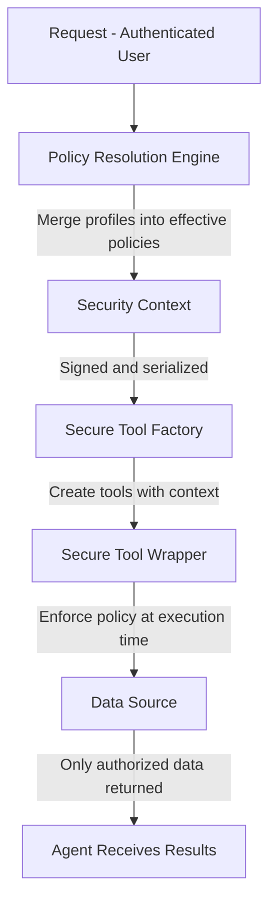

### 1. Security Context

A signed, serializable container that carries the user's complete policy set from the trusted authority to the tool execution environment.

**Responsibilities:**
- Carry user identity (user ID, tenant ID, email, roles)
- Carry all effective policies for accessible data sources
- Provide tamper detection via cryptographic signature (e.g., HMAC-SHA256)
- Enforce time-bound validity (issued-at and expires-at timestamps)

**Properties:**
- Must be serializable (JSON) for cross-process or cross-network transport
- Must be verifiable without access to the issuing authority (signature validation only)
- Must include all policies needed for tool execution -- no database lookups at enforcement time
- Must expire to prevent stale policy enforcement

**Example structure:**

```json
{
  "userId": "uuid",
  "tenantId": "uuid",
  "userEmail": "user@example.com",
  "roles": ["analyst"],
  "policies": [
    { "sourceConnectionId": "uuid", "type": "database", "...": "..." },
    { "sourceConnectionId": "uuid", "type": "api", "...": "..." }
  ],
  "issuedAt": "2026-04-08T12:00:00Z",
  "expiresAt": "2026-04-08T13:00:00Z",
  "integrity": {
    "algorithm": "hmac-sha256",
    "signature": "base64-encoded"
  }
}
```

> **One context governs one data source.** The `policies` array above is the wire
> shape, and the canonical signing projection always normalizes to a one-element
> array. In practice a SecurityContext carries a **single** effective policy: the
> Python and TypeScript SDKs refuse a multi-policy context outright rather than
> silently keeping the first, and the .NET enforcement path reads only the first
> element even though its model holds an array. A deployment spanning several
> sources issues **one context per source**. See
> [`canonical-enforcement-spec.md`](canonical-enforcement-spec.md) §2 rule 3.

### 2. Security Profiles

Reusable, declarative policy definitions that specify what a user can access at the object level.

**Responsibilities:**
- Define access rules for data objects (columns, rows, fields, tags, endpoints)
- Define masking rules for sensitive data
- Define operational limits (max rows, timeouts, similarity thresholds)
- Scope to specific data sources or source patterns
- Support priority ordering when multiple profiles apply

**Properties:**
- Profiles are reusable -- one profile can be assigned to many users
- Profiles are composable -- a user can have multiple profiles for the same data source
- Profiles are category-agnostic in structure but category-specific in which fields are populated
- Profiles are stored in a persistent policy store (database, configuration file, policy service)

**See:** [Policy Definition Schema](../schema/v1.0/policy-definition.schema.json) for the formal specification.

### 3. Policy Resolution Engine

Computes the effective policy for a user-source pair by merging all applicable profiles.

**Responsibilities:**
- Load all active, non-expired profile assignments for the user
- Filter to profiles applicable to the target data source
- Merge multiple profiles using the most-restrictive-wins strategy
- Return a single effective policy per data source

**Merge Rules:**

The merge strategy ensures that the *intersection* of permissions is enforced. If any profile restricts access, the restriction wins.

| Field Type | Merge Strategy | Rationale |
|-----------|---------------|-----------|
| Allowed sets (objects, fields, endpoints, tags, methods) | Intersection | User must be allowed by ALL profiles |
| Hidden/denied sets (objects, fields, endpoints, tags) | Union | ANY profile can hide an object |
| Row filters | AND (all must be satisfied) | Every filter condition applies |
| Masked fields | Most restrictive mask type per field | ranked by disclosure: `null` > `redact` > `full` > `hash` > `partial` |
| Numeric limits (maxResults, maxObjectSize) | Minimum value | Most restrictive limit wins |
| Similarity thresholds (minSimilarityScore) | Maximum value | Higher threshold = more restrictive |
| Boolean permissions (canQuery, canInsert, canUpdate, canDelete) | AND | ALL profiles must allow |
| Read-only flag | OR | ANY profile can enforce read-only |

**Mask type restrictiveness order (most to least).** Ranked by how much of the
original value is disclosed, so the mask that reveals least wins a merge:

1. `null` -- value replaced with null; neither the value nor its length survives
2. `redact` -- value replaced with the fixed literal `[REDACTED]`
3. `full` -- every character replaced (e.g., `*****`); discloses the length
4. `hash` -- irreversible digest, but stable and therefore joinable
5. `partial` -- discloses real characters of the original (e.g., `joh*****`)

Merging `ssn: null` with `ssn: partial` therefore yields `null`. An earlier
release ranked these in the opposite direction, so the merge returned `partial`
and disclosed SSN digits a policy had demanded be erased entirely.

#### Worked example: three assignments, one signed context

A user reaches a source through several routes at once — a baseline attached to a role, a
team policy attached to a group, a personal grant attached to the user. **All of them
apply.** Resolution merges them into one effective policy *before* a context is built, which
is why a `SecurityContext` carries exactly one policy: it holds the resolved answer, not the
inputs.

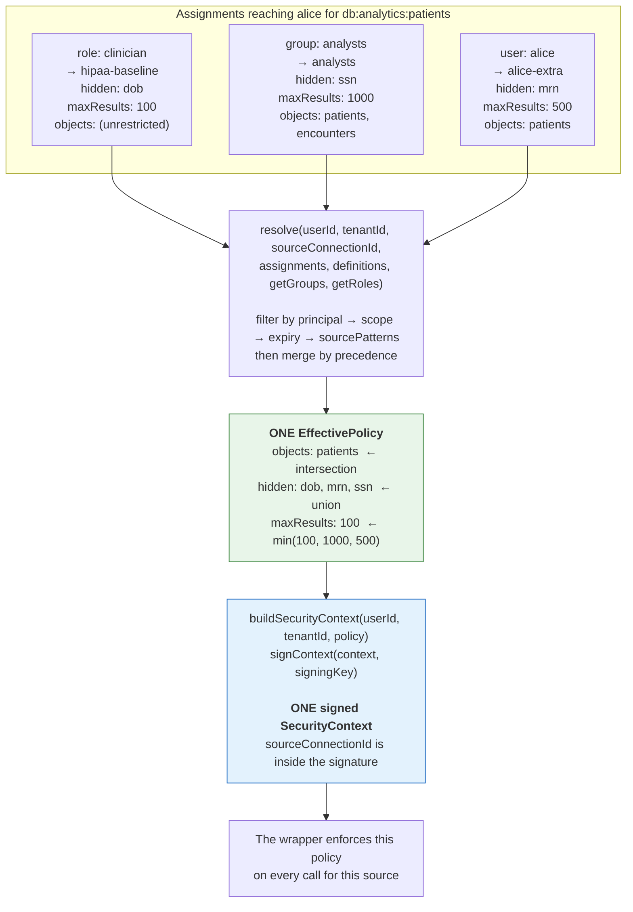

Note each merge direction in the result, because they differ:

- **`objects` narrowed to `patients`** — the intersection. `hipaa-baseline` set no
  `allowedObjects` at all, which means "unrestricted *from that policy*" and cannot widen the
  others. `analysts` allowed `patients, encounters`; `alice-extra` allowed only `patients`. A
  user must be permitted by **every** applicable policy.
- **`hidden` grew to all three fields** — the union. Any one policy can hide a field, and no
  other policy can un-hide it. This is the direction that makes adding a policy safe.
- **`maxResults` fell to 100** — the minimum. The personal grant's `500` and the team's `1000`
  cannot raise the role baseline's `100`.

**A new assignment can only ever restrict.** That is the property to hold onto: granting
someone an extra policy never widens their access, so there is no ordering in which
assignments must be applied to stay safe, and an administrator cannot accidentally escalate
by adding one.

Two consequences worth stating:

- **One context per source, not per user.** A user querying two sources resolves and signs
  twice. `sourceConnectionId` is covered by the signature precisely so a context resolved for
  `db:analytics:patients` cannot be replayed against `db:finance:payroll`.
- **The builders reject more than one policy.** .NET throws `ArgumentException` and Python
  raises `ValueError`; TypeScript's signature takes a single policy. Two policies in one
  context would be ambiguous about which governs a call, and that ambiguity is worth refusing
  rather than resolving by convention.

### 4. Secure Tool Wrappers

The enforcement layer. Each Secure Tool Wrapper wraps a data source and enforces the resolved effective policy at execution time.

**Responsibilities:**

**Before data access:**
- Validate the user has permission (e.g., `canQuery = true`)
- Validate the requested objects/endpoints are in the allowed set
- Validate the requested objects/endpoints are not in the hidden set
- For databases: validate the query does not reference hidden columns
- Apply row filters to the returned rows (post-fetch; TOLAP does not rewrite the query)
- For APIs: validate the HTTP method is in the allowed set
- For APIs: validate the endpoint matches an allowed endpoint pattern
- Apply result limits (max rows, max results)

**After data access:**
- For databases: apply column masking rules to result rows
- For APIs: apply response field masking rules
- For knowledge bases: filter results by allowed/denied tags
- For knowledge bases: filter results below similarity threshold
- For storage: filter objects by allowed/denied prefixes

**Exposure control:**
- Schema introspection methods (list tables, describe columns) only return accessible objects
- Endpoint listing methods only return accessible endpoints
- The agent sees a view of the data source that reflects only what the user can access

**Key design principle:** The wrapper is the *only* path to the data source. There is no way for the agent to query the underlying source directly. This is what makes TOLAP enforcement non-bypassable.

### 5. Secure Tool Factory

Creates a Secure Tool Wrapper of the correct type for a signed Security Context.

**Responsibilities:**
- Accept a signed Security Context and validate its signature and expiry
- Refuse to produce a tool at all when the context is unusable, or when `canQuery` is false
- Determine the source's **category** from the `category` segment of its signed
  `sourceConnectionId` (connector-spec §1)
- Instantiate the Secure Tool Wrapper that enforces that category
- Return the ready-to-use tool

**Properties:**
- The factory is the composition root for secure tools — agents receive tools from the
  factory, never constructing them directly. That is what makes §4's "the wrapper is the
  only path" structural rather than a convention everyone has to remember.
- **One context governs one data source** (§1), so the factory returns one tool per
  context. A caller holding contexts for several sources calls it per context.
- **Dispatch reads the signed category.** Taking it from unsigned configuration instead
  would let a flipped `db` → `api` select the wrapper that enforces the *other*
  category's rules — and `endpointRules` do not constrain a SQL query. Inside the signed
  bytes, changing it invalidates the signature.

**Deliberately out of scope — and why:**

| Not the factory's job | Reason |
| --- | --- |
| Resolving credentials | The SDK never holds a connection: the record-shaped wrapper hands back rewritten SQL for the caller to execute, and the HTTP wrapper is given its client by the caller. Nothing on the enforcement path takes a secret as input, so accepting one would add secret-handling surface for no enforcement benefit. Same reasoning as §9's removal of `maxQueryTimeSeconds`: the SDK cannot enforce what it does not own. |
| Pinning connection configuration | A deployment concern. The factory takes the transport it needs as an argument and opens nothing itself. |
| Holding the user's Security Context | Wrappers are **stateless** and take the context per call. A context stored on a shared wrapper can outlive the request that supplied it and be reused for the next caller, who may be a different user. |

> **Note on earlier drafts.** This section previously described a factory that resolved
> credentials, iterated a multi-source `policies` array, and injected the context into a
> wrapper via `setSecurityContext()`. No SDK implements that shape, and the last of those
> is the statefulness hazard above. The implementation guides' Step 5 has been corrected
> to match what ships.

## Data Flow

### Full Request Lifecycle

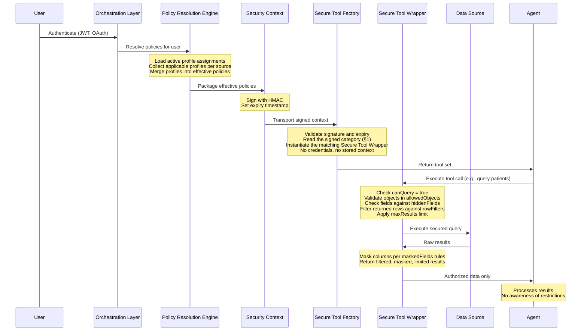

### Cross-Boundary Transport

When the tool execution environment is separate from the policy authority (e.g., a worker service in a different account or process), the Security Context must be transported securely:

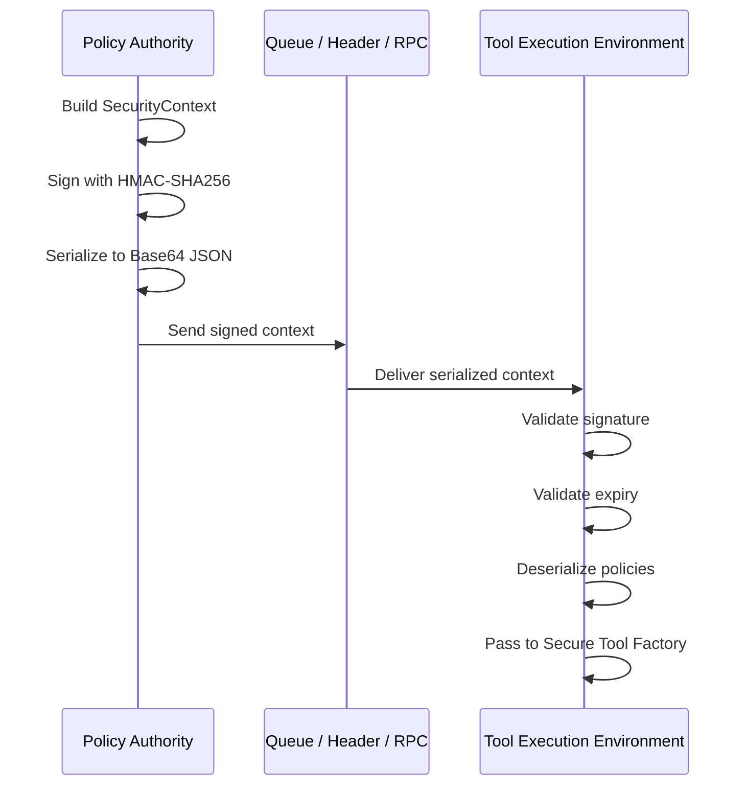

**Requirements for cross-boundary transport:**
- Signature key must be shared between authority and executor (symmetric) or use asymmetric signing
- Context must be encrypted in transit if crossing network boundaries
- Context expiry must be short enough to limit replay window
- Executor must reject contexts with invalid signatures or expired timestamps

## Security Properties

### What TOLAP Guarantees

1. **No unauthorized data exposure** -- The agent cannot receive data the user is not authorized to see, because the tool physically does not return it.
2. **No policy bypass** -- The Secure Tool Wrapper is the only path to the data source. There is no alternate route.
3. **Tamper-proof context** -- The Security Context is cryptographically signed. Modification is detectable.
4. **Time-bounded access** -- Security Context expiry prevents indefinite access from a single policy resolution.
5. **Audit trail** -- Policy assignments record who granted access, when, and why.

### What TOLAP Does Not Guarantee

1. **Correctness of policies** -- TOLAP enforces whatever policies are defined. If a policy is overly permissive, TOLAP will faithfully enforce that permissiveness.
2. **Data-at-rest security** -- TOLAP governs access through tools, not storage encryption or physical security.
3. **Network security** -- TOLAP does not replace TLS, VPNs, or network segmentation.
4. **Authentication** -- TOLAP assumes the user is already authenticated. It does not verify identity.

## Deployment Patterns: Centralized Policy Store

The SDK ships with an in-memory policy store for local development and single-process deployments. In production, policies are typically managed in a centralized store -- a database, a dedicated policy service, or a distributed cache -- shared across all services that enforce TOLAP.

> **This section described a design; it is now implemented.** [`server/`](../server/)
> is a policy server built to this shape -- PostgreSQL store, the `/resolve`
> endpoint from the API table below, schema validation, versioning with rollback,
> an audit trail, and a UI in [`console/`](../console/). See
> [`policy-server.md`](policy-server.md) for deployment, and read this section for
> the reasoning behind it or to build your own.
>
> One correction the implementation forced: the "Policy Service API" section below
> says the service "signs the effective policy before returning it." That is right
> as far as it goes, but the three SDKs do not verify the same artifact -- Python and
> .NET check the `SecurityContext` envelope and read `issuedAt`, while the
> TypeScript wrapper verifies a **bare** `EffectivePolicy` via `validatePolicy` and
> reads `resolvedAt`. Those are HMACs over two different byte strings. A server that
> signs only one of them works with one SDK and silently fails the others. The
> implementation returns both signatures in one artifact, which is sound because the
> envelope projection strips `integrity` before hashing (canonical spec §2 rule 1),
> plus both spellings of the same instant.

### Why Centralize

In any multi-service environment, each Secure Tool Factory needs access to the same policy definitions and assignments. Without a centralized store:

- Policy changes require redeploying every service
- Different services can enforce stale or conflicting policies
- Audit trails are scattered across configuration files
- Assignment expiry and revocation require manual coordination

A centralized store solves all of these by providing a single source of truth that every Policy Resolution Engine reads from.

### Architecture

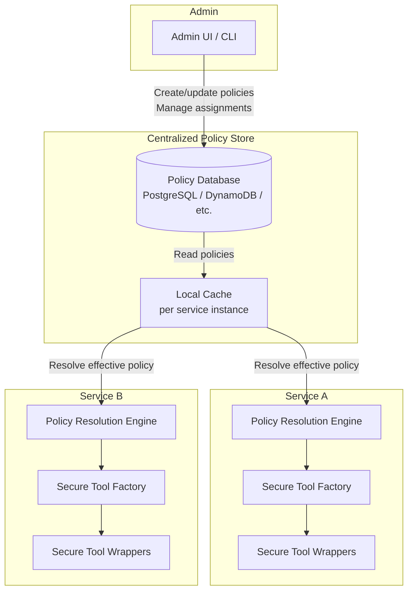

Every service instance reads from the same policy database. The admin UI writes policy definitions and assignments to the store. Changes propagate to all services on the next resolution cycle (or immediately via cache invalidation).

### Implementing a Custom Policy Store

The SDK defines a `IPolicyStore` interface (C#), `PolicyStore` protocol (Python), or `PolicyStore` interface (TypeScript) with these operations:

| Operation | Description |
|-----------|-------------|
| `createPolicy` | Persist a new policy definition |
| `getPolicy` | Retrieve a policy by name |
| `listPolicies` | List all policy definitions |
| `updatePolicy` | Update an existing policy definition |
| `deletePolicy` | Remove a policy definition |
| `assignPolicy` | Create a policy-to-user/group assignment |
| `listAssignments` | List assignments for a user, group, or policy |
| `revokeAssignment` | Remove a policy assignment |
| `resolveEffectivePolicy` | Merge all applicable policies for a user-source pair |

To centralize, implement this interface against your chosen backend. The in-memory store in the SDK serves as a reference implementation.

### Database-Backed Store (PostgreSQL)

A PostgreSQL-backed store uses two core tables:

```sql
CREATE TABLE tolap_policies (
    name            TEXT PRIMARY KEY,
    version         TEXT NOT NULL DEFAULT '1.0',
    description     TEXT,
    priority        INTEGER NOT NULL DEFAULT 0,
    policy_json     JSONB NOT NULL,
    created_at      TIMESTAMPTZ NOT NULL DEFAULT now(),
    updated_at      TIMESTAMPTZ NOT NULL DEFAULT now()
);

CREATE TABLE tolap_assignments (
    id              UUID PRIMARY KEY DEFAULT gen_random_uuid(),
    policy_name     TEXT NOT NULL REFERENCES tolap_policies(name),
    assignee_type   TEXT NOT NULL,          -- 'user', 'group', 'role', 'serviceAccount'
    assignee_id     TEXT NOT NULL,
    tenant_id       TEXT,
    data_source_id  TEXT,
    active          BOOLEAN NOT NULL DEFAULT true,
    expires_at      TIMESTAMPTZ,
    granted_by      TEXT NOT NULL,
    granted_at      TIMESTAMPTZ NOT NULL DEFAULT now(),
    reason          TEXT,
    UNIQUE (policy_name, assignee_type, assignee_id, tenant_id, data_source_id)
);

CREATE INDEX idx_assignments_lookup
    ON tolap_assignments (assignee_id, tenant_id, active)
    WHERE active = true;
```

The `policy_json` column stores the full policy definition as JSONB, enabling PostgreSQL's native JSON querying for policy introspection and reporting.

#### .NET Implementation

```csharp
using Npgsql;
using Tolap.Store;

public class PostgresPolicyStore : IPolicyStore
{
    private readonly NpgsqlDataSource _db;

    public PostgresPolicyStore(string connectionString)
    {
        _db = NpgsqlDataSource.Create(connectionString);
    }

    public async Task CreatePolicyAsync(PolicyDefinition policy, CancellationToken ct = default)
    {
        const string sql = """
            INSERT INTO tolap_policies (name, version, description, priority, policy_json)
            VALUES (@name, @version, @description, @priority, @json::jsonb)
            """;

        await using var cmd = _db.CreateCommand(sql);
        cmd.Parameters.AddWithValue("name", policy.Name);
        cmd.Parameters.AddWithValue("version", policy.Version);
        cmd.Parameters.AddWithValue("description", policy.Description ?? (object)DBNull.Value);
        cmd.Parameters.AddWithValue("priority", policy.Priority);
        cmd.Parameters.AddWithValue("json", Serialize(policy));
        await cmd.ExecuteNonQueryAsync(ct);
    }

    public async Task<PolicyDefinition?> GetPolicyAsync(string name, CancellationToken ct = default)
    {
        const string sql = "SELECT policy_json FROM tolap_policies WHERE name = @name";
        await using var cmd = _db.CreateCommand(sql);
        cmd.Parameters.AddWithValue("name", name);
        var json = (string?)await cmd.ExecuteScalarAsync(ct);
        return json is null ? null : Deserialize<PolicyDefinition>(json);
    }

    public async Task AssignPolicyAsync(PolicyAssignment assignment, CancellationToken ct = default)
    {
        const string sql = """
            INSERT INTO tolap_assignments
                (policy_name, assignee_type, assignee_id, tenant_id, data_source_id,
                 active, expires_at, granted_by, reason)
            VALUES
                (@policy, @type, @id, @tenant, @ds,
                 @active, @expires, @grantedBy, @reason)
            """;

        await using var cmd = _db.CreateCommand(sql);
        cmd.Parameters.AddWithValue("policy", assignment.PolicyName);
        cmd.Parameters.AddWithValue("type", assignment.Assignee.Type);
        cmd.Parameters.AddWithValue("id", assignment.Assignee.Identifier);
        cmd.Parameters.AddWithValue("tenant", assignment.Scope?.TenantId ?? (object)DBNull.Value);
        cmd.Parameters.AddWithValue("ds", assignment.Scope?.DataSourceId ?? (object)DBNull.Value);
        cmd.Parameters.AddWithValue("active", assignment.Active);
        cmd.Parameters.AddWithValue("expires", assignment.ExpiresAt ?? (object)DBNull.Value);
        cmd.Parameters.AddWithValue("grantedBy", assignment.Audit.GrantedBy);
        cmd.Parameters.AddWithValue("reason", assignment.Audit.Reason ?? (object)DBNull.Value);
        await cmd.ExecuteNonQueryAsync(ct);
    }

    public async Task<EffectivePolicy> ResolveEffectivePolicyAsync(
        string userId, string tenantId, string dataSourceId, CancellationToken ct = default)
    {
        // 1. Load all active, non-expired assignments for this user and tenant
        const string sql = """
            SELECT p.policy_json
            FROM tolap_assignments a
            JOIN tolap_policies p ON a.policy_name = p.name
            WHERE a.assignee_id = @userId
              AND (a.tenant_id IS NULL OR a.tenant_id = @tenantId)
              AND (a.data_source_id IS NULL OR a.data_source_id = @dsId)
              AND a.active = true
              AND (a.expires_at IS NULL OR a.expires_at > now())
            ORDER BY p.priority DESC
            """;

        var policies = new List<PolicyDefinition>();
        await using var cmd = _db.CreateCommand(sql);
        cmd.Parameters.AddWithValue("userId", userId);
        cmd.Parameters.AddWithValue("tenantId", tenantId);
        cmd.Parameters.AddWithValue("dsId", dataSourceId);

        await using var reader = await cmd.ExecuteReaderAsync(ct);
        while (await reader.ReadAsync(ct))
        {
            policies.Add(Deserialize<PolicyDefinition>(reader.GetString(0)));
        }

        // 2. Merge using the SDK's PolicyMerger
        return PolicyMerger.Merge(policies);
    }

    // ... Serialize/Deserialize helpers using System.Text.Json
}
```

#### Python Implementation

```python
import asyncpg
from tolap_core import PolicyDefinition, merge
from tolap_store import PolicyStore

class PostgresPolicyStore(PolicyStore):
    def __init__(self, pool: asyncpg.Pool):
        self._pool = pool

    async def create_policy(self, policy: PolicyDefinition) -> None:
        await self._pool.execute(
            """INSERT INTO tolap_policies (name, version, description, priority, policy_json)
               VALUES ($1, $2, $3, $4, $5::jsonb)""",
            policy.name, policy.version, policy.description,
            policy.priority, policy.to_json(),
        )

    async def get_policy(self, name: str) -> PolicyDefinition | None:
        row = await self._pool.fetchrow(
            "SELECT policy_json FROM tolap_policies WHERE name = $1", name
        )
        return PolicyDefinition.from_json(row["policy_json"]) if row else None

    async def assign_policy(self, assignment) -> None:
        await self._pool.execute(
            """INSERT INTO tolap_assignments
                   (policy_name, assignee_type, assignee_id, tenant_id,
                    data_source_id, active, expires_at, granted_by, reason)
               VALUES ($1, $2, $3, $4, $5, $6, $7, $8, $9)""",
            assignment.policy_name, assignment.assignee.type,
            assignment.assignee.identifier, assignment.scope.tenant_id,
            assignment.scope.data_source_id, assignment.active,
            assignment.expires_at, assignment.audit.granted_by,
            assignment.audit.reason,
        )

    async def resolve_effective_policy(
        self, user_id: str, tenant_id: str, data_source_id: str
    ) -> EffectivePolicy:
        rows = await self._pool.fetch(
            """SELECT p.policy_json
               FROM tolap_assignments a
               JOIN tolap_policies p ON a.policy_name = p.name
               WHERE a.assignee_id = $1
                 AND (a.tenant_id IS NULL OR a.tenant_id = $2)
                 AND (a.data_source_id IS NULL OR a.data_source_id = $3)
                 AND a.active = true
                 AND (a.expires_at IS NULL OR a.expires_at > now())
               ORDER BY p.priority DESC""",
            user_id, tenant_id, data_source_id,
        )
        policies = [PolicyDefinition.from_json(r["policy_json"]) for r in rows]
        return merge(policies)
```

#### TypeScript Implementation

```typescript
import { Pool } from "pg";
import { merge, type PolicyDefinition } from "@tolap/core";
import { PolicyStore } from "@tolap/store";

export class PostgresPolicyStore implements PolicyStore {
  constructor(private pool: Pool) {}

  async createPolicy(policy: PolicyDefinition): Promise<void> {
    await this.pool.query(
      `INSERT INTO tolap_policies (name, version, description, priority, policy_json)
       VALUES ($1, $2, $3, $4, $5::jsonb)`,
      [policy.name, policy.version, policy.description,
       policy.priority, JSON.stringify(policy)]
    );
  }

  async getPolicy(name: string): Promise<PolicyDefinition | null> {
    const { rows } = await this.pool.query(
      "SELECT policy_json FROM tolap_policies WHERE name = $1", [name]
    );
    return rows.length ? rows[0].policy_json as PolicyDefinition : null;
  }

  async assignPolicy(assignment: PolicyAssignment): Promise<void> {
    await this.pool.query(
      `INSERT INTO tolap_assignments
           (policy_name, assignee_type, assignee_id, tenant_id,
            data_source_id, active, expires_at, granted_by, reason)
       VALUES ($1, $2, $3, $4, $5, $6, $7, $8, $9)`,
      [assignment.policyName, assignment.assignee.type,
       assignment.assignee.identifier, assignment.scope?.tenantId,
       assignment.scope?.dataSourceId, assignment.active,
       assignment.expiresAt, assignment.audit.grantedBy,
       assignment.audit.reason]
    );
  }

  async resolveEffectivePolicy(
    userId: string, tenantId: string, dataSourceId: string
  ): Promise<EffectivePolicy> {
    const { rows } = await this.pool.query(
      `SELECT p.policy_json
       FROM tolap_assignments a
       JOIN tolap_policies p ON a.policy_name = p.name
       WHERE a.assignee_id = $1
         AND (a.tenant_id IS NULL OR a.tenant_id = $2)
         AND (a.data_source_id IS NULL OR a.data_source_id = $3)
         AND a.active = true
         AND (a.expires_at IS NULL OR a.expires_at > now())
       ORDER BY p.priority DESC`,
      [userId, tenantId, dataSourceId]
    );
    const policies = rows.map(r => r.policy_json as PolicyDefinition);
    return merge(policies);
  }
}
```

### DynamoDB-Backed Store

For serverless and AWS-native deployments, DynamoDB is a natural fit. Use two tables:

| Table | Partition Key | Sort Key | Purpose |
|-------|--------------|----------|---------|
| `tolap-policies` | `name` (S) | -- | Policy definitions |
| `tolap-assignments` | `assignee_id` (S) | `policy_name#tenant_id#data_source_id` (S) | Assignments with composite sort key for efficient lookup |

The composite sort key on assignments enables a single `Query` to retrieve all of a user's active assignments, which the SDK's merge step then reduces to an effective policy (`PolicyMerger.Merge` in .NET, `merge` in Python and TypeScript).

A GSI on `policy_name` enables listing all assignments for a given policy (useful for audit and revocation).

### Caching Strategies

Policy resolution involves database reads on every request. In high-throughput environments, add a caching layer between the store and the resolution engine:

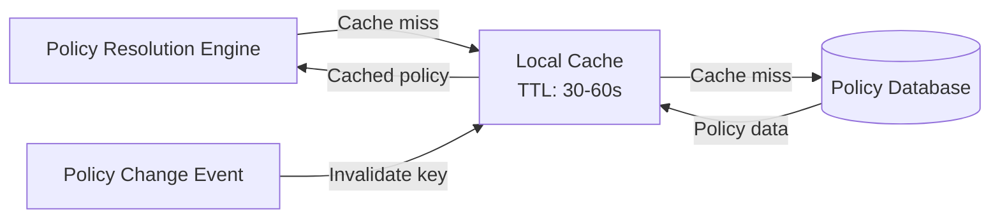

**Recommended patterns:**

| Pattern | When to use | Trade-off |
|---------|-------------|-----------|
| **TTL-based** (30-60s) | Most deployments | Simple. Policy changes take up to TTL to propagate. |
| **Event-driven invalidation** | When policy changes must propagate immediately | Requires pub/sub (Redis, SNS, EventBridge). Zero staleness. |
| **Read-through with write-behind** | High-read, low-write workloads | Cache handles reads; writes go to store asynchronously. |

**Cache key format:** `tolap:effective:{userId}:{tenantId}:{dataSourceId}`

**Invalidation triggers:**
- Policy definition updated or deleted
- Assignment created, revoked, or expired
- Group membership changed (if using group-based assignments)

### Policy Service API

For larger organizations, wrap the centralized store behind a dedicated policy service. This decouples policy management from enforcement services entirely:

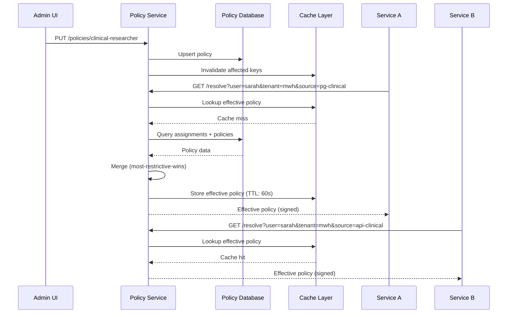

The policy service signs the effective policy before returning it, so enforcement services can validate integrity without trusting the transport layer.

**Suggested endpoints:**

| Method | Path | Description |
|--------|------|-------------|
| `POST` | `/policies` | Create a policy definition |
| `GET` | `/policies/{name}` | Retrieve a policy definition |
| `PUT` | `/policies/{name}` | Update a policy definition |
| `DELETE` | `/policies/{name}` | Delete a policy definition |
| `POST` | `/assignments` | Create a policy assignment |
| `DELETE` | `/assignments/{id}` | Revoke an assignment |
| `GET` | `/assignments?user={id}&tenant={id}` | List assignments |
| `GET` | `/resolve?user={id}&tenant={id}&source={id}` | Resolve effective policy |

---

## Worked Example: Database + API in One Policy

This example walks through a concrete scenario where a single user has TOLAP policies covering both a PostgreSQL database and a REST API. It shows every component in action, from policy definition through to the filtered results the agent receives.

### Scenario

A healthcare analytics platform has two data sources:

1. **PostgreSQL database** (`db:production:clinical`) -- Contains patient records, encounters, diagnoses, and billing tables
2. **REST API** (`api:internal:clinical-api`) -- An internal service that exposes patient demographics, lab results, and administrative endpoints

**Dr. Sarah Chen** is a clinical researcher. She needs to query patient encounters and lab results for a study, but must not see raw PII, billing data, or administrative endpoints.

### Step 1: Define the Policy

The administrator creates a single policy definition that covers both source types. Because TOLAP uses a universal schema, the same policy document contains database rules and API rules side by side.

```json
{
  "$schema": "https://tolap.dev/schema/v1.0/policy-definition.schema.json",
  "version": "1.0",
  "name": "clinical-researcher",
  "description": "Clinical researchers can query patient encounters and lab results. PII is masked. Billing and admin access is denied.",
  "priority": 10,
  "appliesToAll": false,
  "sourcePatterns": ["db:production:clinical", "api:internal:clinical-api"],

  "permissions": {
    "canQuery": true,
    "readOnly": true
  },

  "objectRules": {
    "allowedObjects": [
      "patients", "encounters", "diagnoses",
      "/api/v1/patients", "/api/v1/patients/*",
      "/api/v1/lab-results", "/api/v1/lab-results/*"
    ],
    "hiddenObjects": [
      "billing", "billing_codes", "admin_audit",
      "/api/v1/admin/*", "/api/v1/billing/*"
    ],

    "fieldRules": {
      "allowedFields": [
        "patients.patient_id", "patients.age_group", "patients.gender",
        "patients.region", "patients.enrollment_date",
        "encounters.*",
        "diagnoses.*"
      ],
      "hiddenFields": [
        "patients.ssn", "patients.date_of_birth",
        "patients.street_address", "patients.phone",
        "ssn", "date_of_birth", "home_address", "phone_number"
      ],
      "maskedFields": [
        {
          "field": "patients.full_name",
          "maskType": "partial",
          "parameters": { "showFirst": 1, "showLast": 0, "maskChar": "*" }
        },
        {
          "field": "patients.email",
          "maskType": "hash",
          "parameters": { "algorithm": "sha256" }
        },
        {
          "field": "full_name",
          "maskType": "partial",
          "parameters": { "showFirst": 1, "showLast": 0, "maskChar": "*" }
        },
        {
          "field": "email",
          "maskType": "hash",
          "parameters": { "algorithm": "sha256" }
        }
      ]
    },

    "rowFilters": [
      {
        "field": "region",
        "operator": "in",
        "values": ["us-east", "us-west"]
      },
      {
        "field": "status",
        "operator": "notEquals",
        "value": "deleted"
      }
    ],

    "endpointRules": {
      "allowedEndpoints": [
        "/api/v1/patients",
        "/api/v1/patients/*",
        "/api/v1/lab-results",
        "/api/v1/lab-results/*"
      ],
      "hiddenEndpoints": [
        "/api/v1/admin/*",
        "/api/v1/billing/*",
        "/api/v1/audit/*"
      ],
      "allowedMethods": ["GET", "HEAD", "OPTIONS"]
    }
  },

  "limits": {
    "maxResults": 5000
  }
}
```

Note how database-specific rules (`rowFilters`, column-scoped `allowedFields`) and API-specific rules (`endpointRules`, `allowedMethods`) coexist in the same policy. Each Secure Tool Wrapper uses the fields relevant to its source type and ignores the rest.

### Step 2: Assign the Policy

The administrator assigns this policy to Dr. Chen, scoped to her tenant:

```json
{
  "$schema": "https://tolap.dev/schema/v1.0/policy-assignment.schema.json",
  "version": "1.0",
  "policyName": "clinical-researcher",
  "assignee": {
    "type": "user",
    "identifier": "a1b2c3d4-e5f6-7890-abcd-ef1234567890"
  },
  "scope": {
    "tenantId": "tenant-midwest-health"
  },
  "active": true,
  "expiresAt": "2026-07-01T00:00:00Z",
  "audit": {
    "grantedBy": "admin-jane-doe",
    "grantedAt": "2026-04-08T09:00:00Z",
    "reason": "Q2 clinical outcomes study -- approved by IRB #2026-0142"
  }
}
```

### Step 3: Policy Resolution and Security Context

When Dr. Chen's agent makes a request, the Policy Resolution Engine builds an effective policy for each source. Since she has one policy that matches both sources, the effective policies mirror the definition. If she had additional overlapping policies, the merge rules would produce the most-restrictive intersection.

Each source gets its **own** context. Both are shown together below so the two
resolved policies can be compared side by side, but they are issued and signed
separately — a context carries one policy, and the agent holds one per source:

```json
{
  "userId": "a1b2c3d4-e5f6-7890-abcd-ef1234567890",
  "tenantId": "tenant-midwest-health",
  "userEmail": "s.chen@midwesthealth.org",
  "resolvedAt": "2026-04-08T14:00:00Z",
  "expiresAt": "2026-04-08T15:00:00Z",
  "policies": [
    {
      "sourceConnectionId": "conn-pg-clinical",
      "sourceProfiles": ["clinical-researcher"],
      "permissions": { "canQuery": true, "readOnly": true },
      "objectRules": {
        "allowedObjects": ["patients", "encounters", "diagnoses"],
        "hiddenObjects": ["billing", "billing_codes", "admin_audit"],
        "fieldRules": {
          "allowedFields": [
            "patients.patient_id", "patients.age_group", "patients.gender",
            "patients.region", "patients.enrollment_date",
            "encounters.*",
            "diagnoses.*"
          ],
          "hiddenFields": [
            "patients.ssn", "patients.date_of_birth",
            "patients.street_address", "patients.phone"
          ],
          "maskedFields": [
            {
              "field": "patients.full_name",
              "maskType": "partial",
              "parameters": { "showFirst": 1, "showLast": 0, "maskChar": "*" }
            },
            {
              "field": "patients.email",
              "maskType": "hash",
              "parameters": { "algorithm": "sha256" }
            }
          ],
          "readOnlyFields": []
        },
        "rowFilters": [
          {
            "field": "region",
            "operator": "in",
            "values": ["us-east", "us-west"]
          },
          {
            "field": "status",
            "operator": "notEquals",
            "value": "deleted"
          }
        ]
      },
      "limits": { "maxResults": 5000 }
    },
    {
      "sourceConnectionId": "conn-api-clinical",
      "sourceProfiles": ["clinical-researcher"],
      "permissions": { "canQuery": true, "readOnly": true },
      "objectRules": {
        "allowedObjects": [
          "/api/v1/patients", "/api/v1/patients/*",
          "/api/v1/lab-results", "/api/v1/lab-results/*"
        ],
        "hiddenObjects": [
          "/api/v1/admin/*", "/api/v1/billing/*", "/api/v1/audit/*"
        ],
        "fieldRules": {
          "hiddenFields": [
            "date_of_birth", "home_address", "phone_number", "ssn"
          ],
          "maskedFields": [
            {
              "field": "full_name",
              "maskType": "partial",
              "parameters": { "showFirst": 1, "showLast": 0, "maskChar": "*" }
            },
            {
              "field": "email",
              "maskType": "hash",
              "parameters": { "algorithm": "sha256" }
            }
          ]
        },
        "endpointRules": {
          "allowedEndpoints": [
            "/api/v1/patients", "/api/v1/patients/*",
            "/api/v1/lab-results", "/api/v1/lab-results/*"
          ],
          "hiddenEndpoints": [
            "/api/v1/admin/*", "/api/v1/billing/*", "/api/v1/audit/*"
          ],
          "allowedMethods": ["GET", "HEAD", "OPTIONS"]
        }
      },
      "limits": { "maxResults": 5000 }
    }
  ],
  "integrity": {
    "algorithm": "hmac-sha256",
    "signature": "kX9vL2mN7pQ3rT5uW8xZ1aC4eG6iK9mO2qS4vX7zA0bD3fH5jL8nP1sU3wY6="
  }
}
```

### Step 4: The Agent Interacts with Both Sources

The Secure Tool Factory creates two wrappers from the Security Context: one for the PostgreSQL database and one for the REST API. The agent receives both tools without knowing they are security-enforced.

#### Database interaction

The agent asks: *"How many encounters per diagnosis code were there in Q1 2026?"*

The agent constructs a SQL query:

```sql
SELECT diagnosis_code, COUNT(*) as encounter_count
FROM encounters
JOIN patients ON encounters.patient_id = patients.patient_id
WHERE encounter_date BETWEEN '2026-01-01' AND '2026-03-31'
GROUP BY diagnosis_code
ORDER BY encounter_count DESC
```

The Secure Database Wrapper intercepts this query and enforces the policy:

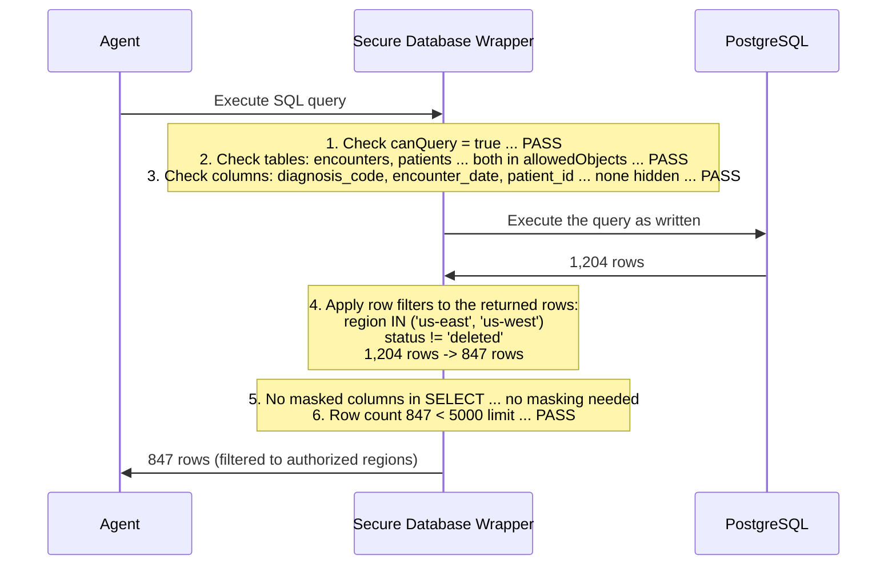

The agent receives 847 rows. It does not know that patients in other regions were excluded, or that deleted records were filtered out. The row filters were applied transparently to the returned rows.

Now suppose the agent tries a different query:

```sql
SELECT full_name, ssn, email FROM patients LIMIT 10
```

The wrapper rejects this before execution:

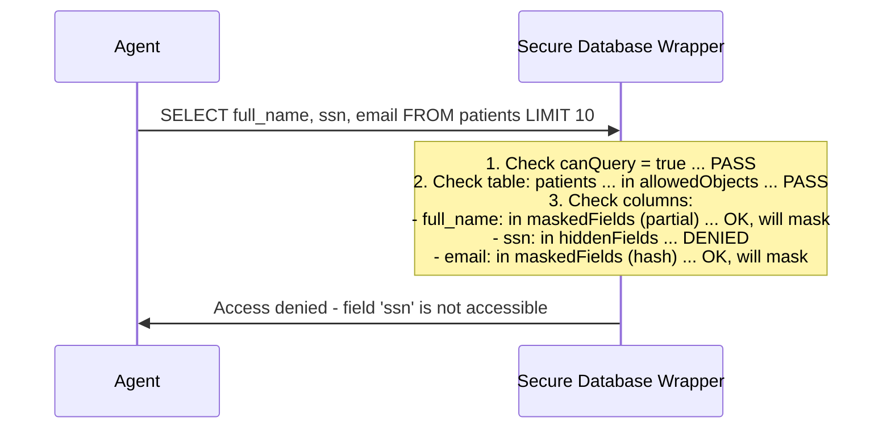

The query is rejected because `ssn` is a hidden field. It does not exist from the agent's perspective. If the agent had omitted `ssn`, the query would succeed but `full_name` would return as `S*****` and `email` as a SHA-256 hash.

#### API interaction

The agent then asks: *"What were the latest lab results for patient P-1234?"*

The agent calls the REST API tool:

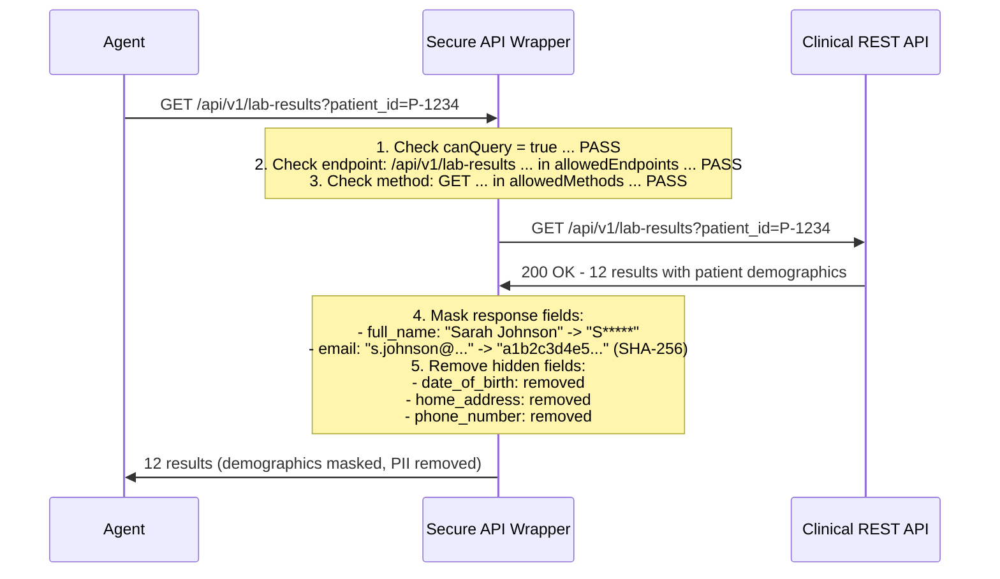

The agent receives lab results with masked patient names, hashed emails, and no date of birth, address, or phone number. It processes the clinical data (test names, values, dates) without restriction.

Now suppose the agent tries to call an admin endpoint:

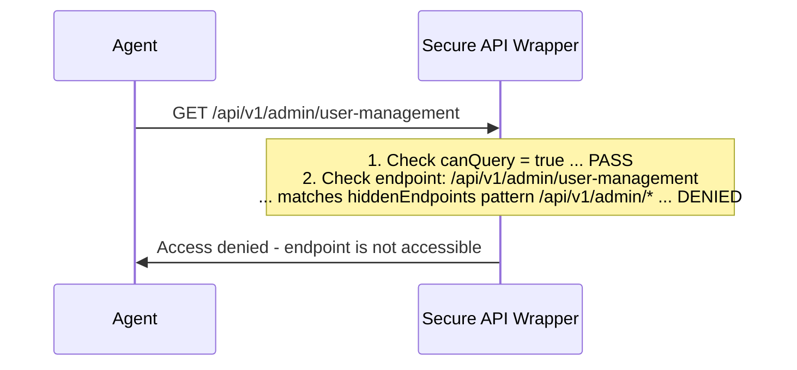

The endpoint does not appear when the agent lists available endpoints. The agent has no way to discover it exists.

### What the Agent Sees

From the agent's perspective, the data sources look like this:

**Database -- available tables:**
- `patients` (columns: patient_id, age_group, gender, region, enrollment_date, full_name*, email*)
- `encounters` (all columns)
- `diagnoses` (all columns)

*\* masked fields -- values returned but transformed*

**API -- available endpoints:**
- `GET /api/v1/patients`
- `GET /api/v1/patients/{id}`
- `GET /api/v1/lab-results`
- `GET /api/v1/lab-results/{id}`

The `billing`, `billing_codes`, and `admin_audit` tables do not exist. The `/api/v1/admin/*`, `/api/v1/billing/*`, and `/api/v1/audit/*` endpoints do not exist. The `ssn`, `date_of_birth`, `street_address`, and `phone` columns do not exist. There is nothing to bypass because there is nothing to see.

### End-to-End Flow

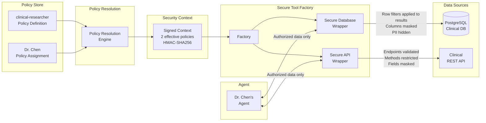

Both data sources are governed by the same policy, enforced independently by their respective wrappers, and presented to the agent as a unified view of only what Dr. Chen is authorized to see.
