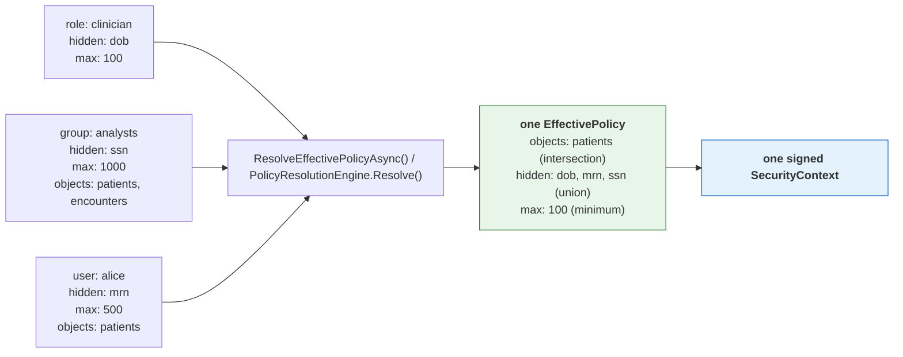

# TOLAP Implementation Guide -- .NET / C#

This guide shows how to enforce TOLAP in a .NET tool layer **using the shipped SDK**. Every
example below compiles against `Tolap.Core`, `Tolap.Store` and `Tolap.Mcp` as published in
[`../sdk/dotnet/`](../sdk/dotnet/).

> **What changed, and why it matters.** An earlier version of this guide walked through
> hand-writing the policy model, the resolution engine, the merge algorithm and the context
> signer — roughly 660 lines reimplementing types the SDK already ships, in a *different and
> incompatible shape* (`EffectivePolicy.SourceConnectionId` as a `Guid` rather than a `string`,
> a nested `Integrity` block rather than flat `Signature`/`Algorithm` fields). Worse, its
> signing example used `JsonSerializer.Serialize` with declaration-order output, which is **not**
> the canonical form: signatures produced that way fail verification in every SDK, including
> .NET's own. See [canonical-enforcement-spec.md §1](canonical-enforcement-spec.md).
>
> Reimplementing any of this is not a supported path. The canonical form, the merge precedence
> and the fail-closed rules are the protocol; an independent implementation that differs
> anywhere is a security defect, not a variation.

## Prerequisites

1. **An authenticated user identity.** TOLAP does not authenticate. Your system supplies a
   verified user ID and tenant ID.
2. **A policy store.** Somewhere to persist definitions and assignments. `Tolap.Store` ships
   `InMemoryPolicyStore` for development and `IPolicyStore` for your own backend.
3. **A tool layer.** The tools your agents use (MCP servers, Semantic Kernel plugins, etc.).

```bash
dotnet add package Tolap.Core
dotnet add package Tolap.Store
dotnet add package Tolap.Mcp
```

## What you write, and what the SDK provides

This is the whole division of labour. Anything in the right column that you find yourself
writing by hand is a bug.

| You write | The SDK provides |
| --- | --- |
| Your `IPolicyStore` backend (Postgres, DynamoDB, a policy service) | `InMemoryPolicyStore`, `IPolicyStore`, and resolution over either |
| Identity extraction from your transport | `IRequestIdentityExtractor`, `HeaderIdentityExtractor`, `JwtIdentityExtractor` |
| Group/role lookup for a user | The merge that consumes it (`PolicyMerger.Merge`) |
| The code that actually queries your data source | Every enforcement decision applied to what it returns |
| Tool registration with your agent framework | `SecureToolFactory` and the three wrappers |

The policy model (`EffectivePolicy`, `ObjectRules`, `RowFilter`, `FieldRules`, `TagRules`,
`PolicyLimits`, `MaskType`, `FilterOperator`, …), the resolution engine, the merge algorithm,
canonical serialization, HMAC signing and verification, the enforcement pipeline, the SQL
rewriter and the `kb` filter renderers are all shipped. None of them are yours to write.

## Step 1: Policy storage

Policies use the [Policy Definition Schema](../schema/v1.0/policy-definition.schema.json) and
attach to principals via the [Policy Assignment Schema](../schema/v1.0/policy-assignment.schema.json).
`Tolap.Core` ships the matching types, so a JSON policy deserializes directly.

```csharp
using Tolap.Core;
using Tolap.Store;

// Development: in-memory.
IPolicyStore store = new InMemoryPolicyStore();

await store.CreatePolicyAsync(TolapJsonOptions.Deserialize<PolicyDefinition>(policyJson));
await store.AssignPolicyAsync(TolapJsonOptions.Deserialize<PolicyAssignment>(assignmentJson));
```

For production, implement `IPolicyStore` over your own database. It is the one interface in
this guide you are expected to write, because only you know where your policies live. The
interface covers policy CRUD, assignment CRUD, and resolution
(`ResolveEffectivePolicyAsync`) — implement the storage, not the resolution semantics, which
`Tolap.Core` supplies.

## Step 2: Resolve, build, sign

One call each. There is no merge algorithm for you to write: `PolicyResolutionEngine` applies
the precedence rules in [connector-spec.md §2](connector-spec.md), and
`SecurityContextSigner` produces the canonical form and the HMAC.

```csharp
using Tolap.Core;
using Tolap.Store;

public static async Task<string> IssueContextAsync(IPolicyStore store, string signingKey)
{
    // Resolution: assignments + definitions -> one effective policy for one source.
    var policy = await store.ResolveEffectivePolicyAsync(
        userId: "analyst-001",
        tenantId: "hospital-001",
        sourceConnectionId: "db:analytics:patients",
        getGroups: userId => LookUpGroups(userId),
        getRoles: userId => LookUpRoles(userId));

    // Envelope + HMAC over the canonical form. Do not hand-roll either.
    var context = SecurityContextBuilder.Build("analyst-001", "hospital-001", new[] { policy });
    var signed = SecurityContextSigner.Sign(context, signingKey);

    return SecurityContextSigner.Serialize(signed);
}

public static bool Verify(string serialized, string signingKey)
{
    var context = SecurityContextSigner.Deserialize(serialized, signingKey);
    return SecurityContextSigner.Validate(context, signingKey);
}
```


### Multiple policies: where they merge

A user usually reaches a source through several assignments at once — a role baseline, a group
policy, a personal grant. **All of them apply.** They are merged into one effective policy by
`ResolveEffectivePolicyAsync() / PolicyResolutionEngine.Resolve()`, *before* a context exists, which is why the context carries a single policy: it
holds the resolved answer, not the inputs.



Allow-lists **intersect**, deny-lists **union**, ceilings take the **minimum** — so adding an
assignment can only ever restrict, never widen. An administrator cannot escalate access by
granting one more policy. The full table is in
[architecture.md](architecture.md#3-policy-resolution-engine).

```csharp
// The store does this for you; PolicyResolutionEngine is exposed directly if you assemble
// the inputs.
var effective = PolicyResolutionEngine.Resolve(
    userId: "alice",
    tenantId: "hospital-001",
    sourceConnectionId: "db:analytics:patients",
    assignments: allAssignmentsForAlice,   // role + group + direct: pass them ALL
    definitions: allDefinitions,
    getGroups: userId => new[] { "analysts" },
    getRoles: userId => new[] { "clinician" });
// effective.ObjectRules.FieldRules.HiddenFields is ["dob", "mrn", "ssn"]
```

**One context governs one data source.** A caller needing several sources resolves and signs
per source; `sourceConnectionId` is inside the signature precisely so a context cannot be
replayed against a different source.

**Never serialize a context yourself.** The signature covers a recursively key-sorted,
null-omitted, compact-separator UTF-8 encoding of the whole envelope. `JsonSerializer.Serialize`
emits declaration order, which produces different bytes and therefore a different HMAC — the
signature then fails verification everywhere. `SecurityContextSigner.BuildCanonicalPayload` is
public if you need to see the exact bytes.

## Step 3: Enforce

The SDK never holds a connection. **You** run the query or the API call; the wrapper enforces
the policy on what comes back. That is why nothing here takes a credential.

```csharp
using Tolap.Core;

// The post-execution pipeline: row filters, tag filters, the relevance floor, the size
// ceiling, hidden fields, allowed-field projection, masking, then the result limit — in that
// order, which is normative (canonical-enforcement-spec.md §4).
var enforced = EnforcementEngine.ApplyResultPipeline(rowsYouFetched, policy);
```

For `db` sources, push what can be pushed into the SQL, then run the pipeline anyway:

```csharp
using Tolap.Core;

public static (bool Allowed, string Sql) Prepare(string sql, EffectivePolicy policy)
{
    // The object check comes first and is separate: a rewrite cannot express "this table is
    // not yours".
    var decision = EnforcementEngine.ValidateAccess("patients", policy);
    if (!decision.Allowed)
        return (false, sql);

    var rewriter = new SqlQueryRewriter(dialect: SqlDialect.Postgres);
    return (true, rewriter.RewriteQuery(sql, policy));
}
```

The rewrite is an **optimization**, never a replacement. It deliberately does not expand
`SELECT *`, because doing so would require knowing the table's real columns — which needs a
connection the SDK does not have. So hidden fields still arrive from the database and the
pipeline removes them. Omitting the pipeline because "the SQL already filters" is a
disclosure bug.

For `kb` sources, render a provider-native metadata filter so denied chunks are never
retrieved — again as an optimization over the normative post pass:

```csharp
using Tolap.Core;

var filter = KbProviders.Render(
    KbFilter.Build(policy, new[] { "classification" }),
    KbProvider.Bedrock);

if (filter.DeniesEverything)
{
    // Skip retrieval entirely. An absent filter must never be read as "unrestricted".
}
```

Check `filter.Confidence`: `Verified` means the shape has been exercised against the live
service, `FromGrammar` means it was written from published documentation and no service has
accepted one. Treat `FromGrammar` as unproven — promoting two renderers out of that state
exposed one fail-open each.

## Step 4: Use the Secure Tool Factory

The SDK ships the factory: `SecureToolFactory` in `Tolap.Mcp`. It is the composition root
for enforced tools — an agent receives its tools from it and never constructs one, which is
what makes "the wrapper is the only path to the source" structural rather than a convention
every call site has to remember.

```csharp
using Tolap.Mcp;

var factory = new SecureToolFactory(
    new SecureToolFactoryOptions(SigningKey: signingKey),
    // Only needed for `api` sources. The SDK never opens a connection of its own, so you
    // supply the client; omitting it and asking for an api tool throws rather than
    // constructing a default HttpClient that would bypass your handler chain, proxy and
    // timeout configuration.
    httpClientFactory.CreateClient("internal-api"));

SecureTool tool;
try
{
    tool = factory.CreateTool(signedContext);
}
catch (ToolCreationException)
{
    // No tool at all: the context was forged, expired, carried no policy, named an
    // unparseable source, or CanQuery was false. Failing here rather than handing back a
    // wrapper that denies every call keeps a caller from reading the denial as a
    // transient error and retrying.
    throw;
}

// Exactly one of the two is non-null, and `Category` says which.
var result = tool.Category switch
{
    SourceCategory.Api => await UseHttpAsync(tool.HttpTool!, signedContext),
    _ => UseRecords(tool.RecordTool!, signedContext)
};
```

### What the factory decides

The wrapper you get is chosen by the **category** segment of the signed
`SourceConnectionId` (`category:namespace:name`, connector-spec section 1):

| Category | Wrapper | Why |
| --- | --- | --- |
| `db`, `kb`, `storage` | `SecureContextToolWrapper` | All three return records — rows, chunks, listing entries — and share the post-execution pipeline. |
| `api` | `SecureHttpToolWrapper` | HTTP-shaped: status lines, headers, redirects. |

Reading the category from the *signed* identifier is deliberate. A category taken from
unsigned configuration could disagree with the policy the context carries, and flipping
`db` to `api` would select the wrapper that enforces the other category's rules —
`endpointRules` do not constrain a SQL query. Inside the signed bytes, changing it
invalidates the signature.

Use `factory.CategoryOf(context)` to branch before requesting a tool.

### What the factory does not do

- **No credentials.** The SDK never holds a connection: the record wrapper hands back
  rewritten SQL for you to execute, and the HTTP wrapper is given its `HttpClient` by you.
  Nothing on the enforcement path takes a secret as input, so the factory accepts none.
- **No stored context.** Wrappers are **stateless**; the context is supplied per call and
  re-validated every time. A context held on a shared wrapper could outlive the request
  that supplied it and be reused for the next caller, who may be a different user. This is
  why there is no `SetSecurityContext()` — an earlier draft of this guide described one,
  and it does not exist.
- **One context, one source.** A `SecurityContext` carries a single effective policy
  (architecture.md section 1), so the factory returns one tool. Hold several contexts and
  call it per context.

### Registering it

```csharp
services.AddSingleton(new SecureToolFactoryOptions(SigningKey: signingKey));
services.AddScoped<SecureToolFactory>();
```

Scoped rather than singleton only because a request-scoped `HttpClient` is the common case;
the factory itself holds no per-request state, so a singleton is equally correct when the
client is too.


## Step 5: Wire It Together

Here is the complete flow from request to results:

```csharp
using Microsoft.Extensions.DependencyInjection;
using Tolap.Core;
using Tolap.Mcp;

// ── Dependency Injection Registration ────────────────────────────────

public static class TolapServiceExtensions
{
    public static IServiceCollection AddTolap(this IServiceCollection services, string signingKey)
    {
        services.AddScoped<IPolicyStore, PolicyStore>();
        services.AddSingleton(new SecureToolFactoryOptions(SigningKey: signingKey));
        services.AddScoped<SecureToolFactory>();
        return services;
    }
}

// ── Request Handler / Orchestration Layer ────────────────────────────

public sealed class AgentOrchestrator
{
    private readonly IPolicyStore _store;
    private readonly SecureToolFactory _factory;
    private readonly string _signingKey;

    public AgentOrchestrator(IPolicyStore store, SecureToolFactory factory, string signingKey)
    {
        _store = store;
        _factory = factory;
        _signingKey = signingKey;
    }

    public async Task<object> HandleAgentRequestAsync(
        string authenticatedUserId,
        string tenantId,
        string sourceConnectionId,
        string request,
        CancellationToken cancellationToken = default)
    {
        // 1. Resolve the effective policy for ONE source and sign it. One context governs
        //    one data source, so an agent reaching several sources gets one context each.
        var policy = PolicyResolutionEngine.Resolve(
            authenticatedUserId,
            tenantId,
            sourceConnectionId,
            await _store.GetAssignmentsAsync(authenticatedUserId, cancellationToken),
            await _store.GetDefinitionsAsync(cancellationToken),
            getGroups: _ => Array.Empty<string>(),
            getRoles: _ => Array.Empty<string>());

        var signedContext = SecurityContextSigner.Sign(
            new SecurityContext(
                Version: "1.0",
                UserId: authenticatedUserId,
                TenantId: tenantId,
                IssuedAt: DateTimeOffset.UtcNow,
                ExpiresAt: DateTimeOffset.UtcNow.AddHours(1),
                Policies: new[] { policy }),
            _signingKey);

        // 2. If executing in a different process/service, serialize for transport. The
        //    signature covers the whole envelope including the expiry, so a captured
        //    context cannot be given a longer life.

        // 3. Build the enforcing tool. The factory picks the wrapper from the signed
        //    category and throws outright if the context does not validate.
        var tool = _factory.CreateTool(signedContext);

        // 4. Give the tool to the agent runtime, passing the context on each call.
        var agent = CreateAgent(tool, signedContext);
        return await agent.ExecuteAsync(request, cancellationToken);
    }

    private static IAgent CreateAgent(SecureTool tool, SecurityContext context)
    {
        // Plug into your agent framework (Strands SDK, Semantic Kernel, etc.). The context
        // travels with each call rather than being stored on the tool.
        throw new NotImplementedException(
            "Replace with your agent runtime initialization.");
    }
}

// Placeholder for the agent abstraction
public interface IAgent
{
    Task<object> ExecuteAsync(string request, CancellationToken cancellationToken = default);
}
```

The agent receives a tool that can only return data the user is authorized to see. It does
not need to know about security policies, check permissions, or filter results. Enforcement
is invisible and non-bypassable — provided the tool came from the factory, which is the
point of routing construction through it.

## Testing Recommendations

### Unit Tests for Policy Resolution

Test the merge algorithm with multiple overlapping policies:

- Two policies with overlapping `AllowedFields` -- verify intersection
- One policy hides a field, another allows it -- verify hidden wins
- Two policies with different `MaxResults` -- verify minimum wins
- One policy sets `CanQuery = false` -- verify AND produces false
- Policy with row filters from multiple profiles -- verify all filters are present

### Integration Tests for Tool Wrappers

Test enforcement at the tool level:

- Query referencing a hidden column -- verify rejection
- Query without row filters -- verify filters are injected
- Result with masked fields -- verify masking is applied
- Schema introspection -- verify hidden objects/fields are absent
- Expired security context -- verify rejection

### End-to-End Tests

Test the full flow from user identity to filtered results:

- User with restrictive policy queries a data source -- verify only authorized data returned
- User with no applicable policies -- verify access denied
- User with expired assignment -- verify access denied
- User with multiple overlapping assignments -- verify most-restrictive merge
