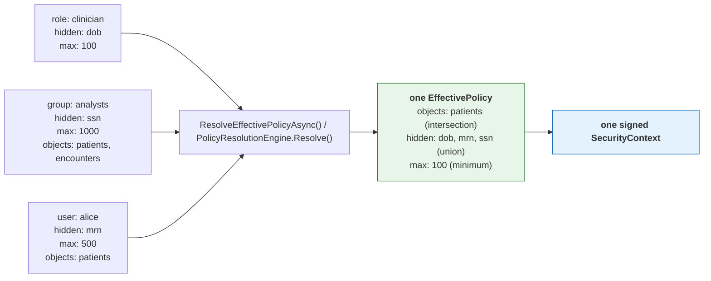

# TOLAP Implementation Guide -- .NET / C#

This guide shows how to enforce TOLAP in a .NET tool layer **using the shipped SDK**. Every
example below compiles against `Tolap.Core`, `Tolap.Store` and `Tolap.Mcp` as published in
[`../sdk/dotnet/`](../sdk/dotnet/).

> **What changed, and why it matters.** An earlier version of this guide walked through
> hand-writing the policy model, the resolution engine, the merge algorithm and the context
> signer — roughly 660 lines reimplementing types the SDK already ships, in a *different and
> incompatible shape* (`EffectivePolicy.SourceConnectionId` as a `Guid` rather than a `string`,
> a nested `Integrity` block rather than flat `Signature`/`Algorithm` fields). Worse, its
> signing example used `JsonSerializer.Serialize` with declaration-order output, which is **not**
> the canonical form: signatures produced that way fail verification in every SDK, including
> .NET's own. See [canonical-enforcement-spec.md §1](canonical-enforcement-spec.md).
>
> Reimplementing any of this is not a supported path. The canonical form, the merge precedence
> and the fail-closed rules are the protocol; an independent implementation that differs
> anywhere is a security defect, not a variation.

## Prerequisites

1. **An authenticated user identity.** TOLAP does not authenticate. Your system supplies a
   verified user ID and tenant ID.
2. **A policy store.** Somewhere to persist definitions and assignments. `Tolap.Store` ships
   `InMemoryPolicyStore` for development and `IPolicyStore` for your own backend.
3. **A tool layer.** The tools your agents use (MCP servers, Semantic Kernel plugins, etc.).

Build the SDK from source -- it is not distributed through a package registry:

```bash
git clone https://github.com/awslabs/tolap && cd tolap
./tools/build-local.sh dotnet
```

That writes `.nupkg` files to `dist/nuget`, which you can register as a local feed
(`dotnet nuget add source "$PWD/dist/nuget" --name tolap-local`) and then reference with
`dotnet add package Tolap.Core`. Referencing the projects directly with
`<ProjectReference>` works too.

## What you write, and what the SDK provides

This is the whole division of labour. Anything in the right column that you find yourself
writing by hand is a bug.

| You write | The SDK provides |
| --- | --- |
| Your `IPolicyStore` backend (Postgres, DynamoDB, a policy service) | `InMemoryPolicyStore`, `IPolicyStore`, and resolution over either |
| Identity extraction from your transport | `IRequestIdentityExtractor`, `HeaderIdentityExtractor`, `JwtIdentityExtractor` |
| Group/role lookup for a user | The merge that consumes it (`PolicyMerger.Merge`) |
| The code that actually queries your data source | Every enforcement decision applied to what it returns |
| Tool registration with your agent framework | `SecureToolFactory` and the three wrappers |

The policy model (`EffectivePolicy`, `ObjectRules`, `RowFilter`, `FieldRules`, `TagRules`,
`PolicyLimits`, `MaskType`, `FilterOperator`, …), the resolution engine, the merge algorithm,
canonical serialization, HMAC signing and verification, the enforcement pipeline, the SQL
rewriter and the `kb` filter renderers are all shipped. None of them are yours to write.

## Step 1: Policy storage

Policies use the [Policy Definition Schema](../schema/v1.0/policy-definition.schema.json) and
attach to principals via the [Policy Assignment Schema](../schema/v1.0/policy-assignment.schema.json).
`Tolap.Core` ships the matching types, so a JSON policy deserializes directly.

```csharp
using Tolap.Core;
using Tolap.Store;

// Development: in-memory.
IPolicyStore store = new InMemoryPolicyStore();

await store.CreatePolicyAsync(TolapJsonOptions.Deserialize<PolicyDefinition>(policyJson));
await store.AssignPolicyAsync(TolapJsonOptions.Deserialize<PolicyAssignment>(assignmentJson));
```

For production, implement `IPolicyStore` over your own database. It is the one interface in
this guide you are expected to write, because only you know where your policies live. The
interface covers policy CRUD, assignment CRUD, and resolution
(`ResolveEffectivePolicyAsync`) — implement the storage, not the resolution semantics, which
`Tolap.Core` supplies.

## Step 2: Resolve, build, sign

One call each. There is no merge algorithm for you to write: `PolicyResolutionEngine` applies
the most-restrictive-wins merge rules in
[canonical-enforcement-spec.md §8](canonical-enforcement-spec.md#8-permission-merging) (permission
merging) and [§6](canonical-enforcement-spec.md#6-masking) (the mask restrictiveness ranking), and
`SecurityContextSigner` produces the canonical form and the HMAC.

```csharp
using Tolap.Core;
using Tolap.Store;

public static async Task<string> IssueContextAsync(IPolicyStore store, string signingKey)
{
    // Resolution: assignments + definitions -> one effective policy for one source.
    var policy = await store.ResolveEffectivePolicyAsync(
        userId: "analyst-001",
        tenantId: "hospital-001",
        sourceConnectionId: "db:analytics:patients",
        getGroups: userId => LookUpGroups(userId),
        getRoles: userId => LookUpRoles(userId));

    // Envelope + HMAC over the canonical form. Do not hand-roll either.
    var context = SecurityContextBuilder.Build("analyst-001", "hospital-001", new[] { policy });
    var signed = SecurityContextSigner.Sign(context, signingKey);

    return SecurityContextSigner.Serialize(signed);
}

public static bool Verify(string serialized, string signingKey)
{
    var context = SecurityContextSigner.Deserialize(serialized, signingKey);
    return SecurityContextSigner.Validate(context, signingKey);
}
```


### Multiple policies: where they merge

A user usually reaches a source through several assignments at once — a role baseline, a group
policy, a personal grant. **All of them apply.** They are merged into one effective policy by
`ResolveEffectivePolicyAsync() / PolicyResolutionEngine.Resolve()`, *before* a context exists, which is why the context carries a single policy: it
holds the resolved answer, not the inputs.



Allow-lists **intersect**, deny-lists **union**, ceilings take the **minimum** — so adding an
assignment can only ever restrict, never widen. An administrator cannot escalate access by
granting one more policy. The full table is in
[architecture.md](architecture.md#3-policy-resolution-engine).

```csharp
// The store does this for you; PolicyResolutionEngine is exposed directly if you assemble
// the inputs.
var effective = PolicyResolutionEngine.Resolve(
    userId: "alice",
    tenantId: "hospital-001",
    sourceConnectionId: "db:analytics:patients",
    assignments: allAssignmentsForAlice,   // role + group + direct: pass them ALL
    definitions: allDefinitions,
    getGroups: userId => new[] { "analysts" },
    getRoles: userId => new[] { "clinician" });
// effective.ObjectRules.FieldRules.HiddenFields is ["dob", "mrn", "ssn"]
```

**One context governs one data source.** A caller needing several sources resolves and signs
per source; `sourceConnectionId` is inside the signature precisely so a context cannot be
replayed against a different source.

**Never serialize a context yourself.** The signature covers a recursively key-sorted,
null-omitted, compact-separator UTF-8 encoding of the whole envelope. `JsonSerializer.Serialize`
emits declaration order, which produces different bytes and therefore a different HMAC — the
signature then fails verification everywhere. `SecurityContextSigner.BuildCanonicalPayload` is
public if you need to see the exact bytes.

## Step 3: Enforce

The SDK never holds a connection. **You** run the query or the API call; the wrapper enforces
the policy on what comes back. That is why nothing here takes a credential.

```csharp
using Tolap.Core;

// The post-execution pipeline: row filters, tag filters, the relevance floor, the size
// ceiling, hidden fields, allowed-field projection, masking, then the result limit — in that
// order, which is normative (canonical-enforcement-spec.md §4).
//
// hashSalt is the THIRD parameter and it is not carried on the policy — the salt is a
// deployment secret, not a policy field (see "Salt `hash` masking" below). Calling the
// two-argument overload after configuring a salt elsewhere produces *unsalted* digests
// with nothing in the output to say so, so pass it here too.
var enforced = EnforcementEngine.ApplyResultPipeline(
    rowsYouFetched, policy, hashSalt: HashSalt);
```

The wrappers pass their own `HashSalt` for you; this only matters when you call the engine
directly. `ApplyRecordPipeline(records, policy, hashSalt)` is the list-typed variant.

For `db` sources, push what can be pushed into the SQL, then run the pipeline anyway:

```csharp
using Tolap.Core;

// One call: pre-execution checks, then the rewrite unless the mode says otherwise.
var rows = await wrapper.ExecuteSqlWithEnforcementAsync(
    context,
    new PreExecuteArgs("pg-query"),
    "SELECT id, email FROM patients",
    sql => RunOnYourConnection(sql),
    dialect: SqlDialect.Postgres);
```

### Choosing where the policy is applied

`SqlEnforcementMode` decides whether TOLAP touches your SQL. `RewriteAndPost` is the default
and pushes what it can into the query; `PostOnly` leaves it byte for byte and enforces
entirely on the rows returned:

```csharp
var rows = await wrapper.ExecuteSqlWithEnforcementAsync(
    context, args, sql, execute,
    dialect: SqlDialect.Postgres,
    mode: SqlEnforcementMode.PostOnly);   // my SQL, untouched
```

**Both modes return the same rows.** Choose `PostOnly` when you will not have your SQL
edited — a statement the rewriter's parser does not handle, a stored procedure, or an ORM
that owns its own SQL. The cost is that the database returns rows the post pass then
discards. `PostOnly` skips the rewrite, not the checks: `canQuery`, `allowedObjects` and the
hidden-field refusal all still apply.

If you need the prepared query rather than the whole execute, `PrepareSqlQuery` takes the
same `mode` and hands back `SqlQueryPreparation` — check `.Allowed` before executing
`.Query`, and `.FullyPushedDown` to learn whether the database will do all the filtering.

The rewrite is an **optimization**, never a replacement — but do not assume it leaves
`SELECT *` alone. `SqlQueryRewriter.ExpandSelectStar` **does** expand it whenever
`allowedFields` is an explicit, glob-free list: the projection becomes that list minus
`hiddenFields`, or the constant `1` when nothing survives the filter.

It is left verbatim only in the two cases where the table's real column list is unknowable
without a connection the SDK does not have:

- `allowedFields` is absent — even when `hiddenFields` is set. The hidden column crosses
  the wire, and the post pass strips it, so a policy hiding a large or sensitive column
  from a `SELECT *` gains nothing from the rewrite.
- `allowedFields` contains a `*`.

Either way the post-execution pipeline is still mandatory. Omitting it because "the SQL
already filters" is a disclosure bug.

For `kb` sources, render a provider-native metadata filter so denied chunks are never
retrieved — again as an optimization over the normative post pass:

```csharp
using Tolap.Core;

var filter = KbProviders.Render(
    KbFilter.Build(policy, new[] { "classification" }),
    KbProvider.Bedrock);

if (filter.DeniesEverything)
{
    // Skip retrieval entirely. An absent filter must never be read as "unrestricted".
}
```

Check `filter.Confidence`: `Verified` means the shape has been exercised against the live
service, `FromGrammar` means it was written from published documentation and no service has
accepted one. Treat `FromGrammar` as unproven — promoting two renderers out of that state
exposed one fail-open each.

### A result shape the pipeline cannot inspect is denied

Enforcement covers records, record lists and nested bodies. Anything else — a class instance or
DTO, a scalar, a stream, an unmaterialized enumerator — is refused with
`UnenforceableResultException` (a `UnauthorizedAccessException`, so a call site that already
denies on that base type fails closed without special-casing the type). The alternative,
returning a shape the policy could not be applied to, is the fail-open
([§5](canonical-enforcement-spec.md#5-result-shapes--fail-closed)).

`AllowUnenforceableShapes` on the wrapper and factory options is the explicit opt-out. It is
`false` by default, it logs a warning **every** time it lets a result through, and it is for
mid-migration only — do not enable it in production. Project to a `Dictionary<string, object?>`
or a list of them before returning, and the shape is enforceable.

## Step 4: Use the Secure Tool Factory

The SDK ships the factory: `SecureToolFactory` in `Tolap.Mcp`. It is the composition root
for enforced tools — an agent receives its tools from it and never constructs one, which is
what makes "the wrapper is the only path to the source" structural rather than a convention
every call site has to remember.

```csharp
using Tolap.Mcp;

var factory = new SecureToolFactory(
    new SecureToolFactoryOptions(SigningKey: signingKey),
    // Only needed for `api` sources. The SDK never opens a connection of its own, so you
    // supply the client; omitting it and asking for an api tool throws rather than
    // constructing a default HttpClient that would bypass your handler chain, proxy and
    // timeout configuration.
    httpClientFactory.CreateClient("internal-api"));

SecureTool tool;
try
{
    tool = factory.CreateTool(signedContext);
}
catch (ToolCreationException)
{
    // No tool at all: the context was forged, expired, carried no policy, named an
    // unparseable source, or CanQuery was false. Failing here rather than handing back a
    // wrapper that denies every call keeps a caller from reading the denial as a
    // transient error and retrying.
    throw;
}

// Exactly one of the two is non-null, and `Category` says which.
var result = tool.Category switch
{
    SourceCategory.Api => await UseHttpAsync(tool.HttpTool!, signedContext),
    _ => UseRecords(tool.RecordTool!, signedContext)
};
```

### What the factory decides

The wrapper you get is chosen by the **category** segment of the signed
`SourceConnectionId` (`category:namespace:name`, connector-spec section 1):

| Category | Wrapper | Why |
| --- | --- | --- |
| `db`, `kb`, `storage` | `SecureContextToolWrapper` | All three return records — rows, chunks, listing entries — and share the post-execution pipeline. |
| `api` | `SecureHttpToolWrapper` | HTTP-shaped: status lines, headers, redirects. |

Reading the category from the *signed* identifier is deliberate. A category taken from
unsigned configuration could disagree with the policy the context carries, and flipping
`db` to `api` would select the wrapper that enforces the other category's rules —
`endpointRules` do not constrain a SQL query. Inside the signed bytes, changing it
invalidates the signature.

Use `factory.CategoryOf(context)` to branch before requesting a tool.

### What the factory does not do

- **No credentials.** The SDK never holds a connection: the record wrapper hands back
  rewritten SQL for you to execute, and the HTTP wrapper is given its `HttpClient` by you.
  Nothing on the enforcement path takes a secret as input, so the factory accepts none.
- **No stored context.** Wrappers are **stateless**; the context is supplied per call and
  re-validated every time. A context held on a shared wrapper could outlive the request
  that supplied it and be reused for the next caller, who may be a different user. This is
  why there is no `SetSecurityContext()` — an earlier draft of this guide described one,
  and it does not exist.
- **One context, one source.** A `SecurityContext` carries a single effective policy
  (architecture.md section 1), so the factory returns one tool. Hold several contexts and
  call it per context.

### Registering it

```csharp
services.AddSingleton(new SecureToolFactoryOptions(SigningKey: signingKey));
services.AddScoped<SecureToolFactory>();
```

Scoped rather than singleton only because a request-scoped `HttpClient` is the common case;
the factory itself holds no per-request state, so a singleton is equally correct when the
client is too.


## Step 5: Wire It Together

Here is the complete flow from request to results:

```csharp
using Microsoft.Extensions.DependencyInjection;
using Tolap.Core;
using Tolap.Mcp;

// ── Dependency Injection Registration ────────────────────────────────

public static class TolapServiceExtensions
{
    public static IServiceCollection AddTolap(this IServiceCollection services, string signingKey)
    {
        services.AddScoped<IPolicyStore, PolicyStore>();
        services.AddSingleton(new SecureToolFactoryOptions(SigningKey: signingKey));
        services.AddScoped<SecureToolFactory>();
        return services;
    }
}

// ── Request Handler / Orchestration Layer ────────────────────────────

public sealed class AgentOrchestrator
{
    private readonly IPolicyStore _store;
    private readonly SecureToolFactory _factory;
    private readonly string _signingKey;

    public AgentOrchestrator(IPolicyStore store, SecureToolFactory factory, string signingKey)
    {
        _store = store;
        _factory = factory;
        _signingKey = signingKey;
    }

    public async Task<object> HandleAgentRequestAsync(
        string authenticatedUserId,
        string tenantId,
        string sourceConnectionId,
        string request,
        CancellationToken cancellationToken = default)
    {
        // 1. Resolve the effective policy for ONE source and sign it. One context governs
        //    one data source, so an agent reaching several sources gets one context each.
        var policy = PolicyResolutionEngine.Resolve(
            authenticatedUserId,
            tenantId,
            sourceConnectionId,
            await _store.GetAssignmentsForUserAsync(authenticatedUserId),
            await _store.ListPoliciesAsync(),
            getGroups: _ => Array.Empty<string>(),
            getRoles: _ => Array.Empty<string>());

        var signedContext = SecurityContextSigner.Sign(
            new SecurityContext(
                Version: "1.0",
                UserId: authenticatedUserId,
                TenantId: tenantId,
                IssuedAt: DateTimeOffset.UtcNow,
                ExpiresAt: DateTimeOffset.UtcNow.AddHours(1),
                Policies: new[] { policy }),
            _signingKey);

        // 2. If executing in a different process/service, serialize for transport. The
        //    signature covers the whole envelope including the expiry, so a captured
        //    context cannot be given a longer life.

        // 3. Build the enforcing tool. The factory picks the wrapper from the signed
        //    category and throws outright if the context does not validate.
        var tool = _factory.CreateTool(signedContext);

        // 4. Give the tool to the agent runtime, passing the context on each call.
        var agent = CreateAgent(tool, signedContext);
        return await agent.ExecuteAsync(request, cancellationToken);
    }

    private static IAgent CreateAgent(SecureTool tool, SecurityContext context)
    {
        // Plug into your agent framework (Strands SDK, Semantic Kernel, etc.). The context
        // travels with each call rather than being stored on the tool.
        throw new NotImplementedException(
            "Replace with your agent runtime initialization.");
    }
}

// Placeholder for the agent abstraction
public interface IAgent
{
    Task<object> ExecuteAsync(string request, CancellationToken cancellationToken = default);
}
```

The agent receives a tool that can only return data the user is authorized to see. It does
not need to know about security policies, check permissions, or filter results. Enforcement
is invisible and non-bypassable — provided the tool came from the factory, which is the
point of routing construction through it.

## Purpose binding

Everything above answers "what may this identity see?". Purpose binding answers "and for
what?": the declared reason becomes an input to resolution and part of the signed bytes. It
is **opt-in and additive** — a policy with no `purposeProfile` and a caller declaring no
purpose behave exactly as they did before, down to the signed bytes. The normative rules are
[canonical-enforcement-spec.md §15](canonical-enforcement-spec.md#15-purpose-binding); this
section is the .NET wiring for them.

| Check | Where it happens | SDK surface |
| --- | --- | --- |
| Resolution filtering | wherever you resolve | `PolicyResolutionEngine.Resolve(..., declaredPurpose)` |
| Action validation | inside the wrapper, once a map is configured | `ToolActionCategories` / `HttpActionCategories` |
| Delegation narrowing | before you build a context | `DelegationChainValidator.Validate` |
| Semantic judge (opt-in) | `PreExecuteAsync`, after the three above | `Judge` + optional `ToolCallHistory` / `EscalationHandler` |

The first three are in `Tolap.Core` and need nothing external. The judge needs a model, so it
is glue you write.

### Authoring a purpose-bound policy

`purposeProfile` goes on a policy **definition**, alongside `sourcePatterns` and
`objectRules`. `PolicyDefinition.PurposeProfile` is the matching property, so the JSON
deserializes with `TolapJsonOptions.Deserialize<PolicyDefinition>` like any other policy.

```json
"purposeProfile": {
  "purposeId": "campaign-x-overlap",
  "description": "Identify overlapping opted-in customer segments for Campaign X.",
  "allowedActions": ["aggregate_overlap", "count_segments"],
  "prohibitedActions": ["export_pii", "enumerate_individuals", "join_external_data"]
}
```

A complete example is
[`schema/v1.0/examples/purpose-bound-policy.json`](../schema/v1.0/examples/purpose-bound-policy.json).
`allowedActions` follows the null-versus-empty rule: absent is unrestricted, `[]` denies every
action. Absence is a real grant here, because a purpose may legitimately constrain only what
is *forbidden*.

### Resolving with a purpose

`declaredPurpose` is the trailing optional parameter on both `Resolve` and
`ResolveEffectivePolicyAsync`, so every existing call site keeps compiling and keeps meaning
what it did:

```csharp
using Tolap.Core;

var policy = await store.ResolveEffectivePolicyAsync(
    userId: "analyst-001",
    tenantId: "acme-001",
    sourceConnectionId: "db:marketing:customer_segments",
    getGroups: LookUpGroups,
    getRoles: LookUpRoles,
    declaredPurpose: "campaign-x-overlap");

// Record the same value on the context, so the artifact says which purpose produced it.
// It is inside the HMAC, so a captured context cannot be re-declared for another purpose.
var context = SecurityContextBuilder.Build(
    "analyst-001", "acme-001", new[] { policy },
    declaredPurpose: "campaign-x-overlap");
```

The filter runs **before** the merge, which is why it is a resolution parameter rather than
something you apply afterwards: a definition scoped to a purpose the caller did not declare
must not fold its rules into the effective policy at all
([§15.1](canonical-enforcement-spec.md#151-resolution-time-purpose-filtering)).

Omit it and a purpose-scoped definition is excluded — a purpose-scoped policy is not a default
grant:

```csharp
var unscoped = await store.ResolveEffectivePolicyAsync(
    "analyst-001", "acme-001", "db:marketing:customer_segments",
    LookUpGroups, LookUpRoles);      // no declaredPurpose
```

If the purpose-scoped definition was the only one that matched, `unscoped` is
`EffectivePolicy.DenyAll()` — `Permissions.CanQuery` is `false`, and
`SecureToolFactory.CreateTool` then throws `ToolCreationException` rather than handing back a
tool that denies every call. That is the same deny-all any empty candidate set produces; there
is no separate purpose-denial path.

The comparison against `purposeId` is exact and case-sensitive. `Campaign-X` resolves nothing
when the policy says `campaign-x`.

### Wiring the action-category map

`allowedActions` and `prohibitedActions` name what an operation *does*. Nothing can check them
until you tell the wrapper which category each call belongs to, and there are two maps because
the two wrapper families identify a call differently:

```csharp
using Tolap.Mcp;

var toolCategories = new Dictionary<string, string>
{
    ["segment_overlap"]    = "aggregate_overlap",
    ["segment_count"]      = "count_segments",
    ["export_segment_csv"] = "export_pii",
};

var recordWrapper = new SecureContextToolWrapper(new SecureContextWrapperOptions(
    SigningKey: signingKey,
    ToolActionCategories: toolCategories));

var httpCategories = new Dictionary<string, string>
{
    ["GET /segments/*/overlap"] = "aggregate_overlap",
    ["GET /segments/*/members"] = "enumerate_individuals",
};

var httpWrapper = new SecureHttpToolWrapper(
    new SecureHttpWrapperOptions(
        SigningKey: signingKey,
        HttpActionCategories: httpCategories),
    httpClient);
```

An HTTP request has a method and a path and **no tool name** — `HttpRequestArgs` carries no
tool identifier — so a single name-keyed map would leave this check permanently inert for
`api` sources. A control the configuration implies and that never runs is worse than no
control, because nothing looks wrong. Keys are therefore `"METHOD path-glob"`, the method
compared case-insensitively and the path with the same glob dialect `allowedEndpoints` uses.
The check runs per redirect hop, on the path with the query string stripped, and when several
entries match a request all of their categories are validated.

Both maps are **administrator configuration**, never a caller argument. An agent that can name
its own action category can name a permitted one, which reduces the check to a formality. That
is also why the category is not a policy field for the caller to echo back.

Configure both maps on `SecureToolFactoryOptions` and let the composition root own them.
`SecureToolFactory` carries `ToolActionCategories`, `HttpActionCategories` and `HashSalt`, and
forwards each to the wrapper that keys on it — the tool-name map to
`SecureContextToolWrapper`, the HTTP map to `SecureHttpToolWrapper`, the salt to both:

```csharp
var factory = new SecureToolFactory(
    new SecureToolFactoryOptions(
        SigningKey: signingKey,
        HashSalt: Environment.GetEnvironmentVariable("TOLAP_HASH_SALT"),
        ToolActionCategories: toolCategories,
        HttpActionCategories: httpCategories),
    httpClient);
```

Constructing wrappers by hand is still supported, but there is no longer a reason to prefer
it for purpose binding, and configuring the maps in two places is how they drift.

A denied call reports which category and which purpose:

```csharp
var decision = recordWrapper.PreExecute(
    signedContext, new PreExecuteArgs("export_segment_csv"));

// decision.Allowed == false
// decision.Reason  == "action 'export_pii' is prohibited under purpose 'campaign-x-overlap'"
```

The other denial is `"action 'x' not in allowed actions for purpose 'p'"`. Prohibited is
checked first, so a category in both lists reports the more specific reason. Category
comparison is case-insensitive — the opposite of the `purposeId` comparison, and for the same
reason: a mis-cased purpose resolves nothing, and a mis-cased category is still caught by a
prohibition.

### Fail closed: an unclassified call is denied

If the resolved profile constrains actions at all and no map entry matches the call, the call
is denied:

```csharp
// "explore_segments" is not in ToolActionCategories.
var undeclared = recordWrapper.PreExecute(
    signedContext, new PreExecuteArgs("explore_segments"));

// undeclared.Reason == PurposeActionResolver.UndeclaredCategoryReason
//                   == "action category not declared for tool"
```

The fix is to **classify the tool**, not to widen the policy:

```csharp
toolCategories["explore_segments"] = "count_segments";   // or whatever it actually does
```

Note this applies to the deny-list half too. A purpose declaring only
`prohibitedActions: ["export_pii"]` means "anything but exporting PII", and an unclassified
tool might be exactly that; permitting the unclassified while forbidding the classified cannot
be what the author meant. An *empty* `prohibitedActions` restricts nothing and so does not
make a call unclassifiable.

The consequence is worth stating plainly: **adding a purpose-bound policy to a working
deployment without configuring a map denies every call through that wrapper.** That is
deliberate. The reason string names a configuration fault, and a noisy failure at rollout is
the outcome to want here — the alternative is a purpose that looks enforced and is not.

### Delegation chains: validate, then build

A chain records how authority reached the caller — a human delegates to an agent, which
delegates to a sub-agent. The invariant is that it may narrow at every hop and never widen
([§15.3](canonical-enforcement-spec.md#153-delegation-chain-narrowing)).

```csharp
using Tolap.Core;

var chain = new[]
{
    new DelegationHop(
        "user-marketing-001", PrincipalType.User,
        DeclaredPurpose: "campaign-x",
        DelegatedAt: DateTimeOffset.UtcNow,
        ScopeNarrowing: new[] { "read:segments", "read:campaigns" }),
    new DelegationHop(
        "agent-overlap", PrincipalType.Agent,
        DeclaredPurpose: "campaign-x-overlap",   // narrows on a '-' segment boundary
        DelegatedAt: DateTimeOffset.UtcNow,
        ScopeNarrowing: new[] { "read:segments" }),   // a subset of the parent's
};

// Validate BEFORE building. SecurityContextBuilder.Build *records* a chain; it does not
// check one, because a builder that silently dropped an invalid chain would produce a
// context that looked delegated and was not.
var chainResult = DelegationChainValidator.Validate(chain);
if (!chainResult.Allowed)
    throw new InvalidOperationException(chainResult.Reason);

var delegated = SecurityContextBuilder.Build(
    "analyst-001", "acme-001", new[] { policy },
    declaredPurpose: "campaign-x-overlap",
    delegationChain: chain);
```

The segment-boundary rule is the one worth testing. `campaign-x` admits
`campaign-x-overlap`, and refuses `campaign-xyz-evil`:

```csharp
var widened = new[]
{
    new DelegationHop("user-marketing-001", PrincipalType.User, DeclaredPurpose: "campaign-x"),
    new DelegationHop("agent-rogue", PrincipalType.Agent, DeclaredPurpose: "campaign-xyz-evil"),
};

var denied = DelegationChainValidator.Validate(widened);
// denied.Allowed == false
// denied.Reason  == "delegation hop 1 purpose 'campaign-xyz-evil' " +
//                   "is not within parent scope 'campaign-x'"
```

A plain `StartsWith` test — the obvious implementation — accepts `campaign-xyz-evil` here. The
two purposes are unrelated; one merely begins with the other's characters. A parent glob
(`campaign-*`) is the way to express "any purpose in this family", and comparison is
case-sensitive throughout.

The scope rule reads the same direction: `ScopeNarrowing` lists the scopes still **in force**
at a hop, not the ones it removed, and each hop's set must be a subset of its parent's. An
empty parent set leaves nothing for a child to claim, so any child scope exceeds it and the
denial is `"delegation hop {i} scopes exceed parent delegation"`.

Null, empty and single-hop chains are allowed: there is no parent to widen against. Validating
the chain is only worth anything because it is inside the signed bytes — appending, mutating
or reordering a hop invalidates the signature, so a validator is not checking the attacker's
own arithmetic.

Every wrapper validates the chain for you, inside `ValidateSecurityContext` and after the
signature check — so `SecureContextToolWrapper`, `SecureHttpToolWrapper` and anything built by
`SecureToolFactory` refuse a context whose chain widens, whether or not you called the validator
when you built it. Calling `DelegationChainValidator.Validate` yourself, as shown above, buys you
an early failure at the issuing end rather than a late one at the consuming end; it is not what
makes the control effective.

Chain depth is **bounded** at `DelegationChainValidator.MaxHops` (10) hops, and the same ceiling is declared
as `maxItems` on `delegationChain` in `security-context.schema.json`, so the schema and
the validator agree rather than one standing in for the other. A longer chain is refused
on its length before any hop is walked. Ten leaves generous room for an orchestrator or
two: delegation depth is a property of your topology, not of a request.

### The judge, if you want one

An optional LLM check on whether a call *plausibly serves* its declared purpose, across the
recent trajectory rather than one call
([§15.4](canonical-enforcement-spec.md#154-the-semantic-judge)). It runs **after** the three
deterministic checks have already allowed a call and can only take that allowance away, which
is what makes a manipulated verdict survivable.

Set `Judge` on the wrapper options and call `PreExecuteAsync` instead of `PreExecute`; the
wrapper runs the deterministic checks, then the gate, and the policy's `model`,
`historyWindow`, thresholds and `maxLatencyMs` all apply without glue of yours. `PreExecute`
stays synchronous and judge-free, so a deployment without one pays nothing.

```csharp
var wrapper = new SecureContextToolWrapper(new SecureContextWrapperOptions(
    signingKey,
    ToolActionCategories: toolMap,
    Judge: new BedrockJudge(converseClient),
    ToolCallHistory: history,                 // you own it, and its retention
    EscalationHandler: async outcome => await ReviewQueue.AskAsync(outcome)));

var pre = await wrapper.PreExecuteAsync(context, new PreExecuteArgs("segment_overlap"));
```

Without an `EscalationHandler`, `Escalate` denies. That is deliberate: a default of "permit"
would make "escalate to human review" mean "allow" in every deployment that never built review.

`Tolap.Mcp` keeps its zero runtime dependencies, so `BedrockJudge` talks to a one-method seam
and you own the transport:

```csharp
using Amazon.BedrockRuntime;
using Amazon.BedrockRuntime.Model;
using Tolap.Mcp;

sealed class ConverseClient(IAmazonBedrockRuntime bedrock) : IBedrockConverseClient
{
    // Verified against a live account: this id, in us-east-1, over Converse. The bare
    // "anthropic.claude-sonnet-5" is refused for on-demand throughput and needs an
    // inference-profile prefix ("global." or a regional "us.").
    public string ModelId => "global.anthropic.claude-sonnet-5";

    public async Task<string> ConverseAsync(
        string systemPrompt, string userPrompt, int maxTokens, CancellationToken ct)
    {
        var response = await bedrock.ConverseAsync(new ConverseRequest
        {
            ModelId = ModelId,
            System = new List<SystemContentBlock> { new() { Text = systemPrompt } },
            Messages = new List<Message>
            {
                new()
                {
                    Role = ConversationRole.User,
                    Content = new List<ContentBlock> { new() { Text = userPrompt } }
                }
            },
            // MaxTokens only. Temperature is deprecated on current Sonnet models and
            // setting it makes Converse fail with a ValidationException, so the obvious
            // "make it deterministic" knob is the one that breaks the call.
            InferenceConfig = new InferenceConfiguration { MaxTokens = maxTokens }
        }, ct);

        return response.Output.Message.Content[0].Text;
    }
}
```

If you are **not** using a wrapper, call the judge through `JudgeGate` rather than invoking it
yourself, and render the call with `SecureContextToolWrapper.RenderToolCall` so your history
matches a wrapper's. That is what makes the
policy's own `historyWindow`, `maxLatencyMs`, thresholds and `model` apply — left to per-call
glue, the predictable outcome is a judge running with a window and thresholds nobody chose
while the policy's `model` is quietly ignored:

```csharp
using Tolap.Core;
using Tolap.Mcp;

IJudge judge = new BedrockJudge(new ConverseClient(bedrockRuntime));

// Sized from the policy, not from a default of your own.
var history = new ToolCallHistory(JudgeGate.HistoryWindowFor(policy));
history.Record("segment_overlap(campaign_id: campaign-x)");

// Your review path, or null if you have none.
Func<string, Task<bool>>? review = null;

async Task<bool> IsAllowedAsync(EffectivePolicy policy, string call)
{
    // EvaluateAsync returns a JudgeOutcome, not a bare disposition: `Disposition`,
    // `Reason`, the optional `Result`, and a precomputed `Allowed`. The reason is what
    // separates "wrong model wired up" from "the judge genuinely could not tell" -- both
    // escalate, and they call for entirely different responses.
    var outcome = await JudgeGate.EvaluateAsync(policy, judge, call, history);

    return outcome.Disposition switch
    {
        JudgeDisposition.Allow => true,
        // Escalate is a DENIAL unless a review path exists. Without this arm falling
        // back to false, "escalate to human review" silently means "permit" in every
        // deployment that never built the review step -- a fail-open on precisely the
        // ambiguous cases the judge exists to surface.
        JudgeDisposition.Escalate => review is not null && await review(call),
        _ => false,
    };
}
```

`outcome.Allowed` is the one-liner for the case with **no** review path: it is
`Disposition == Allow`, so `Escalate` reads as not allowed. Branch on `Disposition` only when
you have somewhere to escalate to.

When the policy enables no judge, `EvaluateAsync` returns an outcome with `Disposition = Allow`,
`Result = null` and `Reason = JudgeGate.NoJudgeConfiguredReason` — nothing is invoked, so it is
safe to call unconditionally. `Result` being null is a positive statement: no tokens were spent
and nothing a model said is being reported. A timeout, a transport failure and an unparseable
response all escalate rather than throwing — an exception escaping into the authorization path
invites a `catch` at the call site that returns "allow".

The model is checked **before** the call is made: when `IJudge.ModelId` is not the `model` the
policy named, the gate escalates without spending tokens and without a `Result`. The outcome's
`Reason` *begins with* `JudgeGate.ModelMismatchReason` (`"judge model mismatch"`) and then names
both model ids, so a log line distinguishes a misconfigured deployment from a genuinely
uncertain verdict — the same disposition, two entirely different responses. Match it with
`StartsWith`, not equality. A policy naming no model accepts any judge, since model ids differ
per account and region.

The judge is non-deterministic and advisory. It cannot be pinned by the shared fixture corpus
the way everything else here can, so treat it as a detection layer over the deterministic
three and never as one of them ([§13](canonical-enforcement-spec.md#13-known-limitations)).

#### `ToolCallHistory` is a buffer, not a store

`Record` takes one already-rendered string per call, and it stores exactly what you give it —
including argument values, if that is what you render. Four properties follow from that, and
none of them is a defect:

- **Process-local and non-persistent.** It dies with the process, and nothing shares it between
  instances. A judge behind a load balancer sees only the calls that landed on its own task.
- **Not thread-safe.** Guard it if one conversation is driven from several threads. The common
  case is one wrapper serving one conversation, which is why there is no lock.
- **Bounded by `MaxSize`, FIFO.** `JudgeGate.HistoryWindowFor(policy)` sizes it from the policy.
  A `MaxSize` below 1 is refused rather than clamped.
- **No retention guidance, because the SDK cannot give any.** There is no expiry, no redaction
  and no classification: whatever you record is in process memory for as long as the buffer
  holds it, and if you copy it anywhere durable the retention rules for that data are yours.
  Render the call without sensitive argument values if you are not prepared to own them.

Each `historyWindow` merges to the **maximum** across contributing policies
([§15.5](canonical-enforcement-spec.md#155-merging-purpose-profiles)), so adding a
purpose-bound policy can enlarge the window — and the prompt — without anyone editing a judge
config.

### Migration

Nothing to migrate. Purpose binding is additive and opt-in: existing policy definitions,
existing contexts and their **signed bytes** are unaffected, because the three envelope fields
are omitted entirely when absent.

The one thing to know is the converse: adding a `declaredPurpose` (or a `delegationChain`) to
a context *changes its signature*. So re-issue contexts rather than trying to migrate them —
they are short-lived by design, default TTL one hour — and do not run a signer that emits the
new fields against a verifier that predates them. The general case is
[§2's upgrade guidance](canonical-enforcement-spec.md#upgrading-across-a-canonical-form-change),
including how to diagnose a mismatch by comparing canonical payload bytes
(`SecurityContextSigner.BuildCanonicalPayload`) rather than signatures.

What purpose binding does **not** do: purpose is *asserted* by the caller. TOLAP verifies that
the assertion matches a policy and that a chain is internally consistent; it cannot verify that
the caller was honest. It constrains a cooperative agent that drifts and narrows the blast
radius of one compromised mid-task. It is not a defence against a lying integrator
([§13](canonical-enforcement-spec.md#13-known-limitations)).

## Testing Recommendations

### Unit Tests for Policy Resolution

Test the merge algorithm with multiple overlapping policies:

- Two policies with overlapping `AllowedFields` -- verify intersection
- One policy hides a field, another allows it -- verify hidden wins
- Two policies with different `MaxResults` -- verify minimum wins
- One policy sets `CanQuery = false` -- verify AND produces false
- Policy with row filters from multiple profiles -- verify all filters are present

### Integration Tests for Tool Wrappers

Test enforcement at the tool level:

- Query referencing a hidden column -- verify rejection
- Query without row filters -- verify filters are injected
- Result with masked fields -- verify masking is applied
- Schema introspection -- verify hidden objects/fields are absent
- Expired security context -- verify rejection

### End-to-End Tests

Test the full flow from user identity to filtered results:

- User with restrictive policy queries a data source -- verify only authorized data returned
- User with no applicable policies -- verify access denied
- User with expired assignment -- verify access denied
- User with multiple overlapping assignments -- verify most-restrictive merge

## Hardening: replay detection and salted masking

Two protections ship switched off, because each needs something only the deployment can
supply — shared state for one, a secret for the other. Neither is required to use TOLAP,
and both are worth turning on in production.

### Make a signed context single-use

A signed context is a bearer credential: capture it and it works until it expires. Pass an
`IReplayGuard` to `Deserialize` and it works exactly once.

```csharp
var guard = new InMemoryReplayGuard();   // process-local; see the warning below

var context = SecurityContextSigner.Deserialize(serialized, SigningKey, guard);
// A second call with the same serialized context throws SecurityException("... replay").
```

The identifier the guard keys on (`Jti`) is **inside the signed payload**, so an attacker
cannot strip or swap it to dodge the check — that is what makes the guard worth having
rather than theatre. The check also runs after signature and expiry validation, so replaying
an already-expired context cannot burn the identifier of one that has not been used yet.

`InMemoryReplayGuard` is process-local. Two instances behind a load balancer each keep their
own set, so a context replayed against a *different* instance is not detected. For anything
multi-process, implement the one-method interface over a store you already run:

```csharp
public sealed class RedisReplayGuard : IReplayGuard
{
    private readonly IDatabase _redis;
    public RedisReplayGuard(IDatabase redis) => _redis = redis;

    public bool CheckAndRegister(string jti, DateTimeOffset? expiresAt)
        // StringSet with When.NotExists is the atomic step. Check-then-register as two
        // calls lets two concurrent replays both succeed, under exactly the load an
        // attacker generates.
        => _redis.StringSet($"tolap:jti:{jti}", "1",
                            TimeSpan.FromHours(1), When.NotExists);
}
```

A context with no `Jti` is **rejected** when a guard is active rather than waved through:
silently skipping the check is the failure mode the guard exists to prevent.

### Salt `hash` masking

Unsalted, `hash` is a truncated digest — a good pseudonymous join key, and brute-forceable
for anything low-entropy. There are ~10^9 SSNs and ~4×10^4 plausible dates of birth, so a
masked column of either is recoverable with a rainbow table while still looking like an
opaque token.

```csharp
var options = new SecureContextWrapperOptions(
    SigningKey: signingKey,
    HashSalt: Environment.GetEnvironmentVariable("TOLAP_HASH_SALT"));  // secrets manager / KMS
```

The salt makes the mask a keyed HMAC. The join-key property survives — the same salt over
the same value gives the same pseudonym in every SDK — which is also why:

- **the salt is a deployment secret, not a policy field.** Policies are readable by every
  administrator and auditor, which would defeat the point.
- **the same salt must be set everywhere the pseudonym is joined.** Changing it changes
  every masked value.

For `blake2b` the salted form is the RFC 2104 HMAC construction over BLAKE2b-512, not
BLAKE2b's native keyed mode — that is what Python's `hmac` and Node's `createHmac` compute,
and the three SDKs are byte-pinned against each other so the pseudonym still joins.

When a value must not be derivable at all, use `redact` or `null` rather than any hash.
