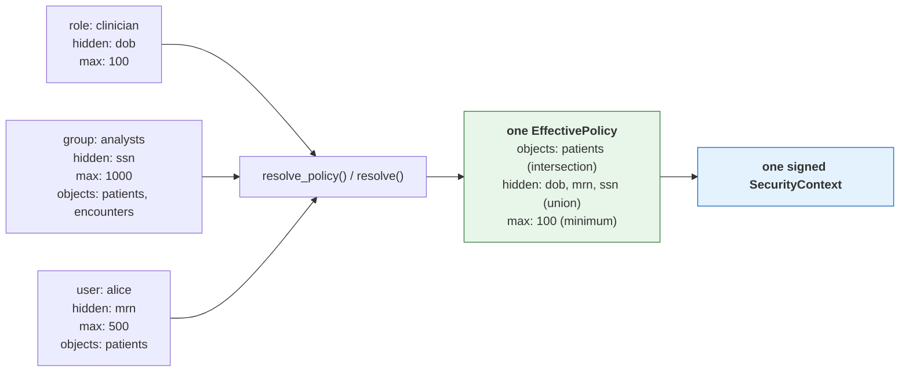

# TOLAP Implementation Guide -- Python

This guide shows how to enforce TOLAP in a Python tool layer **using the shipped SDK**. Every
example is verified against `tolap-core`, `tolap-store` and `tolap-mcp` as published in
[`../sdk/python/`](../sdk/python/).

> **What changed, and why it matters.** An earlier version of this guide walked through
> hand-writing the policy model, the resolution engine, the merge algorithm and the context
> signer -- roughly 650 lines reimplementing types the SDK already ships, in a *different and
> incompatible shape*. Reimplementing any of it is not a supported path: the canonical signing
> form, the merge precedence and the fail-closed rules **are** the protocol, so an independent
> implementation that differs anywhere is a security defect rather than a variation. See
> [canonical-enforcement-spec.md](canonical-enforcement-spec.md).

## Prerequisites

1. **An authenticated user identity.** TOLAP does not authenticate. Your system supplies a
   verified user ID and tenant ID.
2. **A policy store.** Somewhere to persist definitions and assignments. `tolap-store` ships
   `InMemoryPolicyStore` for development and the `PolicyStore` protocol for your own backend.
3. **A tool layer.** The tools your agents use (MCP servers, LangChain tools, etc.).

Build the SDK from source -- it is not distributed through a package registry:

```bash
git clone https://github.com/awslabs/tolap && cd tolap
./tools/build-local.sh python
```

That builds the wheels and installs them into the active environment. To do it by hand:
`pip install ./sdk/python/tolap-core ./sdk/python/tolap-store ./sdk/python/tolap-mcp`.

## What you write, and what the SDK provides

This is the whole division of labour. Anything in the right column that you find yourself
writing by hand is a bug.

| You write | The SDK provides |
| --- | --- |
| Your policy-store backend (Postgres, DynamoDB, a policy service) | `InMemoryPolicyStore`, the store protocol, and resolution over either |
| Identity extraction from your transport | The identity-extractor interfaces and header/JWT implementations |
| Group and role lookup for a user | The merge that consumes it |
| The code that actually queries your data source | Every enforcement decision applied to what it returns |
| Tool registration with your agent framework | The secure tool factory and the three wrappers |

The policy model (`EffectivePolicy`, `ObjectRules`, `RowFilter`, `FieldRules`, `TagRules`,
`PolicyLimits`, `MaskType`, `FilterOperator`, ...), the resolution engine, the merge algorithm,
canonical serialization, HMAC signing and verification, the enforcement pipeline, the SQL
rewriter and the `kb` filter renderers are all shipped. None of them are yours to write.

## Step 1: Policy storage

Policies use the [Policy Definition Schema](../schema/v1.0/policy-definition.schema.json) and
attach to principals via the [Policy Assignment Schema](../schema/v1.0/policy-assignment.schema.json).
`tolap-core` ships the matching dataclasses, so a JSON policy deserializes directly.

```python
from tolap_core.serialization import deserialize_policy_definition, deserialize_policy_assignment
from tolap_store import InMemoryPolicyStore, StaticIdentityResolver

# The store needs an identity resolver: given a user, which groups and roles do they hold?
# That is the input to the merge, and it is yours because only you know your directory.
identity = StaticIdentityResolver(groups={"analyst-001": ["analysts"]}, roles={})
store = InMemoryPolicyStore(identity)

store.save_definition(deserialize_policy_definition(policy_json))
store.save_assignment(deserialize_policy_assignment(assignment_json))
```

For production, implement the `PolicyStore` protocol over your own database. It is the one
interface you are expected to write, because only you know where your policies live --
implement the *storage*, not the resolution semantics, which `tolap-core` supplies.

## Step 2: Resolve, build, sign

One call each. `resolve_policy` applies the most-restrictive-wins merge rules in
[canonical-enforcement-spec.md §8](canonical-enforcement-spec.md#8-permission-merging) (permission
merging) and [§6](canonical-enforcement-spec.md#6-masking) (the mask restrictiveness ranking);
`sign_context` produces the canonical form and the HMAC.

```python
from tolap_core.context import build_security_context, sign_context, serialize_context, validate_context

def issue_context(store, signing_key: str) -> str:
    # Resolution: assignments + definitions -> one effective policy for one source.
    policy = store.resolve_policy(
        user_id="analyst-001",
        tenant_id="hospital-001",
        source_connection_id="db:analytics:patients",
    )

    # Envelope + HMAC over the canonical form. Do not hand-roll either.
    context = build_security_context("analyst-001", "hospital-001", [policy])
    return serialize_context(sign_context(context, signing_key))


def verify(context, signing_key: str) -> bool:
    return validate_context(context, signing_key)
```


### Multiple policies: where they merge

A user usually reaches a source through several assignments at once — a role baseline, a group
policy, a personal grant. **All of them apply.** They are merged into one effective policy by
`resolve_policy() / resolve()`, *before* a context exists, which is why the context carries a single policy: it
holds the resolved answer, not the inputs.



Allow-lists **intersect**, deny-lists **union**, ceilings take the **minimum** — so adding an
assignment can only ever restrict, never widen. An administrator cannot escalate access by
granting one more policy. The full table is in
[architecture.md](architecture.md#3-policy-resolution-engine).

```python
# The store does this for you; `resolve` is exposed directly if you assemble the inputs.
from tolap_core.resolution import resolve

effective = resolve(
    user_id="alice",
    tenant_id="hospital-001",
    source_connection_id="db:analytics:patients",
    assignments=all_assignments_for_alice,   # role + group + direct: pass them ALL
    definitions=definitions_by_name,
    get_groups=lambda user_id: ["analysts"],
    get_roles=lambda user_id: ["clinician"],
)
# effective.object_rules.field_rules.hidden_fields == ["dob", "mrn", "ssn"]
```

**One context governs one data source.** A caller needing several sources resolves and signs
per source; `source_connection_id` is inside the signature precisely so a context cannot be
replayed against a different source.

**Never serialize a context yourself for signing.** The signature covers a recursively
key-sorted, null-omitted, compact-separator UTF-8 encoding of the whole envelope. A plain
`json.dumps(...)` without `sort_keys=True, separators=(",", ":"), ensure_ascii=False` produces
different bytes and therefore a different HMAC, and the signature then fails verification
everywhere.

## Step 3: Enforce

The SDK never holds a connection. **You** run the query or the API call; the SDK enforces the
policy on what comes back. That is why nothing here takes a credential.

```python
from tolap_core.enforcement import apply_result_pipeline

# Row filters, tag filters, the relevance floor, the size ceiling, hidden fields,
# allowed-field projection, masking, then the result limit -- in that order, which is
# normative (canonical-enforcement-spec.md §4).
#
# hash_salt is the THIRD parameter and it is NOT carried on the policy -- the salt is a
# deployment secret, not a policy field (see "Salt `hash` masking" below). Calling this
# with two arguments after configuring a salt elsewhere produces *unsalted* digests with
# nothing in the output to say so, so pass it here too.
enforced = apply_result_pipeline(rows_you_fetched, policy, hash_salt=HASH_SALT)
```

The wrappers pass their own `hash_salt` for you; this only matters when you call the
enforcement function directly.

For `db` sources, push what can be pushed into the SQL, then run the pipeline anyway:

```python
from tolap_core.enforcement import validate_access
from tolap_core.sql_rewriter import rewrite_query, SqlDialect

def prepare(sql: str, policy) -> tuple[bool, str]:
    # The object check comes first and is separate: a rewrite cannot express
    # "this table is not yours".
    decision = validate_access("patients", policy)
    if not decision.allowed:
        return False, sql
    return True, rewrite_query(sql, policy, dialect=SqlDialect.postgres)
```

Pass `dialect` explicitly. It is not cosmetic: MySQL without `ANSI_QUOTES` reads `"region"` as a
*string literal*, so a Postgres-quoted filter evaluates `'region' = 'us-east'` — false for every
row. The direction is worth being precise about: that fails **closed**, so it is a correctness
and availability defect rather than a disclosure ([connector-spec §5.1](connector-spec.md#51-sql-dialects)).
The post-execution pass remains the security boundary; what an integrator sees is empty results
and a product that looks broken.

The rewrite is an **optimization**, never a replacement -- but do not assume it leaves `SELECT *`
alone. It **is** expanded whenever `allowed_fields` is an explicit, glob-free list: the projection
becomes that list minus `hidden_fields`, or the constant `1` when nothing survives the filter.

It is left verbatim only in the two cases where the table's real column list is unknowable
without a connection the SDK does not have:

- `allowed_fields` is absent -- even when `hidden_fields` is set. The hidden column crosses the
  wire and the post pass strips it, so a policy hiding a large or sensitive column from a
  `SELECT *` gains nothing from the rewrite.
- `allowed_fields` contains a `*`.

Either way the post-execution pipeline is still mandatory. Omitting it because "the SQL already
filters" is a disclosure bug.

For `kb` sources, render a provider-native metadata filter so denied chunks are never
retrieved -- again as an optimization over the normative post pass:

```python
from tolap_core.kb_filter import build_kb_filter
from tolap_core.kb_providers import render_kb_filter, KbProvider

rendered = render_kb_filter(
    build_kb_filter(policy, metadata_keys=["classification"]),
    KbProvider.bedrock,
)

if rendered.denies_everything:
    ...  # Skip retrieval. An absent filter must never be read as "unrestricted".
```

Check `rendered.confidence`: `verified` means the shape has been exercised against the live
service, `from_grammar` means it was written from published documentation and no service has
accepted one. Treat `from_grammar` as unproven -- promoting two renderers out of that state
exposed one fail-open each.

### A result shape the pipeline cannot inspect is denied

Enforcement covers records, record lists and nested bodies. Anything else -- a class instance or
DTO, a scalar, a stream, an unconsumed generator -- raises `UnenforceableResultError`, a subclass
of `PermissionError` so a call site that already denies on that base type fails closed without
special-casing the type. The alternative, returning a shape the policy could not be applied to,
is the fail-open ([§5](canonical-enforcement-spec.md#5-result-shapes--fail-closed)).

`allow_unenforceable_shapes` on the wrapper options is the explicit opt-out. It is `False` by
default, it logs a warning **every** time it lets a result through, and it is for mid-migration
only -- do not enable it in production. Convert to a `dict` or a `list[dict]` before returning
and the shape is enforceable.

### SQL sources: choosing where the policy is applied

For a `db` source, `execute_sql_with_enforcement` runs the pre-execution checks, prepares the
query, executes it through a function you supply, and applies the mandatory post pass:

```python
from tolap_core.sql_rewriter import SqlDialect

rows = wrapper.execute_sql_with_enforcement(
    context,
    "SELECT id, email FROM patients",
    lambda q: cursor.execute(q).fetchall(),
    dialect=SqlDialect.postgres,
)
```

`SqlEnforcementMode` decides whether TOLAP touches your SQL:

| Mode | Behaviour |
|---|---|
| `rewrite_and_post` (default) | Pushes row filters into `WHERE`, the limit into `LIMIT`, hidden columns out of `SELECT`. The database returns less. |
| `post_only` | Your query runs byte for byte; enforcement happens entirely on the rows returned. |

```python
from tolap_core.sql_rewriter import SqlEnforcementMode

rows = wrapper.execute_sql_with_enforcement(
    context, sql, execute,
    dialect=SqlDialect.postgres,
    mode=SqlEnforcementMode.post_only,   # my SQL, untouched
)
```

**Both modes return the same rows** -- asserted against live PostgreSQL and MySQL, not
assumed. The mode is a resource decision: it changes how much data the database produces,
never what the caller may see.

Choose `post_only` when you will not have your SQL edited: a statement the rewriter's parser
does not handle, a stored procedure, an ORM that owns its own SQL, or a reviewer who needs the
query that ran to be the query they wrote. The cost is that the database returns rows and
columns the post pass then discards.

`post_only` skips the *rewrite*, not the *checks*. `can_query`, `allowed_objects` and the
refusal of a query naming a hidden field all still apply.

If you need the prepared query rather than the whole execute, call `prepare_sql_query`
directly -- it takes the same `mode`, and `prep.fully_pushed_down` tells you whether the
database will do all the filtering. **The post pass is still mandatory** on whatever it
returns.

There is no rewrite-only mode. Masking has no SQL form, and `contains` / `starts_with` /
`matches` cannot be pushed portably, so skipping the post pass would return unmasked values
and rows the policy excludes. See
[`examples/python/enforcement_mode_example.py`](../examples/python/enforcement_mode_example.py).

## Step 4: Use the Secure Tool Factory

The SDK ships the factory: `SecureToolFactory` in `tolap_mcp`. It is the composition
root for enforced tools — an agent receives its tools from it and never constructs one,
which is what makes "the wrapper is the only path to the source" structural rather than a
convention every call site has to remember.

```python
from tolap_mcp import SecureMcpServerOptions, SecureToolFactory, ToolCreationError

factory = SecureToolFactory(
    SecureMcpServerOptions(signing_key=SIGNING_KEY),
    # Only needed for `api` sources. The SDK never opens a connection of its own, so
    # you supply the transport; omitting it and asking for an api tool is an error
    # rather than a silent fallback that would bypass your proxy and timeout settings.
    client=httpx.Client(base_url="https://api.internal"),
)

try:
    tool = factory.create_tool(signed_context)
except ToolCreationError as exc:
    # No tool at all: the context was forged, expired, carried no policy, named an
    # unparseable source, or `can_query` was false. Failing here rather than handing
    # back a wrapper that denies every call keeps a caller from reading the denial as a
    # transient error and retrying.
    raise
```

### What the factory decides

The wrapper you get is chosen by the **category** segment of the signed
`source_connection_id` (`category:namespace:name`, connector-spec section 1):

| Category | Wrapper | Why |
| --- | --- | --- |
| `db`, `kb`, `storage` | `SecureMcpToolWrapper` | All three return records — rows, chunks, listing entries — and share the post-execution pipeline. |
| `api` | `SecureHttpToolWrapper` | HTTP-shaped: status lines, headers, redirects. |

Reading the category from the *signed* identifier is deliberate. A category taken from
unsigned configuration could disagree with the policy the context carries, and flipping
`db` to `api` would select the wrapper that enforces the other category's rules —
`endpoint_rules` do not constrain a SQL query. Inside the signed bytes, changing it
invalidates the signature.

### What the factory does not do

- **No credentials.** The SDK never holds a connection: the record wrapper hands back
  rewritten SQL for you to execute, and the HTTP wrapper is given its client by you.
  Nothing on the enforcement path takes a secret as input, so the factory accepts none.
- **No stored context.** Wrappers are **stateless**; the context is supplied per call and
  re-validated every time. A context held on a shared wrapper could outlive the request
  that supplied it and be reused for the next caller, who may be a different user. This
  is why there is no `set_security_context()` — an earlier draft of this guide described
  one, and it does not exist.
- **One context, one source.** `SecurityContext` carries a single effective policy
  (architecture.md section 1), so the factory returns one tool. Hold several contexts and
  call it per context.


## Step 5: Wire It Together

Here is the complete flow from request to results:

```python
from __future__ import annotations

from tolap_core import resolve, sign_context, build_security_context
from tolap_mcp import SecureMcpServerOptions, SecureToolFactory

SIGNING_KEY = "your-secret-signing-key"


async def handle_agent_request(
    authenticated_user_id: str,
    tenant_id: str,
    source_connection_id: str,
    request: str,
    *,
    policy_store: PolicyStore,
    user_directory: UserDirectory,
) -> str:
    # 1. Resolve the effective policy for ONE source and sign it. One context governs
    #    one data source, so an agent reaching several sources gets one context each.
    #
    # The PolicyStore protocol is **synchronous** -- there is nothing to await here, and
    # `resolve` is synchronous too. `definitions` is a dict keyed by name, not the list
    # `list_definitions()` returns, so build the mapping.
    policy = resolve(
        user_id=authenticated_user_id,
        tenant_id=tenant_id,
        source_connection_id=source_connection_id,
        assignments=policy_store.get_assignments(authenticated_user_id, tenant_id),
        definitions={d.name: d for d in policy_store.list_definitions()},
        get_groups=user_directory.groups_for,
        get_roles=user_directory.roles_for,
    )
    signed_context = sign_context(
        build_security_context(authenticated_user_id, tenant_id, [policy]),
        SIGNING_KEY,
    )

    # 2. If executing in a different process/service, serialize for transport. The
    #    signature covers the whole envelope including the expiry, so a captured
    #    context cannot be given a longer life.
    # serialized = serialize_context(signed_context)
    # ... send via queue, header, or RPC ...

    # 3. Build the enforcing tool. The factory picks the wrapper from the signed
    #    category and refuses outright if the context does not validate.
    factory = SecureToolFactory(SecureMcpServerOptions(signing_key=SIGNING_KEY))
    tool = factory.create_tool(signed_context)

    # 4. Give the tool to the agent runtime, passing the context on each call.
    agent = create_agent(tool, signed_context)
    return await agent.execute(request)
```

The agent receives a tool that can only return data the user is authorized to see. It does
not need to know about security policies, check permissions, or filter results. Enforcement
is invisible and non-bypassable — provided the tool came from the factory, which is the
point of routing construction through it.

## Purpose binding

Everything above answers "what may this identity see?". Purpose binding answers "and for
what?": the declared reason becomes an input to resolution and part of the signed bytes. It is
**opt-in and additive** -- a policy with no `purpose_profile` and a caller declaring no purpose
behave exactly as they did before, down to the signed bytes. The normative rules are
[canonical-enforcement-spec.md §15](canonical-enforcement-spec.md#15-purpose-binding); this
section is the Python wiring for them.

| Check | Where it happens | SDK surface |
| --- | --- | --- |
| Resolution filtering | wherever you resolve | `resolve(..., declared_purpose=...)` |
| Action validation | inside the wrapper, once a map is configured | `tool_action_categories` / `http_action_categories` |
| Delegation narrowing | before you build a context | `validate_delegation_chain` |
| Semantic judge (opt-in) | your own glue, after the three above | `evaluate_judge` plus a `Judge` |

The first three are in `tolap-core` and need nothing external. The judge needs a model, so it
is glue you write.

### Authoring a purpose-bound policy

`purposeProfile` goes on a policy **definition**, alongside `sourcePatterns` and `objectRules`,
so it arrives through `deserialize_policy_definition` like every other field:

```json
"purposeProfile": {
  "purposeId": "campaign-x-overlap",
  "description": "Identify overlapping opted-in customer segments for Campaign X.",
  "allowedActions": ["aggregate_overlap", "count_segments"],
  "prohibitedActions": ["export_pii", "enumerate_individuals", "join_external_data"]
}
```

A complete example is
[`schema/v1.0/examples/purpose-bound-policy.json`](../schema/v1.0/examples/purpose-bound-policy.json).
In code the same thing is a `PurposeProfile`, whose fields are snake_case:

```python
from tolap_core import PurposeProfile

profile = PurposeProfile(
    purpose_id="campaign-x-overlap",
    description="Identify overlapping opted-in customer segments for Campaign X.",
    allowed_actions=["aggregate_overlap", "count_segments"],
    prohibited_actions=["export_pii", "enumerate_individuals", "join_external_data"],
)
```

`allowed_actions` follows the null-versus-empty rule: `None` is unrestricted, `[]` denies every
action. Absence is a real grant here, because a purpose may legitimately constrain only what is
*forbidden*.

### Resolving with a purpose

`declared_purpose` is keyword-only, so no positional call site changes meaning:

```python
from tolap_core import build_security_context, resolve

policy = resolve(
    user_id="analyst-001",
    tenant_id="acme-001",
    source_connection_id="db:marketing:customer_segments",
    assignments=all_assignments_for_analyst,
    definitions=definitions_by_name,
    get_groups=user_directory.groups_for,
    get_roles=user_directory.roles_for,
    declared_purpose="campaign-x-overlap",
)

# Record the same value on the context, so the artifact says which purpose produced it.
# It is inside the HMAC, so a captured context cannot be re-declared for another purpose.
context = build_security_context(
    "analyst-001", "acme-001", [policy],
    declared_purpose="campaign-x-overlap",
)
```

The store's `resolve_policy` takes the same keyword and forwards it. The filter has to run
**before** the merge -- a definition scoped to a purpose the caller did not declare must not
fold its rules into the effective policy at all
([§15.1](canonical-enforcement-spec.md#151-resolution-time-purpose-filtering)) -- so there is
no later point at which you could apply it yourself.

Omit it and a purpose-scoped definition is excluded. A purpose-scoped policy is not a default
grant:

```python
unscoped = resolve(
    user_id="analyst-001",
    tenant_id="acme-001",
    source_connection_id="db:marketing:customer_segments",
    assignments=all_assignments_for_analyst,
    definitions=definitions_by_name,
    get_groups=user_directory.groups_for,
    get_roles=user_directory.roles_for,
)   # no declared_purpose

assert unscoped.permissions.can_query is False
```

If the purpose-scoped definition was the only one that matched, the candidate set is empty and
resolution returns the same deny-all it returns for any empty set -- `can_query` is `False`, and
`create_tool` then raises `ToolCreationError` rather than handing back a tool that denies every
call. There is no separate purpose-denial path.

The comparison against `purpose_id` is exact and case-sensitive: `Campaign-X` resolves nothing
when the policy says `campaign-x`.

### Wiring the action-category map

`allowed_actions` and `prohibited_actions` name what an operation *does*. Nothing can check
them until you tell the wrapper which category each call belongs to, and there are two maps
because the two wrapper families identify a call differently:

```python
from tolap_mcp import SecureMcpServerOptions

options = SecureMcpServerOptions(
    signing_key=SIGNING_KEY,
    # Tool name -> category. Matched exactly, like allowed_tools: a tool name is an
    # identifier, not a pattern.
    tool_action_categories={
        "segment_overlap": "aggregate_overlap",
        "segment_count": "count_segments",
        "export_segment_csv": "export_pii",
    },
    # "METHOD path-glob" -> category, for `api` sources.
    http_action_categories={
        "GET /segments/*/overlap": "aggregate_overlap",
        "GET /segments/*/members": "enumerate_individuals",
    },
)
```

That is the same options object `SecureToolFactory` is constructed with and forwards to either
wrapper, so a factory-built tool picks both maps up as well.

An HTTP request has a method and a path and **no tool name**, so a single name-keyed map would
leave this check permanently inert for `api` sources. A control the configuration implies and
that never runs is worse than no control, because nothing looks wrong. The method is compared
case-insensitively and the path with the same glob dialect `allowed_endpoints` uses; the check
runs per redirect hop, on the path with the query string stripped, and when several entries
match a request all of their categories are validated.

Both maps are **administrator configuration**, never a caller argument. An agent that can name
its own action category can name a permitted one, which reduces the check to a formality.

A denied call names the category and the purpose:

```python
decision = wrapper.pre_execute(signed_context, "export_segment_csv")

assert decision.allowed is False
assert decision.reason == (
    "action 'export_pii' is prohibited under purpose 'campaign-x-overlap'"
)
```

The other denial is `action '<c>' not in allowed actions for purpose '<p>'`. Prohibited is
checked first, so a category in both lists reports the more specific reason. Category
comparison is case-insensitive -- the opposite of the `purpose_id` comparison, and for the same
reason: a mis-cased purpose resolves nothing, and a mis-cased category is still caught by a
prohibition.

`validate_tool_action(policy, tool_name, tool_action_categories)` and
`validate_http_action(policy, method, path, http_action_categories)` are exported directly if
you enforce outside a wrapper; `validate_action(action_category, purpose_profile)` is the
decision underneath both.

### Fail closed: an unclassified call is denied

If the resolved profile constrains actions at all and no map entry matches, the call is denied:

```python
from tolap_core import UNDECLARED_CATEGORY_REASON

# "explore_segments" is in no map entry.
undeclared = wrapper.pre_execute(signed_context, "explore_segments")

assert undeclared.allowed is False
assert undeclared.reason == UNDECLARED_CATEGORY_REASON   # "action category not declared for tool"
```

The fix is to **classify the tool**, not to widen the policy:

```python
tool_action_categories = {
    # the entries above, plus:
    "explore_segments": "count_segments",   # or whatever it actually does
}
```

This applies to the deny-list half too. A purpose declaring only
`prohibited_actions=["export_pii"]` means "anything but exporting PII", and an unclassified tool
might be exactly that; permitting the unclassified while forbidding the classified cannot be
what the author meant. An *empty* `prohibited_actions` restricts nothing and so does not make a
call unclassifiable -- the two lists read in opposite directions.

Stated plainly: **adding a purpose-bound policy to a working deployment without configuring a
map denies every call through that wrapper.** That is deliberate. The reason names a
*configuration* fault, and a noisy failure at rollout is the outcome to want -- the alternative
is a purpose that looks enforced and is not.

### Delegation chains: validate, then build

A chain records how authority reached the caller: a human delegates to an agent, which
delegates to a sub-agent. The invariant is that it may narrow at every hop and never widen
([§15.3](canonical-enforcement-spec.md#153-delegation-chain-narrowing)).

```python
from datetime import datetime, timezone

from tolap_core import (
    DelegationHop,
    PrincipalType,
    build_security_context,
    validate_delegation_chain,
)

now = datetime.now(timezone.utc)

chain = [
    DelegationHop(
        principal_id="user-marketing-001",
        principal_type=PrincipalType.user,
        declared_purpose="campaign-x",
        delegated_at=now,
        scope_narrowing=["read:segments", "read:campaigns"],
    ),
    DelegationHop(
        principal_id="agent-overlap",
        principal_type=PrincipalType.agent,
        declared_purpose="campaign-x-overlap",   # narrows on a '-' segment boundary
        delegated_at=now,
        scope_narrowing=["read:segments"],       # a subset of the parent's
    ),
]

# Validate BEFORE building. build_security_context *records* a chain; it does not check
# one, because a builder that silently dropped an invalid chain would produce a context
# that looked delegated and was not.
result = validate_delegation_chain(chain)
if not result.allowed:
    raise PermissionError(result.reason)

context = build_security_context(
    "analyst-001", "acme-001", [policy],
    declared_purpose="campaign-x-overlap",
    delegation_chain=chain,
)
```

The segment-boundary rule is the one worth testing. `campaign-x` admits `campaign-x-overlap`
and refuses `campaign-xyz-evil`:

```python
widened = [
    DelegationHop(
        principal_id="user-marketing-001",
        principal_type=PrincipalType.user,
        declared_purpose="campaign-x",
    ),
    DelegationHop(
        principal_id="agent-rogue",
        principal_type=PrincipalType.agent,
        declared_purpose="campaign-xyz-evil",
    ),
]

denied = validate_delegation_chain(widened)
assert denied.allowed is False
assert denied.reason == (
    "delegation hop 1 purpose 'campaign-xyz-evil' is not within parent scope 'campaign-x'"
)
```

A plain `str.startswith` test -- the obvious implementation -- accepts `campaign-xyz-evil`
here. The two purposes are unrelated; one merely begins with the other's characters. A parent
glob (`campaign-*`) is how to express "any purpose in this family", and comparison is
case-sensitive throughout, unlike the SDK's other glob helpers.

`scope_narrowing` lists the scopes still **in force** at a hop, not the ones it removed, and
each hop's set must be a subset of its parent's. An empty parent set leaves nothing for a child
to claim, so any child scope exceeds it and the denial is
`delegation hop <i> scopes exceed parent delegation`.

`None`, `[]` and single-hop chains are allowed: there is no parent to widen against. Validating
a chain is only worth anything because it is inside the signed bytes -- appending, mutating or
reordering a hop invalidates the signature, so a validator is not checking the attacker's own
arithmetic.

Both wrappers validate the chain for you, inside `validate_security_context` and after the
signature check -- so `SecureMcpToolWrapper` and `SecureHttpToolWrapper` refuse a context whose
chain widens, whether or not you called the validator when you built it. Calling
`validate_delegation_chain` yourself, as shown above, buys you an early failure at the issuing end
rather than a late one at the consuming end; it is not what makes the control effective.

Chain depth is **bounded** at `MAX_DELEGATION_HOPS` (10) hops, and the same ceiling is declared
as `maxItems` on `delegationChain` in `security-context.schema.json`, so the schema and
the validator agree rather than one standing in for the other. A longer chain is refused
on its length before any hop is walked. Ten leaves generous room for an orchestrator or
two: delegation depth is a property of your topology, not of a request.

### The judge, if you want one

An optional LLM check on whether a call *plausibly serves* its declared purpose, across the
recent trajectory rather than one call
([§15.4](canonical-enforcement-spec.md#154-the-semantic-judge)). It runs **after** the three
deterministic checks have already allowed a call and can only take that allowance away, which
is what makes a manipulated verdict survivable: the worst it achieves is an allow the
deterministic rules had already granted.

`tolap-mcp` depends on `tolap-core` and `httpx` and nothing else -- an optional semantic check
is a poor reason to put boto3 behind every consumer of a security package -- so `BedrockJudge`
talks to a `BedrockConverseClient` seam and the transport is a dozen lines you own:

```python
import boto3


class ConverseClient:
    """The transport seam. Prompt building, parsing, the timeout and the fail-closed
    mapping all live in BedrockJudge; this is the part that is genuinely yours."""

    # Verified against a live account: this id, in us-east-1, over Converse. The bare
    # "anthropic.claude-sonnet-5" is refused for on-demand throughput and needs an
    # inference-profile prefix ("global." or a regional "us.").
    def __init__(self, model_id: str = "global.anthropic.claude-sonnet-5") -> None:
        self._model_id = model_id
        self._client = boto3.client("bedrock-runtime", region_name="us-east-1")

    @property
    def model_id(self) -> str:
        # Reported by the thing that really issues the call, so the gate can check it
        # against the model the policy asked for and the two cannot drift.
        return self._model_id

    def converse(
        self,
        system_prompt: str,
        user_prompt: str,
        max_tokens: int,
        timeout_seconds: float,
    ) -> str:
        response = self._client.converse(
            modelId=self._model_id,
            system=[{"text": system_prompt}],
            messages=[{"role": "user", "content": [{"text": user_prompt}]}],
            # maxTokens only. `temperature` is deprecated on current Sonnet models and
            # setting it makes Converse fail with a ValidationException, so the obvious
            # "make it deterministic" knob is the one that breaks the call.
            inferenceConfig={"maxTokens": max_tokens},
        )
        return response["output"]["message"]["content"][0]["text"]
```

Let transport faults raise: `BedrockJudge` turns any failure -- timeout, transport fault,
unparseable response -- into a zero-confidence verdict, which escalates. A judge that invented a
confident answer on a network error would be worse than one that admitted it could not tell.

The rubric is a constructor argument on `BedrockJudge`, never a policy field and never
caller-supplied: a policy is writable by administrators, and a caller-supplied template would
let the subject of the check write its own. Agent-influenced text -- the tool call and the
history -- is fenced and labelled as data by the prompt builder.

Run it through `evaluate_judge` rather than calling `judge.evaluate` yourself. That is what makes
the policy's own `history_window`, `max_latency_ms`, thresholds and `model` apply -- left to
per-call glue, the predictable outcome is a judge running with a window and thresholds nobody
chose while the policy's `model` is quietly ignored:

```python
from tolap_core import JudgeDisposition, ToolCallHistory, evaluate_judge, judge_history_window
from tolap_mcp import BedrockJudge

judge = BedrockJudge(ConverseClient())

# Sized from the policy, not from a default of your own: a window smaller than the policy
# asked for hides exactly the trajectory the judge was enabled to notice.
history = ToolCallHistory(judge_history_window(policy))
history.record("segment_overlap(campaign_id='campaign-x')")


def is_allowed(policy, call: str, review=None) -> bool:
    # evaluate_judge returns a JudgeOutcome, NOT a bare JudgeDisposition: `.disposition`,
    # `.reason`, the optional `.result`, and a precomputed `.allowed`. Comparing the
    # outcome itself against a member of the enum -- `outcome is JudgeDisposition.allow`
    # -- is permanently False, which denies every call; and "fixing" that with a plain
    # `if outcome:` is worse, because a dataclass instance is always truthy and that is a
    # fail-OPEN. Read the attribute.
    outcome = evaluate_judge(policy, judge, call, history)

    if outcome.disposition is JudgeDisposition.allow:
        return True
    # Escalate is a DENIAL unless a review path exists. Without this falling back to
    # False, "escalate to human review" silently means "permit" in every deployment that
    # never built the review step -- a fail-open on precisely the ambiguous cases the
    # judge exists to surface.
    if outcome.disposition is JudgeDisposition.escalate:
        return review(call) if review is not None else False
    return False
```

With no review path at all, `outcome.allowed` is the whole function: it is
`disposition is JudgeDisposition.allow`, so `escalate` reads as not allowed. Branch on
`.disposition` only when you have somewhere to escalate *to*.

When the policy enables no judge, `evaluate_judge` returns an outcome whose `disposition` is
`allow`, with `result=None` and `reason=NO_JUDGE_CONFIGURED_REASON` — nothing is invoked, so it is
safe to call unconditionally. `result=None` is a positive statement: no tokens were spent and
nothing a model said is being reported. A timeout, a transport failure and an unparseable response
all escalate rather than raising -- an exception escaping into the authorization path invites an
`except` at the call site that returns "allow", which is the failure mode worth designing out.

The model is checked **before** the call is made: when `judge.model_id` is not the `model` the
policy named, the gate escalates without spending tokens. The escalation's `reason` begins with
`JUDGE_MODEL_MISMATCH_REASON` (`judge model mismatch`) and then names both model ids, so a log
line distinguishes a misconfigured deployment from a genuinely uncertain verdict — the same
disposition, two entirely different responses. Branch on it with `startswith`, not equality.
A policy naming no model accepts any judge, since model ids differ per account and region.

The judge is synchronous here, unlike .NET's `IJudge.EvaluateAsync`, because every other
enforcement entry point in this SDK is synchronous -- an async judge would make the one optional
check the only reason to introduce an event loop.

The judge is non-deterministic and advisory. It cannot be pinned by the shared fixture corpus
the way everything else here can, so treat it as a detection layer over the deterministic
three and never as one of them ([§13](canonical-enforcement-spec.md#13-known-limitations)).

#### `ToolCallHistory` is a buffer, not a store

`record()` takes one already-rendered string per call, and it stores exactly what you give it --
including argument values, if that is what you render. Four properties follow, and none of them
is a defect:

- **Process-local and non-persistent.** It dies with the process and nothing shares it between
  workers. A judge behind a load balancer sees only the calls that landed on its own process.
- **Not thread-safe.** Guard it if one conversation is driven from several threads. The common
  case is one wrapper serving one conversation, which is why there is no lock.
- **Bounded by `max_size`, FIFO** (a `deque(maxlen=...)`). `judge_history_window(policy)` sizes
  it from the policy, `len(history)` reports the current depth, and a `max_size` below 1 is
  refused rather than clamped. Repeats are deliberately *not* de-duplicated: an agent making the
  same call ten times is a signal.
- **No retention guidance, because the SDK cannot give any.** There is no expiry, no redaction and
  no classification: whatever you record sits in process memory for as long as the buffer holds
  it, and if you copy it anywhere durable the retention rules for that data are yours. Render the
  call without sensitive argument values if you are not prepared to own them.

`history_window` merges to the **maximum** across contributing policies
([§15.5](canonical-enforcement-spec.md#155-merging-purpose-profiles)), so adding a purpose-bound
policy can enlarge the window -- and the prompt -- without anyone editing a judge config.

### Migration

Nothing to migrate. Purpose binding is additive and opt-in: existing definitions, existing
contexts and their **signed bytes** are unaffected, because the three envelope fields are
omitted entirely when absent.

The converse is the thing to know: adding a `declared_purpose` (or a `delegation_chain`) to a
context *changes its signature*. Re-issue contexts rather than trying to migrate them -- they
are short-lived by design, default TTL one hour -- and do not run a signer that emits the new
fields against a verifier that predates them. The general case is
[§2's upgrade guidance](canonical-enforcement-spec.md#upgrading-across-a-canonical-form-change),
including how to diagnose a mismatch by comparing canonical payload **bytes** rather than
signatures.

What purpose binding does **not** do: purpose is *asserted* by the caller. TOLAP verifies that
the assertion matches a policy and that a chain is internally consistent; it cannot verify that
the caller was honest. It constrains a cooperative agent that drifts and narrows the blast
radius of one compromised mid-task. It is not a defence against a lying integrator
([§13](canonical-enforcement-spec.md#13-known-limitations)).

## Testing Recommendations

### Unit Tests for Policy Resolution

Test the merge algorithm with multiple overlapping policies:

- Two policies with overlapping `allowed_fields` -- verify intersection
- One policy hides a field, another allows it -- verify hidden wins
- Two policies with different `max_results` -- verify minimum wins
- One policy sets `can_query = False` -- verify AND produces `False`
- Policy with row filters from multiple profiles -- verify all filters are present

```python
import pytest


def test_allowed_fields_intersection() -> None:
    p1 = PolicyDefinition(
        name="policy-a",
        object_rules=ObjectRules(
            field_rules=FieldRules(allowed_fields=["name", "email", "age"])
        ),
    )
    p2 = PolicyDefinition(
        name="policy-b",
        object_rules=ObjectRules(
            field_rules=FieldRules(allowed_fields=["email", "age", "address"])
        ),
    )
    result = merge_policies([p1, p2])
    assert set(result.allowed_fields) == {"email", "age"}


def test_hidden_fields_union() -> None:
    p1 = PolicyDefinition(
        name="policy-a",
        object_rules=ObjectRules(
            field_rules=FieldRules(hidden_fields=["ssn"])
        ),
    )
    p2 = PolicyDefinition(
        name="policy-b",
        object_rules=ObjectRules(
            field_rules=FieldRules(hidden_fields=["salary"])
        ),
    )
    result = merge_policies([p1, p2])
    assert set(result.hidden_fields) == {"ssn", "salary"}


def test_max_results_takes_minimum() -> None:
    p1 = PolicyDefinition(name="policy-a", limits=Limits(max_results=1000))
    p2 = PolicyDefinition(name="policy-b", limits=Limits(max_results=500))
    result = merge_policies([p1, p2])
    assert result.max_results == 500


def test_can_query_requires_all() -> None:
    p1 = PolicyDefinition(
        name="policy-a", permissions=Permissions(can_query=True)
    )
    p2 = PolicyDefinition(
        name="policy-b", permissions=Permissions(can_query=False)
    )
    result = merge_policies([p1, p2])
    assert result.can_query is False


def test_row_filters_concatenated() -> None:
    p1 = PolicyDefinition(
        name="policy-a",
        object_rules=ObjectRules(
            row_filters=[RowFilter(field="dept", operator=FilterOperator.EQUALS, value="sales")]
        ),
    )
    p2 = PolicyDefinition(
        name="policy-b",
        object_rules=ObjectRules(
            row_filters=[RowFilter(field="region", operator=FilterOperator.EQUALS, value="us")]
        ),
    )
    result = merge_policies([p1, p2])
    assert len(result.row_filters) == 2


def test_no_policies_returns_deny_all() -> None:
    result = merge_policies([])
    assert result.can_query is False
    assert result.read_only is True
```

### Integration Tests for Tool Wrappers

Test enforcement at the tool level:

- Query referencing a hidden column -- verify rejection
- Query without row filters -- verify filters are injected
- Result with masked fields -- verify masking is applied
- Schema introspection -- verify hidden objects/fields are absent
- Expired security context -- verify rejection

```python
@pytest.mark.asyncio
async def test_hidden_column_rejected() -> None:
    wrapper = build_test_wrapper(
        effective_policy=EffectivePolicy(
            can_query=True,
            hidden_fields=["ssn"],
        )
    )
    with pytest.raises(PermissionError, match="ssn"):
        await wrapper.execute_query("SELECT ssn FROM patients")


@pytest.mark.asyncio
async def test_field_masking_applied() -> None:
    wrapper = build_test_wrapper(
        effective_policy=EffectivePolicy(
            can_query=True,
            masked_fields=[
                MaskedFieldRule(field="email", mask_type=MaskType.HASH)
            ],
        ),
        mock_results=[{"name": "Alice", "email": "alice@example.com"}],
    )
    results = await wrapper.execute_query("SELECT name, email FROM users")
    assert results[0]["name"] == "Alice"
    assert results[0]["email"] != "alice@example.com"  # hashed


@pytest.mark.asyncio
async def test_expired_context_rejected() -> None:
    import os
    key = os.urandom(32)
    context = SecurityContext(
        user_id="user-1",
        expires_at=datetime(2020, 1, 1),  # already expired
    )
    signed = sign_context(context, key)
    serialized = serialize_for_transport(signed)

    with pytest.raises(ValueError, match="expired"):
        deserialize_and_validate(serialized, key)
```

### End-to-End Tests

Test the full flow from user identity to filtered results:

- User with restrictive policy queries a data source -- verify only authorized data returned
- User with no applicable policies -- verify access denied
- User with expired assignment -- verify access denied
- User with multiple overlapping assignments -- verify most-restrictive merge

## Hardening: replay detection and salted masking

Two protections ship switched off, because each needs something only the deployment can
supply — shared state for one, a secret for the other. Neither is required to use TOLAP,
and both are worth turning on in production.

### Make a signed context single-use

A signed context is a bearer credential: capture it and it works until it expires. Pass a
`ReplayGuard` to `deserialize_context` and it works exactly once.

```python
from tolap_core import InMemoryReplayGuard, deserialize_context

guard = InMemoryReplayGuard()          # process-local; see the warning below

context = deserialize_context(serialized, SIGNING_KEY, replay_guard=guard)
# A second call with the same serialized context raises ValueError("... replay").
```

The identifier the guard keys on (`jti`) is **inside the signed payload**, so an attacker
cannot strip or swap it to dodge the check — that is what makes the guard worth having
rather than theatre. The check also runs after signature and expiry validation, so replaying
an already-expired context cannot burn the identifier of one that has not been used yet.

`InMemoryReplayGuard` is process-local. Two workers behind a load balancer each keep their
own set, so a context replayed against a *different* worker is not detected. For anything
multi-process, implement the one-method protocol over a store you already run:

```python
class RedisReplayGuard:
    def __init__(self, redis): self._redis = redis

    def check_and_register(self, jti: str, expires_at: str | None) -> bool:
        # SET NX is the atomic step. Check-then-register as two calls lets two
        # concurrent replays both succeed, under exactly the load an attacker makes.
        return bool(self._redis.set(f"tolap:jti:{jti}", "1", nx=True, ex=3600))
```

A context with no `jti` is **rejected** when a guard is active rather than waved through:
silently skipping the check is the failure mode the guard exists to prevent.

### Salt `hash` masking

Unsalted, `hash` is a truncated digest — a good pseudonymous join key, and brute-forceable
for anything low-entropy. There are ~10^9 SSNs and ~4×10^4 plausible dates of birth, so a
masked column of either is recoverable with a rainbow table while still looking like an
opaque token.

```python
options = SecureMcpServerOptions(
    signing_key=SIGNING_KEY,
    hash_salt=os.environ["TOLAP_HASH_SALT"],   # from a secrets manager / KMS
)
```

The salt makes the mask a keyed HMAC. The join-key property survives — the same salt over
the same value gives the same pseudonym in every SDK — which is also why:

- **the salt is a deployment secret, not a policy field.** Policies are readable by every
  administrator and auditor, which would defeat the point.
- **the same salt must be set everywhere the pseudonym is joined.** Changing it changes
  every masked value.

When a value must not be derivable at all, use `redact` or `null` rather than any hash.
