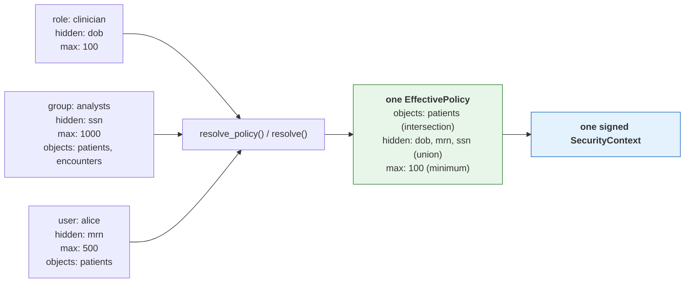

# TOLAP Implementation Guide -- Python

This guide shows how to enforce TOLAP in a Python tool layer **using the shipped SDK**. Every
example is verified against `tolap-core`, `tolap-store` and `tolap-mcp` as published in
[`../sdk/python/`](../sdk/python/).

> **What changed, and why it matters.** An earlier version of this guide walked through
> hand-writing the policy model, the resolution engine, the merge algorithm and the context
> signer -- roughly 650 lines reimplementing types the SDK already ships, in a *different and
> incompatible shape*. Reimplementing any of it is not a supported path: the canonical signing
> form, the merge precedence and the fail-closed rules **are** the protocol, so an independent
> implementation that differs anywhere is a security defect rather than a variation. See
> [canonical-enforcement-spec.md](canonical-enforcement-spec.md).

## Prerequisites

1. **An authenticated user identity.** TOLAP does not authenticate. Your system supplies a
   verified user ID and tenant ID.
2. **A policy store.** Somewhere to persist definitions and assignments. `tolap-store` ships
   `InMemoryPolicyStore` for development and the `PolicyStore` protocol for your own backend.
3. **A tool layer.** The tools your agents use (MCP servers, LangChain tools, etc.).

```bash
pip install tolap-core tolap-store tolap-mcp
```

## What you write, and what the SDK provides

This is the whole division of labour. Anything in the right column that you find yourself
writing by hand is a bug.

| You write | The SDK provides |
| --- | --- |
| Your policy-store backend (Postgres, DynamoDB, a policy service) | `InMemoryPolicyStore`, the store protocol, and resolution over either |
| Identity extraction from your transport | The identity-extractor interfaces and header/JWT implementations |
| Group and role lookup for a user | The merge that consumes it |
| The code that actually queries your data source | Every enforcement decision applied to what it returns |
| Tool registration with your agent framework | The secure tool factory and the three wrappers |

The policy model (`EffectivePolicy`, `ObjectRules`, `RowFilter`, `FieldRules`, `TagRules`,
`PolicyLimits`, `MaskType`, `FilterOperator`, ...), the resolution engine, the merge algorithm,
canonical serialization, HMAC signing and verification, the enforcement pipeline, the SQL
rewriter and the `kb` filter renderers are all shipped. None of them are yours to write.

## Step 1: Policy storage

Policies use the [Policy Definition Schema](../schema/v1.0/policy-definition.schema.json) and
attach to principals via the [Policy Assignment Schema](../schema/v1.0/policy-assignment.schema.json).
`tolap-core` ships the matching dataclasses, so a JSON policy deserializes directly.

```python
from tolap_core.serialization import deserialize_policy_definition, deserialize_policy_assignment
from tolap_store import InMemoryPolicyStore, StaticIdentityResolver

# The store needs an identity resolver: given a user, which groups and roles do they hold?
# That is the input to the merge, and it is yours because only you know your directory.
identity = StaticIdentityResolver(groups={"analyst-001": ["analysts"]}, roles={})
store = InMemoryPolicyStore(identity)

store.save_definition(deserialize_policy_definition(policy_json))
store.save_assignment(deserialize_policy_assignment(assignment_json))
```

For production, implement the `PolicyStore` protocol over your own database. It is the one
interface you are expected to write, because only you know where your policies live --
implement the *storage*, not the resolution semantics, which `tolap-core` supplies.

## Step 2: Resolve, build, sign

One call each. `resolve_policy` applies the precedence rules in
[connector-spec.md §2](connector-spec.md); `sign_context` produces the canonical form and the
HMAC.

```python
from tolap_core.context import build_security_context, sign_context, serialize_context, validate_context

def issue_context(store, signing_key: str) -> str:
    # Resolution: assignments + definitions -> one effective policy for one source.
    policy = store.resolve_policy(
        user_id="analyst-001",
        tenant_id="hospital-001",
        source_connection_id="db:analytics:patients",
    )

    # Envelope + HMAC over the canonical form. Do not hand-roll either.
    context = build_security_context("analyst-001", "hospital-001", [policy])
    return serialize_context(sign_context(context, signing_key))


def verify(context, signing_key: str) -> bool:
    return validate_context(context, signing_key)
```


### Multiple policies: where they merge

A user usually reaches a source through several assignments at once — a role baseline, a group
policy, a personal grant. **All of them apply.** They are merged into one effective policy by
`resolve_policy() / resolve()`, *before* a context exists, which is why the context carries a single policy: it
holds the resolved answer, not the inputs.



Allow-lists **intersect**, deny-lists **union**, ceilings take the **minimum** — so adding an
assignment can only ever restrict, never widen. An administrator cannot escalate access by
granting one more policy. The full table is in
[architecture.md](architecture.md#3-policy-resolution-engine).

```python
# The store does this for you; `resolve` is exposed directly if you assemble the inputs.
from tolap_core.resolution import resolve

effective = resolve(
    user_id="alice",
    tenant_id="hospital-001",
    source_connection_id="db:analytics:patients",
    assignments=all_assignments_for_alice,   # role + group + direct: pass them ALL
    definitions=definitions_by_name,
    get_groups=lambda user_id: ["analysts"],
    get_roles=lambda user_id: ["clinician"],
)
# effective.object_rules.field_rules.hidden_fields == ["dob", "mrn", "ssn"]
```

**One context governs one data source.** A caller needing several sources resolves and signs
per source; `source_connection_id` is inside the signature precisely so a context cannot be
replayed against a different source.

**Never serialize a context yourself for signing.** The signature covers a recursively
key-sorted, null-omitted, compact-separator UTF-8 encoding of the whole envelope. A plain
`json.dumps(...)` without `sort_keys=True, separators=(",", ":"), ensure_ascii=False` produces
different bytes and therefore a different HMAC, and the signature then fails verification
everywhere.

## Step 3: Enforce

The SDK never holds a connection. **You** run the query or the API call; the SDK enforces the
policy on what comes back. That is why nothing here takes a credential.

```python
from tolap_core.enforcement import apply_result_pipeline

# Row filters, tag filters, the relevance floor, the size ceiling, hidden fields,
# allowed-field projection, masking, then the result limit -- in that order, which is
# normative (canonical-enforcement-spec.md §4).
enforced = apply_result_pipeline(rows_you_fetched, policy)
```

For `db` sources, push what can be pushed into the SQL, then run the pipeline anyway:

```python
from tolap_core.enforcement import validate_access
from tolap_core.sql_rewriter import rewrite_query, SqlDialect

def prepare(sql: str, policy) -> tuple[bool, str]:
    # The object check comes first and is separate: a rewrite cannot express
    # "this table is not yours".
    decision = validate_access("patients", policy)
    if not decision.allowed:
        return False, sql
    return True, rewrite_query(sql, policy, dialect=SqlDialect.postgres)
```

Pass `dialect` explicitly. It is not cosmetic: MySQL reads `"status"` as a *string literal*, so
a Postgres-quoted filter is always true there and the filter fails **open**.

The rewrite is an **optimization**, never a replacement. It deliberately does not expand
`SELECT *`, because that would require knowing the table's real columns -- which needs a
connection the SDK does not have. So hidden fields still arrive from the database and the
pipeline removes them. Omitting the pipeline because "the SQL already filters" is a disclosure
bug.

For `kb` sources, render a provider-native metadata filter so denied chunks are never
retrieved -- again as an optimization over the normative post pass:

```python
from tolap_core.kb_filter import build_kb_filter
from tolap_core.kb_providers import render_kb_filter, KbProvider

rendered = render_kb_filter(
    build_kb_filter(policy, metadata_keys=["classification"]),
    KbProvider.bedrock,
)

if rendered.denies_everything:
    ...  # Skip retrieval. An absent filter must never be read as "unrestricted".
```

Check `rendered.confidence`: `verified` means the shape has been exercised against the live
service, `from_grammar` means it was written from published documentation and no service has
accepted one. Treat `from_grammar` as unproven -- promoting two renderers out of that state
exposed one fail-open each.

## Step 4: Use the Secure Tool Factory

The SDK ships the factory: `SecureToolFactory` in `tolap_mcp`. It is the composition
root for enforced tools — an agent receives its tools from it and never constructs one,
which is what makes "the wrapper is the only path to the source" structural rather than a
convention every call site has to remember.

```python
from tolap_mcp import SecureMcpServerOptions, SecureToolFactory, ToolCreationError

factory = SecureToolFactory(
    SecureMcpServerOptions(signing_key=SIGNING_KEY),
    # Only needed for `api` sources. The SDK never opens a connection of its own, so
    # you supply the transport; omitting it and asking for an api tool is an error
    # rather than a silent fallback that would bypass your proxy and timeout settings.
    client=httpx.Client(base_url="https://api.internal"),
)

try:
    tool = factory.create_tool(signed_context)
except ToolCreationError as exc:
    # No tool at all: the context was forged, expired, carried no policy, named an
    # unparseable source, or `can_query` was false. Failing here rather than handing
    # back a wrapper that denies every call keeps a caller from reading the denial as a
    # transient error and retrying.
    raise
```

### What the factory decides

The wrapper you get is chosen by the **category** segment of the signed
`source_connection_id` (`category:namespace:name`, connector-spec section 1):

| Category | Wrapper | Why |
| --- | --- | --- |
| `db`, `kb`, `storage` | `SecureMcpToolWrapper` | All three return records — rows, chunks, listing entries — and share the post-execution pipeline. |
| `api` | `SecureHttpToolWrapper` | HTTP-shaped: status lines, headers, redirects. |

Reading the category from the *signed* identifier is deliberate. A category taken from
unsigned configuration could disagree with the policy the context carries, and flipping
`db` to `api` would select the wrapper that enforces the other category's rules —
`endpoint_rules` do not constrain a SQL query. Inside the signed bytes, changing it
invalidates the signature.

### What the factory does not do

- **No credentials.** The SDK never holds a connection: the record wrapper hands back
  rewritten SQL for you to execute, and the HTTP wrapper is given its client by you.
  Nothing on the enforcement path takes a secret as input, so the factory accepts none.
- **No stored context.** Wrappers are **stateless**; the context is supplied per call and
  re-validated every time. A context held on a shared wrapper could outlive the request
  that supplied it and be reused for the next caller, who may be a different user. This
  is why there is no `set_security_context()` — an earlier draft of this guide described
  one, and it does not exist.
- **One context, one source.** `SecurityContext` carries a single effective policy
  (architecture.md section 1), so the factory returns one tool. Hold several contexts and
  call it per context.


## Step 5: Wire It Together

Here is the complete flow from request to results:

```python
from __future__ import annotations

from tolap_core import resolve, sign_context, build_security_context
from tolap_mcp import SecureMcpServerOptions, SecureToolFactory

SIGNING_KEY = "your-secret-signing-key"


async def handle_agent_request(
    authenticated_user_id: str,
    tenant_id: str,
    source_connection_id: str,
    request: str,
    *,
    policy_store: PolicyStore,
    user_directory: UserDirectory,
) -> str:
    # 1. Resolve the effective policy for ONE source and sign it. One context governs
    #    one data source, so an agent reaching several sources gets one context each.
    policy = resolve(
        user_id=authenticated_user_id,
        tenant_id=tenant_id,
        source_connection_id=source_connection_id,
        assignments=await policy_store.load_assignments(authenticated_user_id),
        definitions=await policy_store.load_definitions(),
        get_groups=user_directory.groups_for,
        get_roles=user_directory.roles_for,
    )
    signed_context = sign_context(
        build_security_context(authenticated_user_id, tenant_id, [policy]),
        SIGNING_KEY,
    )

    # 2. If executing in a different process/service, serialize for transport. The
    #    signature covers the whole envelope including the expiry, so a captured
    #    context cannot be given a longer life.
    # serialized = serialize_context(signed_context)
    # ... send via queue, header, or RPC ...

    # 3. Build the enforcing tool. The factory picks the wrapper from the signed
    #    category and refuses outright if the context does not validate.
    factory = SecureToolFactory(SecureMcpServerOptions(signing_key=SIGNING_KEY))
    tool = factory.create_tool(signed_context)

    # 4. Give the tool to the agent runtime, passing the context on each call.
    agent = create_agent(tool, signed_context)
    return await agent.execute(request)
```

The agent receives a tool that can only return data the user is authorized to see. It does
not need to know about security policies, check permissions, or filter results. Enforcement
is invisible and non-bypassable — provided the tool came from the factory, which is the
point of routing construction through it.

## Testing Recommendations

### Unit Tests for Policy Resolution

Test the merge algorithm with multiple overlapping policies:

- Two policies with overlapping `allowed_fields` -- verify intersection
- One policy hides a field, another allows it -- verify hidden wins
- Two policies with different `max_results` -- verify minimum wins
- One policy sets `can_query = False` -- verify AND produces `False`
- Policy with row filters from multiple profiles -- verify all filters are present

```python
import pytest


def test_allowed_fields_intersection() -> None:
    p1 = PolicyDefinition(
        name="policy-a",
        object_rules=ObjectRules(
            field_rules=FieldRules(allowed_fields=["name", "email", "age"])
        ),
    )
    p2 = PolicyDefinition(
        name="policy-b",
        object_rules=ObjectRules(
            field_rules=FieldRules(allowed_fields=["email", "age", "address"])
        ),
    )
    result = merge_policies([p1, p2])
    assert set(result.allowed_fields) == {"email", "age"}


def test_hidden_fields_union() -> None:
    p1 = PolicyDefinition(
        name="policy-a",
        object_rules=ObjectRules(
            field_rules=FieldRules(hidden_fields=["ssn"])
        ),
    )
    p2 = PolicyDefinition(
        name="policy-b",
        object_rules=ObjectRules(
            field_rules=FieldRules(hidden_fields=["salary"])
        ),
    )
    result = merge_policies([p1, p2])
    assert set(result.hidden_fields) == {"ssn", "salary"}


def test_max_results_takes_minimum() -> None:
    p1 = PolicyDefinition(name="policy-a", limits=Limits(max_results=1000))
    p2 = PolicyDefinition(name="policy-b", limits=Limits(max_results=500))
    result = merge_policies([p1, p2])
    assert result.max_results == 500


def test_can_query_requires_all() -> None:
    p1 = PolicyDefinition(
        name="policy-a", permissions=Permissions(can_query=True)
    )
    p2 = PolicyDefinition(
        name="policy-b", permissions=Permissions(can_query=False)
    )
    result = merge_policies([p1, p2])
    assert result.can_query is False


def test_row_filters_concatenated() -> None:
    p1 = PolicyDefinition(
        name="policy-a",
        object_rules=ObjectRules(
            row_filters=[RowFilter(field="dept", operator=FilterOperator.EQUALS, value="sales")]
        ),
    )
    p2 = PolicyDefinition(
        name="policy-b",
        object_rules=ObjectRules(
            row_filters=[RowFilter(field="region", operator=FilterOperator.EQUALS, value="us")]
        ),
    )
    result = merge_policies([p1, p2])
    assert len(result.row_filters) == 2


def test_no_policies_returns_deny_all() -> None:
    result = merge_policies([])
    assert result.can_query is False
    assert result.read_only is True
```

### Integration Tests for Tool Wrappers

Test enforcement at the tool level:

- Query referencing a hidden column -- verify rejection
- Query without row filters -- verify filters are injected
- Result with masked fields -- verify masking is applied
- Schema introspection -- verify hidden objects/fields are absent
- Expired security context -- verify rejection

```python
@pytest.mark.asyncio
async def test_hidden_column_rejected() -> None:
    wrapper = build_test_wrapper(
        effective_policy=EffectivePolicy(
            can_query=True,
            hidden_fields=["ssn"],
        )
    )
    with pytest.raises(PermissionError, match="ssn"):
        await wrapper.execute_query("SELECT ssn FROM patients")


@pytest.mark.asyncio
async def test_field_masking_applied() -> None:
    wrapper = build_test_wrapper(
        effective_policy=EffectivePolicy(
            can_query=True,
            masked_fields=[
                MaskedFieldRule(field="email", mask_type=MaskType.HASH)
            ],
        ),
        mock_results=[{"name": "Alice", "email": "alice@example.com"}],
    )
    results = await wrapper.execute_query("SELECT name, email FROM users")
    assert results[0]["name"] == "Alice"
    assert results[0]["email"] != "alice@example.com"  # hashed


@pytest.mark.asyncio
async def test_expired_context_rejected() -> None:
    import os
    key = os.urandom(32)
    context = SecurityContext(
        user_id="user-1",
        expires_at=datetime(2020, 1, 1),  # already expired
    )
    signed = sign_context(context, key)
    serialized = serialize_for_transport(signed)

    with pytest.raises(ValueError, match="expired"):
        deserialize_and_validate(serialized, key)
```

### End-to-End Tests

Test the full flow from user identity to filtered results:

- User with restrictive policy queries a data source -- verify only authorized data returned
- User with no applicable policies -- verify access denied
- User with expired assignment -- verify access denied
- User with multiple overlapping assignments -- verify most-restrictive merge

## Hardening: replay detection and salted masking

Two protections ship switched off, because each needs something only the deployment can
supply — shared state for one, a secret for the other. Neither is required to use TOLAP,
and both are worth turning on in production.

### Make a signed context single-use

A signed context is a bearer credential: capture it and it works until it expires. Pass a
`ReplayGuard` to `deserialize_context` and it works exactly once.

```python
from tolap_core import InMemoryReplayGuard, deserialize_context

guard = InMemoryReplayGuard()          # process-local; see the warning below

context = deserialize_context(serialized, SIGNING_KEY, replay_guard=guard)
# A second call with the same serialized context raises ValueError("... replay").
```

The identifier the guard keys on (`jti`) is **inside the signed payload**, so an attacker
cannot strip or swap it to dodge the check — that is what makes the guard worth having
rather than theatre. The check also runs after signature and expiry validation, so replaying
an already-expired context cannot burn the identifier of one that has not been used yet.

`InMemoryReplayGuard` is process-local. Two workers behind a load balancer each keep their
own set, so a context replayed against a *different* worker is not detected. For anything
multi-process, implement the one-method protocol over a store you already run:

```python
class RedisReplayGuard:
    def __init__(self, redis): self._redis = redis

    def check_and_register(self, jti: str, expires_at: str | None) -> bool:
        # SET NX is the atomic step. Check-then-register as two calls lets two
        # concurrent replays both succeed, under exactly the load an attacker makes.
        return bool(self._redis.set(f"tolap:jti:{jti}", "1", nx=True, ex=3600))
```

A context with no `jti` is **rejected** when a guard is active rather than waved through:
silently skipping the check is the failure mode the guard exists to prevent.

### Salt `hash` masking

Unsalted, `hash` is a truncated digest — a good pseudonymous join key, and brute-forceable
for anything low-entropy. There are ~10^9 SSNs and ~4×10^4 plausible dates of birth, so a
masked column of either is recoverable with a rainbow table while still looking like an
opaque token.

```python
options = SecureMcpServerOptions(
    signing_key=SIGNING_KEY,
    hash_salt=os.environ["TOLAP_HASH_SALT"],   # from a secrets manager / KMS
)
```

The salt makes the mask a keyed HMAC. The join-key property survives — the same salt over
the same value gives the same pseudonym in every SDK — which is also why:

- **the salt is a deployment secret, not a policy field.** Policies are readable by every
  administrator and auditor, which would defeat the point.
- **the same salt must be set everywhere the pseudonym is joined.** Changing it changes
  every masked value.

When a value must not be derivable at all, use `redact` or `null` rather than any hash.
