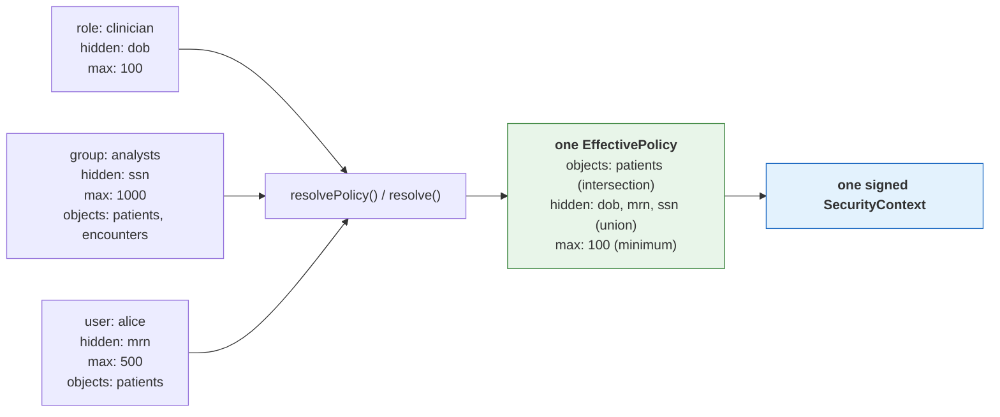

# TOLAP Implementation Guide -- TypeScript / Node.js

This guide shows how to enforce TOLAP in a TypeScript tool layer **using the shipped SDK**.
Every example is verified against `@aws/tolap-core`, `@aws/tolap-store` and `@aws/tolap-mcp` as published in
[`../sdk/typescript/`](../sdk/typescript/).

> **What changed, and why it matters.** An earlier version of this guide walked through
> hand-writing the policy model, the resolution engine, the merge algorithm and the context
> signer -- roughly 650 lines reimplementing types the SDK already ships, and its signing
> example used a bare `JSON.stringify` rather than the canonical recursively key-sorted form.
> A context signed that way fails verification in every SDK. Reimplementing any of this is not
> a supported path: the canonical form, the merge precedence and the fail-closed rules **are**
> the protocol. See [canonical-enforcement-spec.md](canonical-enforcement-spec.md).

## Prerequisites

1. **An authenticated user identity.** TOLAP does not authenticate. Your system supplies a
   verified user ID and tenant ID.
2. **A policy store.** `@aws/tolap-store` ships `InMemoryPolicyStore` for development and the
   `PolicyStore` interface for your own backend.
3. **A tool layer.** The tools your agents use (MCP servers, LangChain tools, etc.).

```bash
npm install @aws/tolap-core @aws/tolap-store @aws/tolap-mcp
```

## What you write, and what the SDK provides

Anything in the right column that you find yourself writing by hand is a bug.

| You write | The SDK provides |
| --- | --- |
| Your policy-store backend (Postgres, DynamoDB, a policy service) | `InMemoryPolicyStore`, the `PolicyStore` interface, and resolution over either |
| Identity extraction from your transport | The identity-extractor interfaces and header/JWT implementations |
| Group and role lookup for a user | `StaticIdentityResolver`, and the merge that consumes it |
| The code that actually queries your data source | Every enforcement decision applied to what it returns |
| Tool registration with your agent framework | `SecureToolFactory` and the three wrappers |

The policy model (`EffectivePolicy`, `ObjectRules`, `RowFilter`, `FieldRules`, `TagRules`,
`PolicyLimits`, `MaskType`, `FilterOperator`, ...), the resolution engine, the merge algorithm,
canonical serialization, HMAC signing and verification, the enforcement pipeline, the SQL
rewriter and the `kb` filter renderers are all shipped from `@aws/tolap-core`. None of them are
yours to write.

## Step 1: Policy storage

Policies use the [Policy Definition Schema](../schema/v1.0/policy-definition.schema.json) and
attach to principals via the [Policy Assignment Schema](../schema/v1.0/policy-assignment.schema.json).
The types are exported from `@aws/tolap-core`, so a parsed JSON policy is used directly.

```typescript
import type { PolicyDefinition, PolicyAssignment } from "@aws/tolap-core";
import { InMemoryPolicyStore, StaticIdentityResolver } from "@aws/tolap-store";

// The resolver answers "which groups and roles does this user hold?" -- the input to the
// merge, and yours because only you know your directory.
const identity = new StaticIdentityResolver();
identity.setGroups("analyst-001", ["analysts"]);

const store = new InMemoryPolicyStore(identity);
await store.putDefinition(JSON.parse(policyJson) as PolicyDefinition);
await store.putAssignment(JSON.parse(assignmentJson) as PolicyAssignment);
```

For production, implement the `PolicyStore` interface over your own database -- the *storage*,
not the resolution semantics, which `@aws/tolap-core` supplies.

## Step 2: Resolve, build, sign

One call each. `resolvePolicy` applies the precedence rules in
[connector-spec.md §2](connector-spec.md); `signContext` produces the canonical form and the
HMAC.

```typescript
import {
  buildSecurityContext,
  signContext,
  serializeContext,
  validateContext,
  type SecurityContext,
} from "@aws/tolap-core";
import { InMemoryPolicyStore } from "@aws/tolap-store";

async function issueContext(store: InMemoryPolicyStore, signingKey: string): Promise<string> {
  // Resolution: assignments + definitions -> one effective policy for one source.
  const policy = await store.resolvePolicy(
    "analyst-001",
    "hospital-001",
    "db:analytics:patients",
  );

  // Envelope + HMAC over the canonical form. Do not hand-roll either.
  const context = buildSecurityContext("analyst-001", "hospital-001", policy);
  return serializeContext(signContext(context, signingKey));
}

function verify(context: SecurityContext, signingKey: string): boolean {
  return validateContext(context, signingKey);
}
```


### Multiple policies: where they merge

A user usually reaches a source through several assignments at once — a role baseline, a group
policy, a personal grant. **All of them apply.** They are merged into one effective policy by
`resolvePolicy() / resolve()`, *before* a context exists, which is why the context carries a single policy: it
holds the resolved answer, not the inputs.



Allow-lists **intersect**, deny-lists **union**, ceilings take the **minimum** — so adding an
assignment can only ever restrict, never widen. An administrator cannot escalate access by
granting one more policy. The full table is in
[architecture.md](architecture.md#3-policy-resolution-engine).

```typescript
// The store does this for you; `resolve` is exposed directly if you assemble the inputs.
import { resolve } from "@aws/tolap-core";

const effective = await resolve(
  "alice",
  "hospital-001",
  "db:analytics:patients",
  allAssignmentsForAlice,   // role + group + direct: pass them ALL
  definitionsByName,
  (userId) => ["analysts"],
  (userId) => ["clinician"],
);
// effective.objectRules.fieldRules.hiddenFields === ["dob", "mrn", "ssn"]
```

**One context governs one data source.** A caller needing several sources resolves and signs
per source; `sourceConnectionId` is inside the signature precisely so a context cannot be
replayed against a different source.

**Never `JSON.stringify` a context for signing.** The signature covers a recursively
key-sorted, null-omitted, compact-separator UTF-8 encoding of the whole envelope. Plain
`JSON.stringify` emits declaration order, which produces different bytes and a different HMAC --
the signature then fails verification everywhere. `signContext` is the only supported path.

## Step 3: Enforce

The SDK never holds a connection. **You** run the query or the API call; the SDK enforces the
policy on what comes back. That is why nothing here takes a credential.

```typescript
import { applyResultPipeline } from "@aws/tolap-core";

// Row filters, tag filters, the relevance floor, the size ceiling, hidden fields,
// allowed-field projection, masking, then the result limit -- in that order, which is
// normative (canonical-enforcement-spec.md §4).
const enforced = applyResultPipeline(rowsYouFetched, policy);
```

For `db` sources, push what can be pushed into the SQL, then run the pipeline anyway:

```typescript
import { validateAccess, SqlQueryRewriter, SqlDialect } from "@aws/tolap-core";

function prepare(sql: string, policy: EffectivePolicy): { allowed: boolean; sql: string } {
  // The object check comes first and is separate: a rewrite cannot express
  // "this table is not yours".
  const decision = validateAccess("patients", policy);
  if (!decision.allowed) return { allowed: false, sql };
  const rewriter = new SqlQueryRewriter({ dialect: SqlDialect.Postgres });
  return { allowed: true, sql: rewriter.rewriteQuery(sql, policy).query };
}
```

Pass the dialect explicitly. It is not cosmetic: MySQL reads `"status"` as a *string literal*,
so a Postgres-quoted filter is always true there and the filter fails **open**.

The rewrite is an **optimization**, never a replacement. It deliberately does not expand
`SELECT *`, because that would require knowing the table's real columns -- which needs a
connection the SDK does not have. So hidden fields still arrive from the database and the
pipeline removes them. Omitting the pipeline because "the SQL already filters" is a disclosure
bug.

For `kb` sources, render a provider-native metadata filter so denied chunks are never
retrieved -- again as an optimization over the normative post pass:

```typescript
import { buildKbFilter, renderKbFilter, KbProvider } from "@aws/tolap-core";

const rendered = renderKbFilter(
  buildKbFilter(policy, { metadataKeys: ["classification"] }),
  KbProvider.Bedrock,
);

if (rendered.deniesEverything) {
  // Skip retrieval. An absent filter must never be read as "unrestricted".
}
```

Check `rendered.confidence`: `Verified` means the shape has been exercised against the live
service, `FromGrammar` means it was written from published documentation and no service has
accepted one. Treat `FromGrammar` as unproven -- promoting two renderers out of that state
exposed one fail-open each.

## Step 4: Use the Secure Tool Factory

The SDK ships the factory: `SecureToolFactory` in `@aws/tolap-mcp`. It is the composition root
for enforced tools — an agent receives its tools from it and never constructs one, which is
what makes "the wrapper is the only path to the source" structural rather than a convention
every call site has to remember.

```typescript
import { SecureToolFactory, ToolCreationError } from "@aws/tolap-mcp";

const factory = new SecureToolFactory({
  signingKey: SIGNING_KEY,
  // Only needed for `api` sources. The SDK never opens a connection of its own, so you
  // supply the transport; omitting it and asking for an api tool is an error rather than
  // a silent fallback to global `fetch` that would bypass your proxy, timeout and retry
  // configuration.
  fetchFn: myFetch,
  baseUrl: "https://api.internal",
});

let tool;
try {
  tool = factory.createTool(signedContext);
} catch (error) {
  if (error instanceof ToolCreationError) {
    // No tool at all: the context was forged, expired, carried no policy, named an
    // unparseable source, or `canQuery` was false. Failing here rather than handing back
    // a wrapper that denies every call keeps a caller from reading the denial as a
    // transient error and retrying.
  }
  throw error;
}
```

### What the factory decides

The wrapper you get is chosen by the **category** segment of the signed
`sourceConnectionId` (`category:namespace:name`, connector-spec §1):

| Category | Wrapper | Why |
| --- | --- | --- |
| `db`, `kb`, `storage` | `SecureContextToolWrapper` | All three return records — rows, chunks, listing entries — and share the post-execution pipeline. |
| `api` | `SecureHttpToolWrapper` | HTTP-shaped: status lines, headers, redirects. |

Reading the category from the *signed* identifier is deliberate. A category taken from
unsigned configuration could disagree with the policy the context carries, and flipping
`db` to `api` would select the wrapper that enforces the other category's rules —
`endpointRules` do not constrain a SQL query. Inside the signed bytes, changing it
invalidates the signature.

Use `factory.categoryOf(context)` to branch before requesting a tool.

### What the factory does not do

- **No credentials.** The SDK never holds a connection: the record wrapper hands back
  rewritten SQL for you to execute, and the HTTP wrapper is given its transport by you.
  Nothing on the enforcement path takes a secret as input, so the factory accepts none.
- **No stored context.** Wrappers are **stateless**; the context is supplied per call and
  re-validated every time. A context held on a shared wrapper could outlive the request
  that supplied it and be reused for the next caller, who may be a different user. This is
  why there is no `setSecurityContext()` — an earlier draft of this guide described one,
  and it does not exist.
- **One context, one source.** A `SecurityContext` carries a single effective policy
  (architecture.md §1), so the factory returns one tool. Hold several contexts and call it
  per context.


## Step 5: Wire It Together

Here is the complete flow from request to results:

```typescript
// ── In your request handler / orchestration layer ───────────────────────

import { resolve, buildSecurityContext, signContext } from "@aws/tolap-core";
import { SecureToolFactory } from "@aws/tolap-mcp";

const SIGNING_KEY = process.env.TOLAP_SIGNING_KEY!;

async function handleAgentRequest(
  authenticatedUserId: string,
  tenantId: string,
  sourceConnectionId: string,
  request: string,
): Promise<unknown> {
  // 1. Resolve the effective policy for ONE source and sign it. One context governs one
  //    data source, so an agent reaching several sources gets one context each.
  const policy = await resolve(
    authenticatedUserId,
    tenantId,
    sourceConnectionId,
    await policyStore.loadAssignments(authenticatedUserId),
    await policyStore.loadDefinitions(),
    (userId) => userDirectory.groupsFor(userId),
    (userId) => userDirectory.rolesFor(userId),
  );
  const signedContext = signContext(
    buildSecurityContext(authenticatedUserId, tenantId, policy),
    SIGNING_KEY,
  );

  // 2. If executing in a different process/service, serialize for transport. The
  //    signature covers the whole envelope including the expiry, so a captured context
  //    cannot be given a longer life.
  // const serialized = serializeContext(signedContext);
  // ... send via queue, header, or RPC ...

  // 3. Build the enforcing tool. The factory picks the wrapper from the signed category
  //    and refuses outright if the context does not validate.
  const factory = new SecureToolFactory({ signingKey: SIGNING_KEY, fetchFn: myFetch });
  const tool = factory.createTool(signedContext);

  // 4. Give the tool to the agent runtime, passing the context on each call.
  const agent = createAgent(tool, signedContext);
  return agent.execute(request);
}
```

The agent receives a tool that can only return data the user is authorized to see. It does
not need to know about security policies, check permissions, or filter results. Enforcement
is invisible and non-bypassable — provided the tool came from the factory, which is the
point of routing construction through it.

## Testing Recommendations

### Unit Tests for Policy Resolution

Test the merge algorithm with multiple overlapping policies:

- Two policies with overlapping `allowedFields` -- verify intersection
- One policy hides a field, another allows it -- verify hidden wins
- Two policies with different `maxResults` -- verify minimum wins
- One policy sets `canQuery = false` -- verify AND produces false
- Policy with row filters from multiple profiles -- verify all filters are present

```typescript
import { describe, it, expect } from "vitest"; // or jest, node:test, etc.

describe("mergePolicies", () => {
  it("should intersect allowedFields across policies", () => {
    const policies: PolicyDefinition[] = [
      makePolicyWith({ allowedFields: ["id", "name", "email"] }),
      makePolicyWith({ allowedFields: ["id", "email", "phone"] }),
    ];
    const result = mergePolicies(policies);
    expect(result.allowedFields).toEqual(
      expect.arrayContaining(["id", "email"]),
    );
    expect(result.allowedFields).toHaveLength(2);
  });

  it("should deny query when any policy denies", () => {
    const policies: PolicyDefinition[] = [
      makePolicyWith({ canQuery: true }),
      makePolicyWith({ canQuery: false }),
    ];
    const result = mergePolicies(policies);
    expect(result.canQuery).toBe(false);
  });

  it("should take the minimum maxResults", () => {
    const policies: PolicyDefinition[] = [
      makePolicyWith({ maxResults: 1000 }),
      makePolicyWith({ maxResults: 100 }),
    ];
    const result = mergePolicies(policies);
    expect(result.maxResults).toBe(100);
  });

  it("should return DENY_ALL when no policies apply", () => {
    const result = mergePolicies([]);
    expect(result.canQuery).toBe(false);
    expect(result.readOnly).toBe(true);
  });
});
```

### Integration Tests for Tool Wrappers

Test enforcement at the tool level:

- Query referencing a hidden column -- verify rejection
- Query without row filters -- verify filters are injected
- Result with masked fields -- verify masking is applied
- Schema introspection -- verify hidden objects/fields are absent
- Expired security context -- verify rejection

```typescript
describe("SecureToolWrapper", () => {
  it("should reject queries referencing hidden fields", async () => {
    const wrapper = createTestWrapper({
      hiddenFields: ["ssn", "credit_card"],
    });
    // Assuming analyzeQuery returns { referencedFields: ["ssn"] }
    await expect(
      wrapper.executeQuery("SELECT ssn FROM patients"),
    ).rejects.toThrow("Access denied: field 'ssn' is not accessible");
  });

  it("should apply field masking to results", async () => {
    const wrapper = createTestWrapper({
      maskedFields: [
        { field: "email", maskType: MaskType.Partial, visibleChars: 4 },
      ],
    });
    const results = await wrapper.executeQuery("SELECT email FROM users");
    // Original value "user@example.com" should be partially masked
    expect(results[0].email).toMatch(/^\*+\.com$/);
  });

  it("should exclude hidden objects from listing", async () => {
    const wrapper = createTestWrapper({
      hiddenObjects: ["audit_log", "internal_config"],
    });
    const objects = await wrapper.listAccessibleObjects();
    expect(objects).not.toContain("audit_log");
    expect(objects).not.toContain("internal_config");
  });
});
```

### End-to-End Tests

Test the full flow from user identity to filtered results:

- User with restrictive policy queries a data source -- verify only authorized data returned
- User with no applicable policies -- verify access denied
- User with expired assignment -- verify access denied
- User with multiple overlapping assignments -- verify most-restrictive merge

```typescript
describe("TOLAP end-to-end", () => {
  it("should return only authorized data for a restricted user", async () => {
    // Set up: user has a policy that allows only the "patients" table,
    // hides the "ssn" column, and filters to region = "us-east"
    const context = await buildSecurityContext(
      restrictedUserId,
      tenantId,
      [patientDbSource],
      engine,
    );
    const signed = signContext(context, TEST_SIGNING_KEY);
    const tool = factory.createTool(signed);

    const results = await executeQueryWith(tool, signed, "SELECT * FROM patients");

    // Verify: ssn column is not present, all rows are us-east
    for (const row of results) {
      expect(row).not.toHaveProperty("ssn");
      expect(row.region).toBe("us-east");
    }
  });

  it("should produce no tool at all when no policies apply", async () => {
    // A user no policy applies to resolves to deny-all, so `canQuery` is false and the
    // factory refuses to build a tool. Asserting the *absence of a tool* is stronger than
    // asserting a later denial: there is no object a caller could accidentally use.
    const context = await buildSecurityContext(unknownUserId, tenantId, denyAllPolicy);
    const signed = signContext(context, TEST_SIGNING_KEY);

    expect(() => factory.createTool(signed)).toThrow(ToolCreationError);
  });

  it("should reject an expired security context", () => {
    const expiredContext = serializeForTransport(
      signContext(
        { ...validContext, expiresAt: new Date("2020-01-01") },
        TEST_SIGNING_KEY,
      ),
    );

    expect(() =>
      deserializeAndValidate(expiredContext, TEST_SIGNING_KEY),
    ).toThrow("Security context has expired");
  });
});
```

## Hardening: replay detection and salted masking

Two protections ship switched off, because each needs something only the deployment can
supply — shared state for one, a secret for the other. Neither is required to use TOLAP,
and both are worth turning on in production.

### Make a signed context single-use

A signed context is a bearer credential: capture it and it works until it expires. Pass a
`ReplayGuard` to `deserializeContext` and it works exactly once.

```ts
import { InMemoryReplayGuard, deserializeContext } from "@aws/tolap-core";

const guard = new InMemoryReplayGuard();   // process-local; see the warning below

const context = deserializeContext(serialized, SIGNING_KEY, guard);
// A second call with the same serialized context throws "... (replay)".
```

The identifier the guard keys on (`jti`) is **inside the signed payload**, so an attacker
cannot strip or swap it to dodge the check — that is what makes the guard worth having
rather than theatre. The check also runs after signature and expiry validation, so replaying
an already-expired context cannot burn the identifier of one that has not been used yet.

`InMemoryReplayGuard` is process-local. Two workers behind a load balancer each keep their
own set, so a context replayed against a *different* worker is not detected. For anything
multi-process, implement the one-method interface over a store you already run:

```ts
import type { ReplayGuard } from "@aws/tolap-core";

class RedisReplayGuard implements ReplayGuard {
  constructor(private redis: RedisClient) {}

  checkAndRegister(jti: string, expiresAt?: string): boolean {
    // SET NX is the atomic step. Check-then-register as two calls lets two
    // concurrent replays both succeed, under exactly the load an attacker makes.
    return this.redis.setNxSync(`tolap:jti:${jti}`, "1", 3600);
  }
}
```

A context with no `jti` is **rejected** when a guard is active rather than waved through:
silently skipping the check is the failure mode the guard exists to prevent.

### Salt `hash` masking

Unsalted, `hash` is a truncated digest — a good pseudonymous join key, and brute-forceable
for anything low-entropy. There are ~10^9 SSNs and ~4×10^4 plausible dates of birth, so a
masked column of either is recoverable with a rainbow table while still looking like an
opaque token.

```ts
const wrapper = new SecureContextToolWrapper({
  signingKey: SIGNING_KEY,
  hashSalt: process.env.TOLAP_HASH_SALT,   // from a secrets manager / KMS
});
```

The salt makes the mask a keyed HMAC. The join-key property survives — the same salt over
the same value gives the same pseudonym in every SDK — which is also why:

- **the salt is a deployment secret, not a policy field.** Policies are readable by every
  administrator and auditor, which would defeat the point.
- **the same salt must be set everywhere the pseudonym is joined.** Changing it changes
  every masked value. It must also match on the HTTP wrapper, or the same field masks to
  two different pseudonyms depending on which transport served the request.

When a value must not be derivable at all, use `redact` or `null` rather than any hash.
