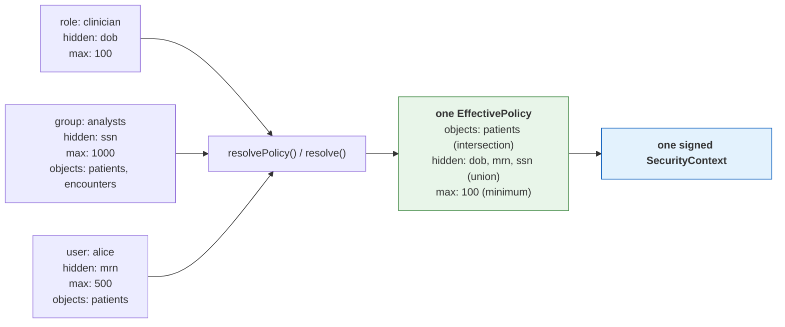

# TOLAP Implementation Guide -- TypeScript / Node.js

This guide shows how to enforce TOLAP in a TypeScript tool layer **using the shipped SDK**.
Every example is verified against `@aws/tolap-core`, `@aws/tolap-store` and `@aws/tolap-mcp` as published in
[`../sdk/typescript/`](../sdk/typescript/).

> **What changed, and why it matters.** An earlier version of this guide walked through
> hand-writing the policy model, the resolution engine, the merge algorithm and the context
> signer -- roughly 650 lines reimplementing types the SDK already ships, and its signing
> example used a bare `JSON.stringify` rather than the canonical recursively key-sorted form.
> A context signed that way fails verification in every SDK. Reimplementing any of this is not
> a supported path: the canonical form, the merge precedence and the fail-closed rules **are**
> the protocol. See [canonical-enforcement-spec.md](canonical-enforcement-spec.md).

## Prerequisites

1. **An authenticated user identity.** TOLAP does not authenticate. Your system supplies a
   verified user ID and tenant ID.
2. **A policy store.** `@aws/tolap-store` ships `InMemoryPolicyStore` for development and the
   `PolicyStore` interface for your own backend.
3. **A tool layer.** The tools your agents use (MCP servers, LangChain tools, etc.).

Build the SDK from source -- it is not distributed through a package registry:

```bash
git clone https://github.com/awslabs/tolap && cd tolap
./tools/build-local.sh typescript
```

That compiles the three packages and writes tarballs to `dist/npm`. Consuming projects
reference them by path -- `"@aws/tolap-core": "file:../tolap/sdk/typescript/packages/core"`
-- which is how [`examples/`](../examples/) and [`server/`](../server/) do it.

## What you write, and what the SDK provides

Anything in the right column that you find yourself writing by hand is a bug.

| You write | The SDK provides |
| --- | --- |
| Your policy-store backend (Postgres, DynamoDB, a policy service) | `InMemoryPolicyStore`, the `PolicyStore` interface, and resolution over either |
| Identity extraction from your transport | The identity-extractor interfaces and header/JWT implementations |
| Group and role lookup for a user | `StaticIdentityResolver`, and the merge that consumes it |
| The code that actually queries your data source | Every enforcement decision applied to what it returns |
| Tool registration with your agent framework | `SecureToolFactory` and the three wrappers |

The policy model (`EffectivePolicy`, `ObjectRules`, `RowFilter`, `FieldRules`, `TagRules`,
`PolicyLimits`, `MaskType`, `FilterOperator`, ...), the resolution engine, the merge algorithm,
canonical serialization, HMAC signing and verification, the enforcement pipeline, the SQL
rewriter and the `kb` filter renderers are all shipped from `@aws/tolap-core`. None of them are
yours to write.

## Step 1: Policy storage

Policies use the [Policy Definition Schema](../schema/v1.0/policy-definition.schema.json) and
attach to principals via the [Policy Assignment Schema](../schema/v1.0/policy-assignment.schema.json).
The types are exported from `@aws/tolap-core`, so a parsed JSON policy is used directly.

```typescript
import type { PolicyDefinition, PolicyAssignment } from "@aws/tolap-core";
import { InMemoryPolicyStore, StaticIdentityResolver } from "@aws/tolap-store";

// The resolver answers "which groups and roles does this user hold?" -- the input to the
// merge, and yours because only you know your directory.
const identity = new StaticIdentityResolver();
identity.setGroups("analyst-001", ["analysts"]);

const store = new InMemoryPolicyStore(identity);
await store.putDefinition(JSON.parse(policyJson) as PolicyDefinition);
await store.putAssignment(JSON.parse(assignmentJson) as PolicyAssignment);
```

For production, implement the `PolicyStore` interface over your own database -- the *storage*,
not the resolution semantics, which `@aws/tolap-core` supplies.

## Step 2: Resolve, build, sign

One call each. `resolvePolicy` applies the most-restrictive-wins merge rules in
[canonical-enforcement-spec.md §8](canonical-enforcement-spec.md#8-permission-merging) (permission
merging) and [§6](canonical-enforcement-spec.md#6-masking) (the mask restrictiveness ranking);
`signContext` produces the canonical form and the HMAC.

```typescript
import {
  buildSecurityContext,
  signContext,
  serializeContext,
  validateContext,
  type SecurityContext,
} from "@aws/tolap-core";
import { InMemoryPolicyStore } from "@aws/tolap-store";

async function issueContext(store: InMemoryPolicyStore, signingKey: string): Promise<string> {
  // Resolution: assignments + definitions -> one effective policy for one source.
  const policy = await store.resolvePolicy(
    "analyst-001",
    "hospital-001",
    "db:analytics:patients",
  );

  // Envelope + HMAC over the canonical form. Do not hand-roll either.
  const context = buildSecurityContext("analyst-001", "hospital-001", policy);
  return serializeContext(signContext(context, signingKey));
}

function verify(context: SecurityContext, signingKey: string): boolean {
  return validateContext(context, signingKey);
}
```


### Multiple policies: where they merge

A user usually reaches a source through several assignments at once — a role baseline, a group
policy, a personal grant. **All of them apply.** They are merged into one effective policy by
`resolvePolicy() / resolve()`, *before* a context exists, which is why the context carries a single policy: it
holds the resolved answer, not the inputs.



Allow-lists **intersect**, deny-lists **union**, ceilings take the **minimum** — so adding an
assignment can only ever restrict, never widen. An administrator cannot escalate access by
granting one more policy. The full table is in
[architecture.md](architecture.md#3-policy-resolution-engine).

```typescript
// The store does this for you; `resolve` is exposed directly if you assemble the inputs.
import { resolve } from "@aws/tolap-core";

const effective = await resolve(
  "alice",
  "hospital-001",
  "db:analytics:patients",
  allAssignmentsForAlice,   // role + group + direct: pass them ALL
  definitionsByName,
  (userId) => ["analysts"],
  (userId) => ["clinician"],
);
// effective.objectRules.fieldRules.hiddenFields === ["dob", "mrn", "ssn"]
```

**One context governs one data source.** A caller needing several sources resolves and signs
per source; `sourceConnectionId` is inside the signature precisely so a context cannot be
replayed against a different source.

**Never `JSON.stringify` a context for signing.** The signature covers a recursively
key-sorted, null-omitted, compact-separator UTF-8 encoding of the whole envelope. Plain
`JSON.stringify` emits declaration order, which produces different bytes and a different HMAC --
the signature then fails verification everywhere. `signContext` is the only supported path.

## Step 3: Enforce

The SDK never holds a connection. **You** run the query or the API call; the SDK enforces the
policy on what comes back. That is why nothing here takes a credential.

```typescript
import { applyResultPipeline } from "@aws/tolap-core";

// Row filters, tag filters, the relevance floor, the size ceiling, hidden fields,
// allowed-field projection, masking, then the result limit -- in that order, which is
// normative (canonical-enforcement-spec.md §4).
//
// hashSalt is the THIRD parameter and it is NOT carried on the policy -- the salt is a
// deployment secret, not a policy field (see "Salt `hash` masking" below). Calling this
// with two arguments after configuring a salt elsewhere produces *unsalted* digests with
// nothing in the output to say so, so pass it here too.
const enforced = applyResultPipeline(rowsYouFetched, policy, HASH_SALT);
```

The wrappers pass their own `hashSalt` for you; this only matters when you call
`applyResultPipeline` directly.

For `db` sources, push what can be pushed into the SQL, then run the pipeline anyway:

```typescript
import { prepareSqlQuery, applyResultPipeline, SqlDialect } from "@aws/tolap-core";

// prepareSqlQuery runs the pre-execution checks in order -- canQuery, the object rule, the
// hidden-field refusal -- and then rewrites unless the mode says otherwise.
const prep = prepareSqlQuery(sql, policy, { dialect: SqlDialect.Postgres });
if (!prep.allowed) throw new Error(`Access denied: ${prep.denialReason}`);

const rows = await runOnYourConnection(prep.query);
return applyResultPipeline(rows, policy, HASH_SALT);   // still mandatory, salt included
```

### Choosing where the policy is applied

`SqlEnforcementMode` decides whether TOLAP touches your SQL. `RewriteAndPost` is the default
and pushes what it can into the query; `PostOnly` leaves it byte for byte and enforces
entirely on the rows returned:

```typescript
import { SqlEnforcementMode } from "@aws/tolap-core";

const prep = prepareSqlQuery(sql, policy, {
  dialect: SqlDialect.Postgres,
  mode: SqlEnforcementMode.PostOnly,   // my SQL, untouched
});
```

**Both modes return the same rows.** Choose `PostOnly` when you will not have your SQL
edited — a statement the rewriter's parser does not handle, a stored procedure, or an ORM
that owns its own SQL. The cost is that the database returns rows the post pass then
discards; `fullyPushedDown(prep)` tells you whether the database is doing all the filtering.
`PostOnly` skips the rewrite, not the checks.

Pass the dialect explicitly. It is not cosmetic: MySQL without `ANSI_QUOTES` reads `"region"` as
a *string literal*, so a Postgres-quoted filter evaluates `'region' = 'us-east'` — false for
every row. The direction is worth being precise about: that fails **closed**, so it is a
correctness and availability defect rather than a disclosure
([connector-spec §5.1](connector-spec.md#51-sql-dialects)). The post-execution pass remains the
security boundary; what an integrator sees is empty results and a product that looks broken.

The rewrite is an **optimization**, never a replacement -- but do not assume it leaves `SELECT *`
alone. `expandSelectStar` **does** expand it whenever `allowedFields` is an explicit, glob-free
list: the projection becomes that list minus `hiddenFields`, or the constant `1` when nothing
survives the filter.

It is left verbatim only in the two cases where the table's real column list is unknowable
without a connection the SDK does not have:

- `allowedFields` is absent -- even when `hiddenFields` is set. The hidden column crosses the
  wire and the post pass strips it, so a policy hiding a large or sensitive column from a
  `SELECT *` gains nothing from the rewrite.
- `allowedFields` contains a `*` or a `?`. (.NET and Python check only for `*`; this SDK also
  bails on `?`, which is a wider bail-out and therefore never less safe.)

Either way the post-execution pipeline is still mandatory. Omitting it because "the SQL already
filters" is a disclosure bug.

For `kb` sources, render a provider-native metadata filter so denied chunks are never
retrieved -- again as an optimization over the normative post pass:

```typescript
import { buildKbFilter, renderKbFilter, KbProvider } from "@aws/tolap-core";

const rendered = renderKbFilter(
  buildKbFilter(policy, { metadataKeys: ["classification"] }),
  KbProvider.Bedrock,
);

if (rendered.deniesEverything) {
  // Skip retrieval. An absent filter must never be read as "unrestricted".
}
```

Check `rendered.confidence`: `Verified` means the shape has been exercised against the live
service, `FromGrammar` means it was written from published documentation and no service has
accepted one. Treat `FromGrammar` as unproven -- promoting two renderers out of that state
exposed one fail-open each.

### A result shape the pipeline cannot inspect is denied

Enforcement covers records, record arrays and nested bodies. Anything else -- a class instance or
DTO, a scalar, a stream, an unconsumed iterator -- throws `UnenforceableResultError`, whose
`shape` field names what was returned and whose message names the escape hatch. The alternative,
returning a shape the policy could not be applied to, is the fail-open
([§5](canonical-enforcement-spec.md#5-result-shapes--fail-closed)).

`allowUnenforceableShapes` on the wrapper and factory options is the explicit opt-out. It is
`false` by default, it logs a warning **every** time it lets a result through, and it is for
mid-migration only -- do not enable it in production. Return a plain object or an array of them
and the shape is enforceable.

## Step 4: Use the Secure Tool Factory

The SDK ships the factory: `SecureToolFactory` in `@aws/tolap-mcp`. It is the composition root
for enforced tools — an agent receives its tools from it and never constructs one, which is
what makes "the wrapper is the only path to the source" structural rather than a convention
every call site has to remember.

```typescript
import { SecureToolFactory, ToolCreationError } from "@aws/tolap-mcp";

const factory = new SecureToolFactory({
  signingKey: SIGNING_KEY,
  // Only needed for `api` sources. The SDK never opens a connection of its own, so you
  // supply the transport; omitting it and asking for an api tool is an error rather than
  // a silent fallback to global `fetch` that would bypass your proxy, timeout and retry
  // configuration.
  fetchFn: myFetch,
  baseUrl: "https://api.internal",
});

let tool;
try {
  tool = factory.createTool(signedContext);
} catch (error) {
  if (error instanceof ToolCreationError) {
    // No tool at all: the context was forged, expired, carried no policy, named an
    // unparseable source, or `canQuery` was false. Failing here rather than handing back
    // a wrapper that denies every call keeps a caller from reading the denial as a
    // transient error and retrying.
  }
  throw error;
}
```

### What the factory decides

The wrapper you get is chosen by the **category** segment of the signed
`sourceConnectionId` (`category:namespace:name`, connector-spec §1):

| Category | Wrapper | Why |
| --- | --- | --- |
| `db`, `kb`, `storage` | `SecureContextToolWrapper` | All three return records — rows, chunks, listing entries — and share the post-execution pipeline. |
| `api` | `SecureHttpToolWrapper` | HTTP-shaped: status lines, headers, redirects. |

Reading the category from the *signed* identifier is deliberate. A category taken from
unsigned configuration could disagree with the policy the context carries, and flipping
`db` to `api` would select the wrapper that enforces the other category's rules —
`endpointRules` do not constrain a SQL query. Inside the signed bytes, changing it
invalidates the signature.

Use `factory.categoryOf(context)` to branch before requesting a tool.

### What the factory does not do

- **No credentials.** The SDK never holds a connection: the record wrapper hands back
  rewritten SQL for you to execute, and the HTTP wrapper is given its transport by you.
  Nothing on the enforcement path takes a secret as input, so the factory accepts none.
- **No stored context.** Wrappers are **stateless**; the context is supplied per call and
  re-validated every time. A context held on a shared wrapper could outlive the request
  that supplied it and be reused for the next caller, who may be a different user. This is
  why there is no `setSecurityContext()` — an earlier draft of this guide described one,
  and it does not exist.
- **One context, one source.** A `SecurityContext` carries a single effective policy
  (architecture.md §1), so the factory returns one tool. Hold several contexts and call it
  per context.


## Step 5: Wire It Together

Here is the complete flow from request to results:

```typescript
// ── In your request handler / orchestration layer ───────────────────────

import { resolve, buildSecurityContext, signContext } from "@aws/tolap-core";
import { SecureToolFactory } from "@aws/tolap-mcp";

const SIGNING_KEY = process.env.TOLAP_SIGNING_KEY!;

async function handleAgentRequest(
  authenticatedUserId: string,
  tenantId: string,
  sourceConnectionId: string,
  request: string,
): Promise<unknown> {
  // 1. Resolve the effective policy for ONE source and sign it. One context governs one
  //    data source, so an agent reaching several sources gets one context each.
  const policy = await resolve(
    authenticatedUserId,
    tenantId,
    sourceConnectionId,
    await policyStore.listAssignments(authenticatedUserId),
    // `resolve` takes a Map (or a plain Record) keyed by policy name -- NOT the array
    // `listDefinitions()` returns. Build the Map.
    new Map<string, PolicyDefinition>(
      (await policyStore.listDefinitions()).map((d) => [d.name, d] as const),
    ),
    (userId) => userDirectory.groupsFor(userId),
    (userId) => userDirectory.rolesFor(userId),
  );
  const signedContext = signContext(
    buildSecurityContext(authenticatedUserId, tenantId, policy),
    SIGNING_KEY,
  );

  // 2. If executing in a different process/service, serialize for transport. The
  //    signature covers the whole envelope including the expiry, so a captured context
  //    cannot be given a longer life.
  // const serialized = serializeContext(signedContext);
  // ... send via queue, header, or RPC ...

  // 3. Build the enforcing tool. The factory picks the wrapper from the signed category
  //    and refuses outright if the context does not validate.
  const factory = new SecureToolFactory({ signingKey: SIGNING_KEY, fetchFn: myFetch });
  const tool = factory.createTool(signedContext);

  // 4. Give the tool to the agent runtime, passing the context on each call.
  const agent = createAgent(tool, signedContext);
  return agent.execute(request);
}
```

The agent receives a tool that can only return data the user is authorized to see. It does
not need to know about security policies, check permissions, or filter results. Enforcement
is invisible and non-bypassable — provided the tool came from the factory, which is the
point of routing construction through it.

## Purpose binding

Everything above answers "what may this identity see?". Purpose binding answers "and for
what?": the declared reason becomes an input to resolution and part of the signed bytes. It is
**opt-in and additive** -- a policy with no `purposeProfile` and a caller declaring no purpose
behave exactly as they did before, down to the signed bytes. The normative rules are
[canonical-enforcement-spec.md §15](canonical-enforcement-spec.md#15-purpose-binding); this
section is the TypeScript wiring for them.

| Check | Where it happens | SDK surface |
| --- | --- | --- |
| Resolution filtering | wherever you resolve | `resolve(..., declaredPurpose)` |
| Action validation | inside the wrapper, once a map is configured | `toolActionCategories` / `httpActionCategories` |
| Delegation narrowing | before you build a context | `validateDelegationChain` |
| Semantic judge (opt-in) | `preExecuteAsync`, after the three above | `judge` + optional `toolCallHistory` / `escalationHandler` |

The first three are in `@aws/tolap-core` and need nothing external. The judge needs a model, so
it is glue you write.

### Authoring a purpose-bound policy

`purposeProfile` goes on a policy **definition**, alongside `sourcePatterns` and `objectRules`,
so a parsed JSON policy carries it like any other field:

```json
"purposeProfile": {
  "purposeId": "campaign-x-overlap",
  "description": "Identify overlapping opted-in customer segments for Campaign X.",
  "allowedActions": ["aggregate_overlap", "count_segments"],
  "prohibitedActions": ["export_pii", "enumerate_individuals", "join_external_data"]
}
```

A complete example is
[`schema/v1.0/examples/purpose-bound-policy.json`](../schema/v1.0/examples/purpose-bound-policy.json).
The `PurposeProfile` type mirrors it in camelCase. `allowedActions` follows the
null-versus-empty rule: absent is unrestricted, `[]` denies every action. Absence is a real
grant here, because a purpose may legitimately constrain only what is *forbidden*.

### Resolving with a purpose

`declaredPurpose` is the trailing optional argument on `resolve`, after `ttlMs`, so no existing
positional call changes meaning:

```typescript
import { buildSecurityContext, resolve } from "@aws/tolap-core";

const policy = await resolve(
  "analyst-001",
  "acme-001",
  "db:marketing:customer_segments",
  allAssignmentsForAnalyst,
  definitionsByName,
  (userId) => userDirectory.groupsFor(userId),
  (userId) => userDirectory.rolesFor(userId),
  3_600_000,
  "campaign-x-overlap",
);

// Record the same value on the context, so the artifact says which purpose produced it.
// It is inside the HMAC, so a captured context cannot be re-declared for another purpose.
const context = buildSecurityContext(
  "analyst-001",
  "acme-001",
  policy,
  3_600_000,
  undefined,             // jti: let the SDK mint one
  "campaign-x-overlap",  // declaredPurpose
);
```

A store's `resolvePolicy(userId, tenantId, sourceConnectionId, declaredPurpose?)` takes it as a
trailing optional argument too, and forwards it. The filter runs **before** the merge, which is
why it is a resolution argument rather than something you apply afterwards: a definition scoped
to a purpose the caller did not declare must not fold its rules into the effective policy at all
([§15.1](canonical-enforcement-spec.md#151-resolution-time-purpose-filtering)), so there is no
later point at which you could apply it yourself.

Leave it off and a purpose-scoped definition is excluded. A purpose-scoped policy is not a
default grant:

```typescript
const unscoped = await resolve(
  "analyst-001",
  "acme-001",
  "db:marketing:customer_segments",
  allAssignmentsForAnalyst,
  definitionsByName,
);  // no declaredPurpose

// unscoped.permissions.canQuery === false, when the purpose-scoped definition was the
// only one that matched: the candidate set is empty and resolution returns the same
// deny-all it returns for any empty set. `factory.createTool` then throws
// ToolCreationError rather than handing back a tool that denies every call.
```

The comparison against `purposeId` is exact and case-sensitive: `Campaign-X` resolves nothing
when the policy says `campaign-x`.

### Wiring the action-category map

`allowedActions` and `prohibitedActions` name what an operation *does*. Nothing can check them
until you tell the wrapper which category each call belongs to, and there are two maps because
the two wrapper families identify a call differently:

```typescript
import type { ActionCategoryMap } from "@aws/tolap-core";
import { SecureContextToolWrapper, SecureHttpToolWrapper } from "@aws/tolap-mcp";

// Tool name -> category. Matched exactly, like allowedTools: a tool name is an
// identifier, not a pattern.
const toolActionCategories: ActionCategoryMap = {
  segment_overlap: "aggregate_overlap",
  segment_count: "count_segments",
  export_segment_csv: "export_pii",
};

// "METHOD path-glob" -> category.
const httpActionCategories: ActionCategoryMap = {
  "GET /segments/*/overlap": "aggregate_overlap",
  "GET /segments/*/members": "enumerate_individuals",
};

const recordWrapper = new SecureContextToolWrapper({
  signingKey: SIGNING_KEY,
  toolActionCategories,
});

const httpWrapper = new SecureHttpToolWrapper(
  { signingKey: SIGNING_KEY, httpActionCategories },
  myFetch,
);
```

An HTTP request has a method and a path and **no tool name**, so a single name-keyed map would
leave this check permanently inert for `api` sources. A control the configuration implies and
that never runs is worse than no control, because nothing looks wrong. The method is compared
case-insensitively and the path with the same glob dialect `allowedEndpoints` uses; the check
runs per redirect hop, on the path with the query string stripped, and when several entries
match a request all of their categories are validated -- so the outcome does not depend on the
order the object's keys happen to be written in.

Both maps are **administrator configuration**, never a caller argument. An agent that can name
its own action category can name a permitted one, which reduces the check to a formality. Set
them where the wrapper's options are constructed, not per call.

A denied call names the category and the purpose:

```typescript
const decision = recordWrapper.preExecute(signedContext, {
  toolName: "export_segment_csv",
});

// decision.allowed === false
// decision.reason  === "action 'export_pii' is prohibited under purpose 'campaign-x-overlap'"
```

The other denial is `action '<c>' not in allowed actions for purpose '<p>'`. Prohibited is
checked first, so a category in both lists reports the more specific reason. Category comparison
is case-insensitive -- the opposite of the `purposeId` comparison, and for the same reason: a
mis-cased purpose resolves nothing, and a mis-cased category is still caught by a prohibition.

`validateToolAction(policy, toolName, toolActionCategories)` and
`validateHttpRequestAction(policy, method, path, httpActionCategories)` are exported if you
enforce outside a wrapper; `validateAction(actionCategory, purposeProfile)` is the decision
underneath both.

Configure both maps on `SecureToolFactoryOptions` and let the composition root own them.
`SecureToolFactory` carries `toolActionCategories`, `httpActionCategories` and `hashSalt`, and
forwards each to the wrapper that keys on it — the tool-name map to `SecureContextToolWrapper`,
the HTTP map to `SecureHttpToolWrapper`, the salt to both:

```typescript
const factory = new SecureToolFactory({
  signingKey: SIGNING_KEY,
  fetchFn: myFetch,
  hashSalt: process.env.TOLAP_HASH_SALT,
  toolActionCategories,
  httpActionCategories,
});
```

Constructing wrappers by hand is still supported, but there is no longer a reason to prefer it
for purpose binding, and configuring the maps in two places is how they drift. `factory-parity`
tests compare the factory's option keys against the wrappers' so a future option cannot be added
to one side alone.

### Fail closed: an unclassified call is denied

If the resolved profile constrains actions at all and no map entry matches, the call is denied:

```typescript
// "explore_segments" is in no map entry.
const undeclared = recordWrapper.preExecute(signedContext, {
  toolName: "explore_segments",
});

// undeclared.allowed === false
// undeclared.reason  === UNDECLARED_CATEGORY_REASON
//                    === "action category not declared for tool"
```

The fix is to **classify the tool**, not to widen the policy:

```typescript
const toolActionCategories = {
  // the entries above, plus:
  explore_segments: "count_segments",   // or whatever it actually does
};
```

This applies to the deny-list half too. A purpose declaring only
`prohibitedActions: ["export_pii"]` means "anything but exporting PII", and an unclassified tool
might be exactly that; permitting the unclassified while forbidding the classified cannot be
what the author meant. An *empty* `prohibitedActions` restricts nothing and so does not make a
call unclassifiable -- the two arrays read in opposite directions.

Stated plainly: **adding a purpose-bound policy to a working deployment without configuring a
map denies every call through that wrapper.** That is deliberate. The reason names a
*configuration* fault, and a noisy failure at rollout is the outcome to want -- the alternative
is a purpose that looks enforced and is not.

### Delegation chains: validate, then build

A chain records how authority reached the caller: a human delegates to an agent, which delegates
to a sub-agent. The invariant is that it may narrow at every hop and never widen
([§15.3](canonical-enforcement-spec.md#153-delegation-chain-narrowing)).

```typescript
import {
  buildSecurityContext,
  validateDelegationChain,
  PrincipalType,
  type DelegationHop,
} from "@aws/tolap-core";

const delegatedAt = new Date().toISOString();

const chain: DelegationHop[] = [
  {
    principalId: "user-marketing-001",
    principalType: PrincipalType.User,
    declaredPurpose: "campaign-x",
    delegatedAt,
    scopeNarrowing: ["read:segments", "read:campaigns"],
  },
  {
    principalId: "agent-overlap",
    principalType: PrincipalType.Agent,
    declaredPurpose: "campaign-x-overlap",   // narrows on a '-' segment boundary
    delegatedAt,
    scopeNarrowing: ["read:segments"],       // a subset of the parent's
  },
];

// Validate BEFORE building. buildSecurityContext *records* a chain; it does not check one,
// because a builder that silently dropped an invalid chain would produce a context that
// looked delegated and was not.
const chainResult = validateDelegationChain(chain);
if (!chainResult.allowed) throw new Error(chainResult.reason);

const context = buildSecurityContext(
  "analyst-001",
  "acme-001",
  policy,
  3_600_000,
  undefined,
  "campaign-x-overlap",
  chain,
);
```

The segment-boundary rule is the one worth testing. `campaign-x` admits `campaign-x-overlap`
and refuses `campaign-xyz-evil`:

```typescript
const widened: DelegationHop[] = [
  {
    principalId: "user-marketing-001",
    principalType: PrincipalType.User,
    declaredPurpose: "campaign-x",
  },
  {
    principalId: "agent-rogue",
    principalType: PrincipalType.Agent,
    declaredPurpose: "campaign-xyz-evil",
  },
];

const denied = validateDelegationChain(widened);
// denied.allowed === false
// denied.reason  === "delegation hop 1 purpose 'campaign-xyz-evil' is not within " +
//                    "parent scope 'campaign-x'"
```

A plain `startsWith` test -- the obvious implementation -- accepts `campaign-xyz-evil` here. The
two purposes are unrelated; one merely begins with the other's characters. A parent glob
(`campaign-*`) is how to express "any purpose in this family", and comparison is case-sensitive
throughout -- note both existing glob helpers in this SDK are case-*insensitive*, so this is a
third dialect rather than a reuse of either.

`scopeNarrowing` lists the scopes still **in force** at a hop, not the ones it removed, and each
hop's set must be a subset of its parent's. An empty parent set leaves nothing for a child to
claim, so any child scope exceeds it and the denial is
`delegation hop <i> scopes exceed parent delegation`.

Absent, empty and single-hop chains are allowed: there is no parent to widen against. Validating
a chain is only worth anything because it is inside the signed bytes -- appending, mutating or
reordering a hop invalidates the signature, so a validator is not checking the attacker's own
arithmetic.

Both wrappers validate the chain for you, inside `validateSecurityContext` and after the
signature check -- so `SecureContextToolWrapper` and `SecureHttpToolWrapper` refuse a context whose
chain widens, whether or not you called the validator when you built it. Calling
`validateDelegationChain` yourself, as shown above, buys you an early failure at the issuing end
rather than a late one at the consuming end; it is not what makes the control effective.

Chain depth is **bounded** at `MAX_DELEGATION_HOPS` (10) hops, and the same ceiling is declared
as `maxItems` on `delegationChain` in `security-context.schema.json`, so the schema and
the validator agree rather than one standing in for the other. A longer chain is refused
on its length before any hop is walked. Ten leaves generous room for an orchestrator or
two: delegation depth is a property of your topology, not of a request.

### The judge, if you want one

An optional LLM check on whether a call *plausibly serves* its declared purpose, across the
recent trajectory rather than one call
([§15.4](canonical-enforcement-spec.md#154-the-semantic-judge)). It runs **after** the three
deterministic checks have already allowed a call and can only take that allowance away, which is
what makes a manipulated verdict survivable: the worst it achieves is an allow the deterministic
rules had already granted.

`@aws/tolap-mcp` carries no AWS SDK dependency -- an optional semantic check is a poor reason to
put the Bedrock client behind every consumer of a security package -- so `BedrockJudge` talks to
a `BedrockConverseClient` seam and the transport is a dozen lines you own:

```typescript
import {
  BedrockRuntimeClient,
  ConverseCommand,
} from "@aws-sdk/client-bedrock-runtime";
import type { BedrockConverseClient } from "@aws/tolap-mcp";

// Verified against a live account: this id, in us-east-1, over Converse. The bare
// "anthropic.claude-sonnet-5" is refused for on-demand throughput and needs an
// inference-profile prefix ("global." or a regional "us.").
class ConverseClient implements BedrockConverseClient {
  readonly modelId = "global.anthropic.claude-sonnet-5";

  private readonly client = new BedrockRuntimeClient({ region: "us-east-1" });

  async converse(
    systemPrompt: string,
    userPrompt: string,
    maxTokens: number,
    signal: AbortSignal,
  ): Promise<string> {
    const response = await this.client.send(
      new ConverseCommand({
        modelId: this.modelId,
        system: [{ text: systemPrompt }],
        messages: [{ role: "user", content: [{ text: userPrompt }] }],
        // maxTokens only. `temperature` is deprecated on current Sonnet models and
        // setting it makes Converse fail with a ValidationException, so the obvious
        // "make it deterministic" knob is the one that breaks the call.
        inferenceConfig: { maxTokens },
      }),
      { abortSignal: signal },
    );

    return response.output?.message?.content?.[0]?.text ?? "";
  }
}
```

Let transport faults reject: `BedrockJudge` turns any failure -- timeout, transport fault,
unparseable response -- into a zero-confidence verdict, which escalates. A judge that invented a
confident answer on a network error would be worse than one that admitted it could not tell.
Prompt building, parsing, the latency budget and the fail-closed mapping all live in
`BedrockJudge`; the class above is the part that is genuinely yours.

The rubric is a constructor argument, never a policy field and never caller-supplied: a policy is
writable by administrators, and a caller-supplied template would let the subject of the check
write its own. Agent-influenced text -- the tool call and the history -- is fenced and labelled
as data by the prompt builder.

Set `judge` on the wrapper options and call `preExecuteAsync` instead of `preExecute`; the
wrapper runs the deterministic checks, then the gate, and the policy's `model`, `historyWindow`,
thresholds and `maxLatencyMs` all apply without glue of yours. `preExecute` stays synchronous
and judge-free, so a deployment without one pays nothing.

```typescript
const wrapper = new SecureContextToolWrapper({
  signingKey,
  toolActionCategories: toolMap,
  judge: new BedrockJudge(converseClient),
  toolCallHistory: history,              // you own it, and its retention
  escalationHandler: (outcome) => reviewQueue.ask(outcome),
});

const pre = await wrapper.preExecuteAsync(context, { toolName: "segment_overlap" });
```

Without an `escalationHandler`, `escalate` denies — a default of "permit" would make "escalate
to human review" mean "allow" in every deployment that never built review.

If you are **not** using a wrapper, run the judge through `evaluateJudge` rather than calling
`judge.evaluate` yourself, and render the call with `renderToolCall` so your history matches a
wrapper's. That is what makes
the policy's own `historyWindow`, `maxLatencyMs`, thresholds and `model` apply -- left to
per-call glue, the predictable outcome is a judge running with a window and thresholds nobody
chose while the policy's `model` is quietly ignored:

```typescript
import {
  JudgeDisposition,
  ToolCallHistory,
  evaluateJudge,
  judgeHistoryWindow,
  type EffectivePolicy,
} from "@aws/tolap-core";
import { BedrockJudge } from "@aws/tolap-mcp";

const judge = new BedrockJudge(new ConverseClient());

// Sized from the policy, not from a default of your own: a window smaller than the policy
// asked for hides exactly the trajectory the judge was enabled to notice.
const history = new ToolCallHistory(judgeHistoryWindow(policy));
history.record("segment_overlap(campaignId='campaign-x')");

async function isAllowed(
  policy: EffectivePolicy,
  call: string,
  review?: (call: string) => Promise<boolean>,
): Promise<boolean> {
  // evaluateJudge resolves to a JudgeOutcome, not a bare disposition: `disposition`,
  // `reason`, the optional `result`, and a precomputed `allowed`. Switching on the
  // outcome object itself matches no case and falls through to `default` -- every call
  // denied -- so read the property.
  const outcome = await evaluateJudge(policy, judge, call, history);

  switch (outcome.disposition) {
    case JudgeDisposition.Allow:
      return true;
    // Escalate is a DENIAL unless a review path exists. Without this falling back to
    // false, "escalate to human review" silently means "permit" in every deployment that
    // never built the review step -- a fail-open on precisely the ambiguous cases the
    // judge exists to surface.
    case JudgeDisposition.Escalate:
      return review ? review(call) : false;
    default:
      return false;
  }
}
```

With no review path at all, `outcome.allowed` is the whole function: it is
`disposition === JudgeDisposition.Allow`, so `Escalate` reads as not allowed. Branch on
`disposition` only when you have somewhere to escalate *to*.

When the policy enables no judge, `evaluateJudge` resolves to an outcome whose `disposition` is
`Allow`, with `result` absent and `reason` set to `NO_JUDGE_CONFIGURED_REASON` — nothing is
invoked, so it is safe to call unconditionally. An absent `result` is a positive statement: no
tokens were spent and nothing a model said is being reported. A timeout, a transport failure and
an unparseable response all escalate rather than throwing -- an exception escaping into the
authorization path invites a `catch` at the call site that returns "allow", which is the failure
mode worth designing out.

The model is checked **before** the call is made: when `judge.modelId` is not the `model` the
policy named, the gate escalates without spending tokens and without a `result`. The outcome's
`reason` *begins with* `JUDGE_MODEL_MISMATCH_REASON` and then names both model ids, so a log line
distinguishes a misconfigured deployment from a genuinely uncertain verdict — the same
disposition, two entirely different responses. Match it with `startsWith`, not equality. A policy
naming no model accepts any judge, since model ids differ per account and region.

#### `ToolCallHistory` is a buffer, not a store

`record()` takes one already-rendered string per call, and it stores exactly what you give it --
including argument values, if that is what you render. Three properties follow, and none of them
is a defect:

- **Process-local and non-persistent.** It dies with the process and nothing shares it between
  instances. A judge behind a load balancer sees only the calls that landed on its own process.
- **Bounded by `maxSize`, FIFO.** `judgeHistoryWindow(policy)` sizes it from the policy, `count`
  reports the current depth, and a `maxSize` below 1 (or non-integer) throws rather than being
  clamped.
- **No retention guidance, because the SDK cannot give any.** There is no expiry, no redaction and
  no classification: whatever you record sits in process memory for as long as the buffer holds
  it, and if you copy it anywhere durable the retention rules for that data are yours. Render the
  call without sensitive argument values if you are not prepared to own them.

`historyWindow` merges to the **maximum** across contributing policies
([§15.5](canonical-enforcement-spec.md#155-merging-purpose-profiles)), so adding a purpose-bound
policy can enlarge the window -- and the prompt -- without anyone editing a judge config.

The judge is non-deterministic and advisory. It cannot be pinned by the shared fixture corpus
the way everything else here can, so treat it as a detection layer over the deterministic three
and never as one of them ([§13](canonical-enforcement-spec.md#13-known-limitations)).

### Migration

Nothing to migrate. Purpose binding is additive and opt-in: existing definitions, existing
contexts and their **signed bytes** are unaffected, because the three envelope fields are
omitted entirely when absent.

The converse is the thing to know: adding a `declaredPurpose` (or a `delegationChain`) to a
context *changes its signature*. Re-issue contexts rather than trying to migrate them -- they
are short-lived by design, default TTL one hour -- and do not run a signer that emits the new
fields against a verifier that predates them. The general case is
[§2's upgrade guidance](canonical-enforcement-spec.md#upgrading-across-a-canonical-form-change),
including how to diagnose a mismatch by comparing canonical payload **bytes** rather than
signatures.

What purpose binding does **not** do: purpose is *asserted* by the caller. TOLAP verifies that
the assertion matches a policy and that a chain is internally consistent; it cannot verify that
the caller was honest. It constrains a cooperative agent that drifts and narrows the blast
radius of one compromised mid-task. It is not a defence against a lying integrator
([§13](canonical-enforcement-spec.md#13-known-limitations)).

## Testing Recommendations

### Unit Tests for Policy Resolution

Test the merge algorithm with multiple overlapping policies:

- Two policies with overlapping `allowedFields` -- verify intersection
- One policy hides a field, another allows it -- verify hidden wins
- Two policies with different `maxResults` -- verify minimum wins
- One policy sets `canQuery = false` -- verify AND produces false
- Policy with row filters from multiple profiles -- verify all filters are present

```typescript
import { describe, it, expect } from "vitest"; // or jest, node:test, etc.

describe("mergePolicies", () => {
  it("should intersect allowedFields across policies", () => {
    const policies: PolicyDefinition[] = [
      makePolicyWith({ allowedFields: ["id", "name", "email"] }),
      makePolicyWith({ allowedFields: ["id", "email", "phone"] }),
    ];
    const result = mergePolicies(policies);
    expect(result.allowedFields).toEqual(
      expect.arrayContaining(["id", "email"]),
    );
    expect(result.allowedFields).toHaveLength(2);
  });

  it("should deny query when any policy denies", () => {
    const policies: PolicyDefinition[] = [
      makePolicyWith({ canQuery: true }),
      makePolicyWith({ canQuery: false }),
    ];
    const result = mergePolicies(policies);
    expect(result.canQuery).toBe(false);
  });

  it("should take the minimum maxResults", () => {
    const policies: PolicyDefinition[] = [
      makePolicyWith({ maxResults: 1000 }),
      makePolicyWith({ maxResults: 100 }),
    ];
    const result = mergePolicies(policies);
    expect(result.maxResults).toBe(100);
  });

  it("should return DENY_ALL when no policies apply", () => {
    const result = mergePolicies([]);
    expect(result.canQuery).toBe(false);
    expect(result.readOnly).toBe(true);
  });
});
```

### Integration Tests for Tool Wrappers

Test enforcement at the tool level:

- Query referencing a hidden column -- verify rejection
- Query without row filters -- verify filters are injected
- Result with masked fields -- verify masking is applied
- Schema introspection -- verify hidden objects/fields are absent
- Expired security context -- verify rejection

```typescript
describe("SecureToolWrapper", () => {
  it("should reject queries referencing hidden fields", async () => {
    const wrapper = createTestWrapper({
      hiddenFields: ["ssn", "credit_card"],
    });
    // Assuming analyzeQuery returns { referencedFields: ["ssn"] }
    await expect(
      wrapper.executeQuery("SELECT ssn FROM patients"),
    ).rejects.toThrow("Access denied: field 'ssn' is not accessible");
  });

  it("should apply field masking to results", async () => {
    const wrapper = createTestWrapper({
      maskedFields: [
        { field: "email", maskType: MaskType.Partial, visibleChars: 4 },
      ],
    });
    const results = await wrapper.executeQuery("SELECT email FROM users");
    // Original value "user@example.com" should be partially masked
    expect(results[0].email).toMatch(/^\*+\.com$/);
  });

  it("should exclude hidden objects from listing", async () => {
    const wrapper = createTestWrapper({
      hiddenObjects: ["audit_log", "internal_config"],
    });
    const objects = await wrapper.listAccessibleObjects();
    expect(objects).not.toContain("audit_log");
    expect(objects).not.toContain("internal_config");
  });
});
```

### End-to-End Tests

Test the full flow from user identity to filtered results:

- User with restrictive policy queries a data source -- verify only authorized data returned
- User with no applicable policies -- verify access denied
- User with expired assignment -- verify access denied
- User with multiple overlapping assignments -- verify most-restrictive merge

```typescript
describe("TOLAP end-to-end", () => {
  it("should return only authorized data for a restricted user", async () => {
    // Set up: user has a policy that allows only the "patients" table,
    // hides the "ssn" column, and filters to region = "us-east"
    const context = await buildSecurityContext(
      restrictedUserId,
      tenantId,
      [patientDbSource],
      engine,
    );
    const signed = signContext(context, TEST_SIGNING_KEY);
    const tool = factory.createTool(signed);

    const results = await executeQueryWith(tool, signed, "SELECT * FROM patients");

    // Verify: ssn column is not present, all rows are us-east
    for (const row of results) {
      expect(row).not.toHaveProperty("ssn");
      expect(row.region).toBe("us-east");
    }
  });

  it("should produce no tool at all when no policies apply", async () => {
    // A user no policy applies to resolves to deny-all, so `canQuery` is false and the
    // factory refuses to build a tool. Asserting the *absence of a tool* is stronger than
    // asserting a later denial: there is no object a caller could accidentally use.
    const context = await buildSecurityContext(unknownUserId, tenantId, denyAllPolicy);
    const signed = signContext(context, TEST_SIGNING_KEY);

    expect(() => factory.createTool(signed)).toThrow(ToolCreationError);
  });

  it("should reject an expired security context", () => {
    const expiredContext = serializeForTransport(
      signContext(
        { ...validContext, expiresAt: new Date("2020-01-01") },
        TEST_SIGNING_KEY,
      ),
    );

    expect(() =>
      deserializeAndValidate(expiredContext, TEST_SIGNING_KEY),
    ).toThrow("Security context has expired");
  });
});
```

## Hardening: replay detection and salted masking

Two protections ship switched off, because each needs something only the deployment can
supply — shared state for one, a secret for the other. Neither is required to use TOLAP,
and both are worth turning on in production.

### Make a signed context single-use

A signed context is a bearer credential: capture it and it works until it expires. Pass a
`ReplayGuard` to `deserializeContext` and it works exactly once.

```ts
import { InMemoryReplayGuard, deserializeContext } from "@aws/tolap-core";

const guard = new InMemoryReplayGuard();   // process-local; see the warning below

const context = deserializeContext(serialized, SIGNING_KEY, guard);
// A second call with the same serialized context throws "... (replay)".
```

The identifier the guard keys on (`jti`) is **inside the signed payload**, so an attacker
cannot strip or swap it to dodge the check — that is what makes the guard worth having
rather than theatre. The check also runs after signature and expiry validation, so replaying
an already-expired context cannot burn the identifier of one that has not been used yet.

`InMemoryReplayGuard` is process-local. Two workers behind a load balancer each keep their
own set, so a context replayed against a *different* worker is not detected. For anything
multi-process, implement the one-method interface over a store you already run:

```ts
import type { ReplayGuard } from "@aws/tolap-core";

class RedisReplayGuard implements ReplayGuard {
  constructor(private redis: RedisClient) {}

  checkAndRegister(jti: string, expiresAt?: string): boolean {
    // SET NX is the atomic step. Check-then-register as two calls lets two
    // concurrent replays both succeed, under exactly the load an attacker makes.
    return this.redis.setNxSync(`tolap:jti:${jti}`, "1", 3600);
  }
}
```

A context with no `jti` is **rejected** when a guard is active rather than waved through:
silently skipping the check is the failure mode the guard exists to prevent.

### Salt `hash` masking

Unsalted, `hash` is a truncated digest — a good pseudonymous join key, and brute-forceable
for anything low-entropy. There are ~10^9 SSNs and ~4×10^4 plausible dates of birth, so a
masked column of either is recoverable with a rainbow table while still looking like an
opaque token.

```ts
const wrapper = new SecureContextToolWrapper({
  signingKey: SIGNING_KEY,
  hashSalt: process.env.TOLAP_HASH_SALT,   // from a secrets manager / KMS
});
```

The salt makes the mask a keyed HMAC. The join-key property survives — the same salt over
the same value gives the same pseudonym in every SDK — which is also why:

- **the salt is a deployment secret, not a policy field.** Policies are readable by every
  administrator and auditor, which would defeat the point.
- **the same salt must be set everywhere the pseudonym is joined.** Changing it changes
  every masked value. It must also match on the HTTP wrapper, or the same field masks to
  two different pseudonyms depending on which transport served the request.

When a value must not be derivable at all, use `redact` or `null` rather than any hash.
